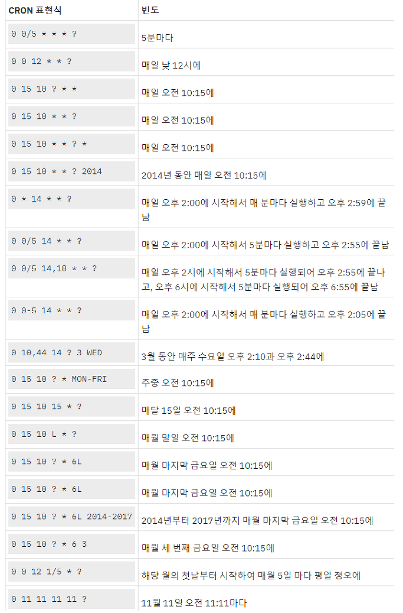

# Cron 개념정리

---

>[참고 사이트1](https://zamezzz.tistory.com/197)

## Cron

### 정의

- 특정시간마다 어떤 작업을 수행하도록 하는 명령어. 
- cronTap의 내용을 읽어 작업이 수행된다

### Cron 표현식 - 필드
- Cron 스케줄러의 정규 표현식은 7개의 각 필드로 구성되어있다. 

| 필드명       | 값의 허용 범위                  | 허용된 특수문자 |
| ------------ | ------------------------------- | --------------- |
| 초 (Seconds) | 0 ~ 59                          | , - * /         |
| 분 (Minutes) | 0 ~ 59                          | , - * /         |
| 시 (Hours)   | 0 ~ 23                          | , - * /         |
| 일 (Day)     | 1 ~ 31                          | , - * ? / L W   |
| 월 (Month)   | 1 ~ 12 or JAN ~ DEC             | , - * /         |
| 요일 (Week)  | 0 ~ 6 or SUN ~ SAT (7도 일요일) | , - * ? / L #   |
| 연도 (Year)  | empty or 1970 ~ 2099            | , - * /         |

### Cron 표현식 - 특수문자

1. \* : 모든 값을 뜻합니다.
2. ? : 특정한 값이 없음을 뜻합니다. 
3. \- : 범위를 뜻합니다. (예) 월요일에서 수요일까지는 MON-WED로 표현
4. , : 특별한 값일 때만 동작 (예) 월,수,금 MON,WED,FRI 
5. / : 시작시간 / 단위  (예) 0분부터 매 5분 0/5
6. L : 일에서 사용하면 마지막 일, 요일에서는 마지막 요일(토요일)
7. W : 가장 가까운 평일 (예) 15W는 15일에서 가장 가까운 평일 (월 ~ 금)을 찾음
8. \# : 몇째주의 무슨 요일을 표현 (예) 3#2 : 2번째주 수요일

