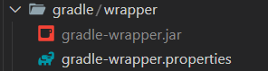

# Gradlew 동작방법

---

>



##### 1. Wrapper 스크립트 실행

- 터미널에서 `./gradlew <태스크>` (Windows는 `gradlew.bat`) 를 실행하면,
- 내부에 포함된 작은 JVM 부트스트랩(`gradle/wrapper/gradle-wrapper.jar`)을 호출

##### 2. `gradle-wrapper.properties` 읽기

- `gradle/wrapper/gradle-wrapper.properties` 파일의 `distributionUrl` 항목을 읽어,
- 어떤 버전의 Gradle ZIP을 내려받아야 할지 결정

```bash
distributionUrl=https\://services.gradle.org/distributions/gradle-7.6.4-bin.zip
```

##### 3. 자동 다운로드 & 캐싱

- 로컬(보통 `~/.gradle/wrapper/dists/`)에 해당 버전이 없으면 ZIP을 다운로드해 풀어놓고,
- 이후 같은 버전 호출 시에는 다시 다운로드하지 않고 캐시된 디렉토리에서 바로 사용

##### 4. 실제 Gradle 실행

- 다운로드된 Gradle 실행 파일(`bin/gradle`)을 호출해,
- `build.gradle` 등 프로젝트 설정대로 빌드·테스트·패키징 등 지정된 태스크를 수행

##### 5. 결과 반환

- 태스크가 끝나면 스크립트가 종료되며,
- 별도 전역 Gradle 설치 없이도 “프로젝트마다 동일 버전” 보장 상태로 빌드가 완료

