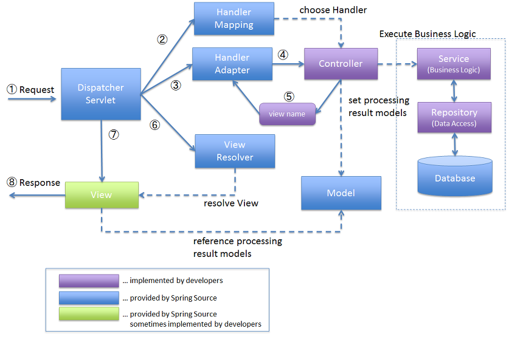

# Servlet 동작방법

> [참고고 사이트1](https://kohen.tistory.com/29)

## Servlet

### 정의

- 웹 프로그래밍에서 **클라이언트 요청을 처리**하고 처리 **결과를 클라이언트에 전송**하는 기술
  - 쉽게 말하자면 **자바**를 사용해서 **웹을 만들기 위해 필요한 기술**이다.
- 일반적으로 **웹서버**는 **정적인 페이지만 제공**하는데, **동적인 페이지**를 제공하기 위해  **서블릿을 활용**한다. 
  - 동적인 페이지란 사용자의 요청에 의해 변화되는 무언가를 제공하는 것을 말하는데, 서블릿이 바로 이러한 동적인 페이지를 제공하기 위해 도움을 주는 어플리케이션이다.

### 특징

1. 클라이언트의 요청에 대해 동적으로 작동하는 웹 어플리케이션 컴포넌트
2. html을 사용해서 요청에 응답한다
3. Java thread를 통해 동작한다.
4. MVC패턴중 Controller로 이용된다
5. HTTP 프로토콜 서비스를 지원하는 javax.servlet.http.HttpServlet 클래스를 상속받는다.(UDP보다 속도가 느림)
6. HTML 변경시 Servlet을 재 컴파일 해야한다

### 동작 흐름

1. 사용자가 URL을 클릭하면 HTTP Request를 서블릿 컨테이너로 전송한다. 
   - 이때 컨테이너는 해당 서블릿이 메모리에 존재하는지 확인하고, 없을경우 init() 을 통해 메모리에 적제한다. 
2. HTTP Request를 전달받은 서블릿 컨테이너는 HttpServletRequest, HttpServletResponse 두 객체를 생성한다. ( 요청과 응답을 하기 위해서 필요한 객체이다. )
3. web.xml은 사용자가 요청한 URL을 분석하여 어느 서블릿에 대해 요청을 한 것인지 찾는다
4. 해당 서블릿에서 service 메소드를 호출한 후 클라이언트의 요청종류 (GET, POST)에 따라 doGet 혹은 doPost를 호출한다.
5. doGet, doPost 메소드는 동적 페이지를 생성한 후 HttpServletResponse 객체에 응답을 보낸다.
6. 응답이 끝나면 HttpServletRequest, HttpServletResponse 두 객체를 소멸시킨다

### Servlet Container

- **서블릿을 관리해주는 컨테이너**이다. 대표적으로 **Tomcat**이 Servlet Container이다. 
- 서블릿 컨테이너는 클라이언트의 **요청**을 받아주고 **응답**할 수 있도록 **소켓을 통해 웹 서버와 통신**한다. 

### DispatcherServlet

-  Spring MVC 웹 애플리케이션의 진입점으로 동작하여 , 클라이언트( 애플리케이션 ) 에서 요청이 들어오면 가장 먼저 실행된다. 
-  클라이언트의 요청을 처리하기 위해 다양한 Spring MVC 구성 요소와 상호작용한다. 이를 통해 요청을 처리하고 응답을 생성한다. 
-  컨트롤러에서는 비즈니스 로직을 수행하고 모델을 준비한 뒤, `DispatcherServlet`에게 반환한다. 
   - 이후 `DispatcherServlet`은 적절한 뷰를 찾아 모델과 함께 응답을 생성하고 클라이언트에게 반환한다. 

###  HandlerMapping

- Request URL에 따라 각각 어떤 Controller가 실제로 처리할 것인지 찾아주는 역할

### Controller

- Request를 직접 처리한 후 그 결과를 다시 DispatcherServelt에 돌려주는 역할

### ModelAndView

- Controller가 처리한 결과와 그 결과를 보여줄 View에 관한 정보를 담고 있는 객체

### ViewResolver

- View 관련 정보를 갖고 실제 View를 찾아주는 역할

### View

- Controller가 처리한 결과값을 보여줄 View를 생성