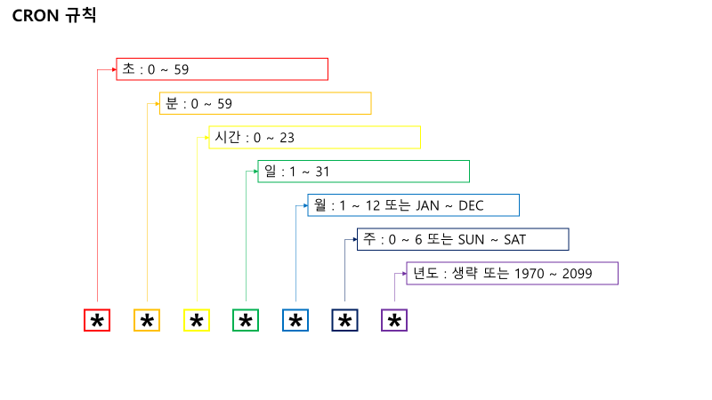

# Scheduler 어노테이션

---

>[참고 사이트1](https://yongku.tistory.com/entry/Spring-%EC%8A%A4%ED%94%84%EB%A7%81Spring-%ED%81%AC%EB%A1%A0-%ED%91%9C%ED%98%84%EC%8B%9DCron-Expression-%EC%A0%95%EB%A6%AC)
>
>[참고 사이트2](https://dev-coco.tistory.com/176)

## @Scheduler

### 정의 

- 

### CRON 규칙

- CRON은 총 7자리를 사용하는데, CRON 표현식 규칙은 다음과 같다.  
  - 다른 표기법들과는 다르게 가장 먼저오는 값이 "초(s)" 이다.  

### CRON 표현식 특수문자 

- CRON 표현식에서 특수문자는 정규 표현식과 비슷하기도 한데, 의미가 다른 것도 있다.

| 표현식 | 의미                              |
| ------ | --------------------------------- |
| *      | 모든 값을 의미                    |
| ?      | 어떤 값이든 상관 없음             |
| -      | 범위값 지정                       |
| ,      | 여러 값 지정                      |
| /      | 증분값 지정 EX) 매 2시간 마다 0/2 |
| L      | 지정할 수 있는 범위 마지막 값     |
| W      | 가장 가까운 평일 설정             |
| #      | N번 째 특정 요일                  |

### CRON 표현식 예제 

| 조건                               | 표현식                                 |
| :--------------------------------- | -------------------------------------- |
| 매 1초마다                         | @Scheduled(cron="0/1 * * * * * *")     |
| 매 1분마다                         | @Scheduled(cron="0 0/1 * * * * *")     |
| 5분에 시작해서 매 10분마다         | @Scheduled(cron="0 5/10 * * * * *")    |
| 매 1시간마다                       | @Scheduled(cron="0 0 0/1 * * * *")     |
| 오전 9시부터 6시까지 매 10분마다   | @Scheduled(cron="0 0/10 9-16 * * * *") |
| 오전 9시, 오전 6시에만 매 10분마다 | @Scheduled(cron="0 0/10 9,16 * * * *") |
| 매달 마지막 날 23시마다            | @Scheduled(cron="0 0 23 L * * *")      |
| 매월 1일 새벽 3시                  | @Scheduled(cron="0 0 3 1 * ?")         |
| 매일 새벽 1시                      | @Scheduled(cron="0 0 1 * * ?")         |
| 매일 새벽 2시                      | @Scheduled(cron="0 0 2 * * ?")         |