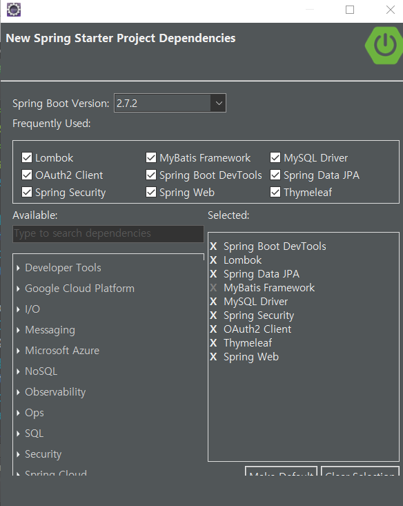

# Spring boot Security 정리 

---

> Spring boot 애서 지원하는 OAuth 2.0 을 이용하여 소셜 로그인 만들기
>
> OAuth 2.0 구조에대해 학습하고 구현해본다. 
>
> [프로젝트 코드 깃허브 ](https://github.com/wonyoung0207/Spring-boot-Security-OAuth-2.0/tree/master/OAuthSecurity)

## 참고 강의 

1. [Spring boot Security 구현 강의](https://www.inflearn.com/course/%EC%8A%A4%ED%94%84%EB%A7%81%EB%B6%80%ED%8A%B8-%EC%8B%9C%ED%81%90%EB%A6%AC%ED%8B%B0/dashboard)
   - [깃허브 자료](https://github.com/codingspecialist/-Springboot-Security-OAuth2.0-V3)
2. [유튜브 강의-나도코딩](https://opentutorials.org/course/2473/16571)
3. [생활코딩 OAuth ](https://www.inflearn.com/course/web2-oauth2/unit/36283?tab=curriculum) 
4. [참고 유튜브 강의](https://www.youtube.com/watch?v=9ui2i-SgBpk)
5. [내용 참고 ](https://deeplify.dev/back-end/spring/oauth2-social-login)

---

## 구현시 사용된 용어 및 개념

### 용어 

1. client id : 애플리케이션의 고유 ID
2. redirect uri : 사용자의 확인이 완료되면 리다이렉트 되어 돌아올 uri
3. access_token : 소셜 서버가 해당 앱에서 사용자의 정보를 사용할 수 있도록 승인했다는  검증(credentials(자격)) 코드 
4. Resource Owner : 액세스 중인 리소스 유저 - **사용자**
5. Client : Resource Owner를 대신하여 보호된 리소스에 액세스하는 응용프로그램 - **앱**
6. Resource server : Client의 요청을 수락하고 응답할 수 있는 서버
   - **소셜 플랫폼 서버** 
   - 사용저 정보를 가지고 있는 서버로, access_token을 이용해 client가 사용자 정보를 사용할 수 있도록 허락한다. 
7. Authorization server : Resource server가 액세스 토큰을 발급하는 서버
   - 클라이언트 앱의 서버로, tomcat_server 같은서버를 뜻한다. 
8. Authorization grant : 클라이언트가 엑세스 토큰을 얻을떄 사용하는 자격 증명
9. Authorization code : access token을 발급받기 전에 필요한 code
   - 클라이언트 Id, 클라이언트 Secret, code와 함께 리소스 서버로 전송되어 access_token을 발급받는 역할을 한다. 
   - 소셜 api 콘솔에서 등록된 앱 - 리디렉션 uri 에 http://127.0.0.1:80/login/oauth2/code/google 를 적여줘야한다. 
     - 이때 "/login/oauth2/code/소셜이름" 은 변할수 없는 값이고 앞에 127.0.0.1 은 앱의 도메인 주소를 사용하면 된다. 

10. Scope : 주어진 액세스 토큰을 사용하여 액세스할 수 있는 리소스 범위
    - 구글 서버에 저장된 데이터 중 사용자의 어떤 정보에 접근할 것인가를 적는 곳 . 
    - 헤당 프로젝트에서는 properties 나 yml 파일에 설정되어 있다. 
11. Provider : 소셜 플랫폼 이름을 가리킨다. 예를들어 provider : google 이면 google 리소스 서버로부터 받은 정보이다. 
12. **Authentication** : Spring boot Security 사용시 받아온 정보를 저장할 수 있는 객체의 형태이다. 따라서 시큐리티 세션에는 Authentication 형태로만 들어가야 한다. 
    - 사용자 정보는 Authentication 에 2가지의 형태로 들어갈 수 있다. 

      1. **UserDetails** => 일반로그인시 저장됨 
      2. **OAuth2User** => 플렛폼 로그인시 저장됨 
    - 두가지 형태를 동시에 받아서 사용하기 위해 필요한 형태가 **PrincipalDetails** 이다.
    - 정리하자면 **_Athentication <= PrincipalDetails <=  UserDetails  or  OAuth2User_** 의 순서로 들어갈 수 있다. 

### 개념 

#### spring boot 에서 properties 와 yml 파일의 차이점 

- [참고 사이트](https://newwisdom.tistory.com/89)

- **_properties (속성 파일)_**

  - 기본적으로 Spring Boot는 key-value 형식을 사용 하는 *application.properties* 파일에 설정된 구성에 액세스 할 수 있다. 

  - 버전 2.4.0부터 Spring Boot는 다중 문서 속성 파일 생성을 지원한다. 따라서 각 프로필에 대한 문서를 모두 동일한 파일에 정의 할 수 있다.

    ```properties
    # apllication-prod.properties
    spring.config.activate.on-profile=prod
    # apllication-dev.properties
    spring.config.activate.on-profile=dev
    
    # 예를 들어 application-dev.yml 또는  application-dev.properties 와 같이 파일 이름에 프로필 이름을 입력하면됩니다 .
    ```

- **_yml (YAML 파일)_**

  - YAML은 계층 적 구성 데이터를 지정하기위한 편리한 형식이다. 

  - 속성 파일( properties 파일 )과 달리 YAML은 설계에 따라 다중 문서 파일을 지원하므로 사용하는 Spring Boot 버전에 관계없이 동일한 파일에 여러 프로필을 저장할 수 있다.

    ```yaml
    spring:
      config:
        activate:
          on-profile: staging
      datasource:
        password: 'password'
        url: jdbc:h2:staging
        username: SA
    bael:
      property: stagingValue
    ```

- 사용방법

  1. 값 어노테이션 이용 

     ```java
     @Value("${key.something}")
     private String injectedProperty;
     ```

  2. Envirionment Abstraction 이용 

     - Envirionment API 를 이용해서 사용 

     ```java
     @Autowired
     private Environment env;
     
     public String getSomeKey(){
         return env.getProperty("key.something");
     }
     ```

  3. ConfigurationProperties 어노테이션 이용 

     ```java
     @ConfigurationProperties(prefix = "mail")
     public class ConfigProperties {
         String name;
         String description;
     }
     ```

- 정리 

  - properties 파일은 ket-value 형식으로 여러 Profile 값들을 가져와 사용한다. 
  - yml 파일은 계층구조로 되어있어 데이터를 지정하기 더 편리하다. 
  - 주의할점은 **application.properties와 application.yml 동시사용이다.**  둘 간의 순서 차이가 있는데, application.properties가 항상 나중에 로드되어 YAML에 정의한 profil 설정이 덮어씌여질 수 있기 때문이다.

#### 어노테이션 GetMapping 과 RequestMapping 차이점

- @RequestMapping은 method를 생략하면 GET 방식과 POST 방식을 모두 처리해준다. 어찌 보면 @RequestMapping만 쓰는 게 제일 편하다. 결국 @GetMapping과 @PostMapping을 사용하는 이유는 @RequestMapping에 굳이 method를 명시하는 이유와 같다고 볼 수 있다.

- `@GetMapping`과 `@PostMapping` 어노테이션은 `@PutMapping`, `@DeleteMapping`, `@PatchMapping`과 함께 스프링 4.3부터 등장

- 정리하자면, RequestMapping을 사용하지 않고 GetMapping과 PostMapping을 사용하는 이유는 url 요청을 통해 메서드를 요청할 때 전송 방식을 하나의 url로 두개 이상의 매핑을 처리할 수 있기 때문이다. 

  ```java
  //만약 @RequestMapping("/insertBoard")으로 GET 방식의 요청을 받았다면 POST 방식의 요청은 다른 url을 써하는 반면에 getMapping , postMapping은 하나의 url을 사용해 처리할 수 있다. 
  @getMapping("/insertBoard")
  @PostMapping("/insertBoard")
  
  // requestMapping
  @RequestMapping(value="경로", method=RequestMethod.GET)
  @RequestMapping(value="경로", method=RequestMethod.POST)
  
  //get, post Mapping
  @GetMapping("경로")
  @PostMapping("경로")
  ```

#### JPA

- [inflearn.com 사이트에서의 강의](https://www.inflearn.com/course/%EC%8A%A4%ED%94%84%EB%A7%81-%EC%9E%85%EB%AC%B8-%EC%8A%A4%ED%94%84%EB%A7%81%EB%B6%80%ED%8A%B8/unit/49598?tab=curriculum&volume=1.00)

  

- 간단한 SQL 문의 CRUD 기능을 스프링 데이터 JPA가 모두 제공한다.  

  - 실무에서 많이 사용됨 

- 스프링 데이터 JPA는 JPA를 편리하게 사용하도록 도와주는 기술이다. 따라서 JPA를 먼저 학습한 후에 스프링 데이터 JPA를 학습하는 것이 좋다. 

- 사용방법

  - 사용자가 기능을 등록하는 것이 아닌 spring Data JPA가 JpaRepository 상속받은 클래스를 인식하고 자동으로 만들어준다. 
  - 사용자는 사용하고자 하는 클래스에서 해당 인터페이스를 선언하면 Spring 컨테이너에서 멤버 레포지토리를 찾는다.  
  - 해당 레포지토리를 Spring이 자동으로 Bean 에다가 등록해놓는다. 

- JPA에서 사용되는 findByEmail(..) 같은 함수를 **"쿼리 메소드(Query Methods )"** 라고 부른다.

  ```java
  package com.multi.oauth;
  // 레포지토리 인터페이스를 생성한다. 
  public interface UserRepository extends JpaRepository<User, Long> , MemberRepository{
      // 해당 인터페이스는 JPA레포지토리를 상속받아서 사용된다. 이때 JPA 레포지토리 클래스에는 findByEmail 함수 외 여러가지 함수를 포함하고 있다. 
      
      //email을 이용해서 찾을 수 있도록 findByEmail 도 만든다.
  	//소셜 로그인으로 반환되는 값 중에서 email을 통해 이미 생성된 사용자인지 처음 가입한 사용자인지 판단한다.
      @Override
      Optional<User> findByEmail(String email);
      // findAll, save(Iterable<ID>), getOne(ID) 등의 기능을 상속받아 사용할 수 있다. 
      
      // select m from Member m where m.name = ?   이런형식으로 쿼리문을 날림 
      Optional<User> findByEmailAndId(String email, String id);
      // And Or 등을 섞어서 사용할 수도 있다. 
     
  }
  ```

#### 스프링 시큐리티 Session


- Session은 시큐리티 세션이 관리하는 세션과 일반 세션이 구분되어있다. 

- **_시큐리티 세션에 들어갈 수 있는 객체형태는 Authentication 형태밖에 없다._** 

  - Authentication 형태안에는 2가지의 형태가 들어갈 수있다. 

    1. **UserDetails** => 일반로그인시 저장됨 
    2. **OAuth2User** => 플렛폼 로그인시 저장됨 

- 이떄 Controller 에서 **일반로그인**과 **플렛폼 로그인**을 나눠서 작성해줘야한다는 문제가 발생한다.  이러한 문제를 해결하기 위해서 PrincipalDetails 형태로 받아준다. 

  - PrincipalDetails 은 Athentication 에 들어가는 데이터 형태를 뜻한다. 

  ```java
  // 로그인 세션정보 확인 - 일반 로그인시 사용 
  @RequestMapping("/test/login")
  public @ResponseBody String testLogin(Authentication authentication,@AuthenticationPrincipal PrincipalDetails userDetails) {//DI(의존성 주입) 
      System.out.println("test/login/ ==========");
  
      // 로그인한 유저 정보를 찾는 방법 
      
      
      // 첫번째. Authentication 객체를 이용해서 유저 정보 찾기 
      PrincipalDetails principalDetails = (PrincipalDetails) authentication.getPrincipal();
      System.out.println("Authentication : " + principalDetails.getUser());//로그인한 유저의 정보가 담겨있다.
      
      
      // 두번째. @AuthenticationPrincipal 걸어서 유저정보 찾기  
      // @AuthenticationPrincipal 어노테이션을 이용해서 세션정보에 접근할 수 있다. 
      System.out.println("userDetails : " + userDetails.getUser());
  
      return "세션정보 확인하기 ";
  }
  ```

  ```java
  // 로그인 세션정보 확인 - 플랫폼 로그인시 사용 (google, facebook) 
  @RequestMapping("/test/oauth/login")
  public @ResponseBody String testOAuthLogin(Authentication authentication, @AuthenticationPrincipal OAuth2User userDetails) {//DI(의존성 주입) 
      System.out.println("test/oauth/login/ ==========");
  
      OAuth2User oauth2User = (OAuth2User) authentication.getPrincipal();
      // 방법 1
      System.out.println("Authentication : " + oauth2User.getAttributes());//로그인한 유저의 정보가 담겨있다.
  
      // 방법 2
      System.out.println("userDetails : " + userDetails.getAttributes());
      return "OAuth 세션정보 확인하기 ";
  }
  ```

  ```java
  // 로그인 세션정보 확인 - 플랫폼 로그인시 사용 (google, facebook) 
  // 일반로그인 , 플랫폼 로그인으로 해도 모두 PrincipalDetails 로 받을 수 있다. 
  @RequestMapping("/user")
  public String user(	@AuthenticationPrincipal PrincipalDetails principalDetails) {//DI(의존성 주입) 
      System.out.println("principalDetails : " + principalDetails.getUser());
  
      return "user";
  }
  ```

---


## Spring boot Security 구조


1. **_사용자( Owner )_** 가 client 와 연결된다.
   - client는 내가 개발하는 web, app 이다. 
2. 플랫폼 로그인 진행시 **_Client_** 의 화면에서 사용자에게 Resorce Server 로 요청하기 위한 **계정 동의** 를 구한다. -> 동의 버튼은 **_Resorce Server_** 로 연결되어 있어 바로 3번이 진행된다. 
   - Resorce Server 는 신뢰할 수 있는 기업인 google, naver, Kakao 같은 server 를 뜻한다. 
   - 계정 동의는 해당 플랫폼의 id, password로 로그인하는것을 뜻한다. 
3. 동의를 구하면 Resorce Server 로 계정 인증 내용을 보낸다. 
4. Resorce Server 가 인증요청을 받고 **_Client에서 필요로 하는 정보 ( Scope List )_** 가 무엇인지 사용자에게 보여준다. 사용할 정보 리스트( Scope List ) 를 가지고 Client가 이용할 수 있도록 허락하는지 사용자에게 물어본다. 
   - scope List 의 내용을 사용자가 허락할 것인지 창으로 보여준다. 
5. 이때 동의 버튼을 클릭하면  Resorce Server 가 Client에게 사용자의 정보 ( Scope List ) 를 볼 수 있도록 허락하는  **_비밀번호 ( Code )_** 를 보낸다. 
   - 따라서 Code에는 사용자가 자신의 정보를 볼 수 있도록 Client에게 권한을 줬다는 것을 뜻한다. 
6. Client가 Resorce Server 로부터 받은 Code를 **_Client id, Client secretKey_** 와 함께 묶어 다시 Resorce Server 로 보낸다. 
   - Resorce Server 는 전달받은 3가지의 정보 ( Code와 해당 클라이언트 id. SecretKey) 가 맞는지 판단한다.
7. Resorce Server 가 판단을 통해 Client에게 **_Access Token_** 을 보내준다. 
   - Access Token을 가지고 Client는 해당 사용자가 허락한 범위 내에서 정보를 열람할 수있다. 
8. Client 는 Access Token을 가지고 API를 사용할 수 있다. 

---

## Spring boot OAuth 2.0 환경설정

### 의존성 주입 



```xml
<dependency>
    <groupId>org.springframework.boot</groupId>
    <artifactId>spring-boot-starter-data-jpa</artifactId>
</dependency>
<dependency>
    <groupId>org.springframework.boot</groupId>
    <artifactId>spring-boot-starter-mustache</artifactId>
</dependency>
<dependency>
    <groupId>org.springframework.boot</groupId>
    <artifactId>spring-boot-starter-oauth2-client</artifactId>
</dependency>
<dependency>
    <groupId>org.springframework.boot</groupId>
    <artifactId>spring-boot-starter-security</artifactId>
</dependency>
<dependency>
    <groupId>org.springframework.boot</groupId>
    <artifactId>spring-boot-starter-thymeleaf</artifactId>
</dependency>
<dependency>
    <groupId>org.springframework.boot</groupId>
    <artifactId>spring-boot-starter-web</artifactId>
</dependency>
<dependency>
    <groupId>org.mybatis.spring.boot</groupId>
    <artifactId>mybatis-spring-boot-starter</artifactId>
    <version>2.2.2</version>
</dependency>
<dependency>
    <groupId>org.thymeleaf.extras</groupId>
    <artifactId>thymeleaf-extras-springsecurity5</artifactId>
</dependency>

<dependency>
    <groupId>org.springframework.boot</groupId>
    <artifactId>spring-boot-devtools</artifactId>
    <scope>runtime</scope>
    <optional>true</optional>
</dependency>
<dependency>
    <groupId>mysql</groupId>
    <artifactId>mysql-connector-java</artifactId>
    <scope>runtime</scope>
</dependency>
<dependency>
    <groupId>org.projectlombok</groupId>
    <artifactId>lombok</artifactId>
    <optional>true</optional>
</dependency>
<dependency>
    <groupId>org.springframework.boot</groupId>
    <artifactId>spring-boot-starter-tomcat</artifactId>
    <scope>provided</scope>
</dependency>
<dependency>
    <groupId>org.springframework.boot</groupId>
    <artifactId>spring-boot-starter-test</artifactId>
    <scope>test</scope>
</dependency>
```

### application.Properties 또는 application.yml 파일 설정

#### application.properties

```properties
server.port=80

spring.datasource.driverClassName=com.mysql.cj.jdbc.Driver
spring.datasource.url=jdbc:mysql://localhost:3306/testdb?serverTimezone=Asia/Seoul

spring.datasource.username=admin1
spring.datasource.password=0000

# mybatis 가 있는 경로 설정 
mybatis.type-aliases-package=com.security.Cust
mybatis.mapper-locations=com/security/Cust/*.xml

spring.servlet.multipart.max-file-size=10MB

# 데이터 베이스에 값 넣을 때 사용 
spring.jpa.hibernate.ddl-auto=update 
# 데이터 베이스 만들때 사용 
#spring.jpa.hibernate.ddl-auto=create  


spring.jpa.hibernate.naming.physical-strategy=org.hibernate.boot.model.naming.PhysicalNamingStrategyStandardImpl
spring.jpa.show-sql=true

# spring boot security 사용시 필요한 앱 인증 id, password
spring.security.user.name = user
spring.security.user.password = 1234

# application-oauth.properties 로딩
# application-xxx.properties 파일을 profiles 함수를 통해 해당 properties에 포함할 수 있다.
# 여기선  application-oauth.properties 프로필을 포함하게 한다. 
spring.profiles.include=oauth
```

-  만약 properties 파일이 아닌 yml 파일로 하고 싶다면 다음 형태로 사용할 수 있다. 

```yaml
  security:
    oauth2.client:
      registration:
        google:
          clientId: '{구글 client-id}'
          clientSecret: '{구글 client-secret}'
          scope:
            - email
            - profile
        facebook:
          clientId: '{페이스북 client-id}'
          clientSecret: '{페이스북 client-secret}'
          scope:
            - email
            - public_profile
        naver:
          clientId: '{네이버 client-id}'
          clientSecret: '{네이버 client-secret}'
          clientAuthenticationMethod: post
          authorizationGrantType: authorization_code
          redirectUri: "{baseUrl}/{action}/oauth2/code/{registrationId}"
          scope:
            - nickname
            - email
            - profile_image
          clientName: Naver
        kakao:
          clientId: '{카카오 client-id}'
          clientSecret: '{카카오 client-secret}'
          clientAuthenticationMethod: post
          authorizationGrantType: authorization_code
          redirectUri: "{baseUrl}/{action}/oauth2/code/{registrationId}"
          scope:
            - profile_nickname
            - profile_image
            - account_email
          clientName: Kakao
```

#### application-oauth.properties

```properties
# google API 
spring.security.oauth2.client.registration.google.client-id= 
spring.security.oauth2.client.registration.google.client-secret= 
spring.security.oauth2.client.registration.google.scope= profile,email,https://www.googleapis.com/auth/user.birthday.read,https://www.googleapis.com/auth/user.gender.read


# FaceBook API
spring.security.oauth2.client.registration.facebook.client-id= 
spring.security.oauth2.client.registration.facebook.client-secret= 
spring.security.oauth2.client.registration.facebook.scope= public_profile,email
# user_age_range ,user_birthday 
 
# Naver API
spring.security.oauth2.client.registration.naver.client-id = 
spring.security.oauth2.client.registration.naver.client-secret= 
spring.security.oauth2.client.registration.naver.client-name=Naver
spring.security.oauth2.client.registration.naver.authorization-grant-type=authorization_code
spring.security.oauth2.client.registration.naver.redirect-uri=http://localhost:80/login/oauth2/code/naver
#spring.security.oauth2.client.registration.naver.scope=nickname,email,gender,age,profile_image

# Naver Provider 
spring.security.oauth2.client.provider.naver.authorization-uri=https://nid.naver.com/oauth2.0/authorize
spring.security.oauth2.client.provider.naver.token-uri=https://nid.naver.com/oauth2.0/token
spring.security.oauth2.client.provider.naver.user-info-uri=https://openapi.naver.com/v1/nid/me
spring.security.oauth2.client.provider.naver.user-name-attribute= response


# KAKAO
#spring.security.oauth2.client.registration.kakao.client-id = 
#spring.security.oauth2.client.registration.kakao.client-secret = 
#spring.security.oauth2.client.registration.kakao.redirect-uri=http://localhost:8080/login/oauth2/code/kakao
#spring.security.oauth2.client.registration.kakao.authorization-grant-type=authorization_code
#spring.security.oauth2.client.registration.kakao.scope=profile,account_email
#spring.security.oauth2.client.registration.kakao.client-name=kakao
#spring.security.oauth2.client.registration.kakao.client-authentication-method=POST

## kAKAO Provider \uB4F1\uB85D!
#spring.security.oauth2.client.provider.kakao.authorization-uri= https://kauth.kakao.com/oauth/authorize
#spring.security.oauth2.client.provider.kakao.token-uri=https://kauth.kakao.com/oauth/token
#spring.security.oauth2.client.provider.kakao.user-info-uri=https://kapi.kakao.com/v2/user/me
#spring.security.oauth2.client.provider.kakao.user-name-attribute=id 
```

### 소셜 api 콘솔에서 앱설정

#### Google API 콘솔 이용 방법 

- [google api 콘솔](https://console.cloud.google.com/apis/)
- [참고 유튜브 강의](https://www.youtube.com/watch?v=9ui2i-SgBpk)
- [내용 참고 ](https://deeplify.dev/back-end/spring/oauth2-social-login) : 정리 잘되어있음 

1. 해당 사이트에 들어가 먼저 프로젝트를 등록해야한다. 

2. 프로젝트 등록 후 OAuth 동의 화면 선택 

   - 외부 체크 
   - 애플리케이션 이름 설정 - 저장

3. 사용자 인증정보 - Oauth 클라이언트 ID만들기 

   - 애플리케이션 유형 - 웹 애플리케이션 
   - 승인된 리디렉션 URI설정
     - https://localhost:8080/login/oauth2/code/google
     - 리디렉션 URI는 google server 쪽에서 인증이 되었다는 code를 보내주는데 이때 client에서는 이 code와 client-id, seretkey를 함께 google server로 넘긴다.
     - 따라서 리디렉션 URI 는 인증 되었다는 code를 받을 URL 이다. 
     - **_spring boot Security를 사용하면 자동으로 의존성 주입된 라이브러리가 해당 uri를 처리한다._**
   - 리디렉션 URI의 주소는 앞에 https://localhost:8080 부분 까지는 바꿀 수 있지만 그 뒤의 주소 "/login/oauth2/code/google" 는 바꿀 수 없다. 
     - 해당 주소는 우리 Server에서 컨트롤 하지 않고 google library에서 컨트롤 한다. 

4. Spring boot Oauth2.0 라이브러리 설치 

   - spring-boot-starter-**oauth2-client**라는 라이브러리는 구글,페이스북 같은 로그인을 통한 인증과 권한 처리를 쉽게 할 수 있게 해준다. 
   - 사용할 프로젝트 - pom.xml 파일에 해당 내용 추가 

   ```xml
   <dependency>
   	<groupId>org.springframework.boot</groupId>
   	<artifactId>spring-boot-starter-security</artifactId>
   </dependency>
   <dependency>
   	<groupId>org.springframework.boot</groupId>
   	<artifactId>spring-boot-starter-oauth2-client</artifactId>
   </dependency>
   ```

---

## 파일 구조


---

## Spring boot Security 진행 순서 

1. 소셜 로그인 요청

2. 백엔드로 GET “/oauth2/authorization/{provider-id}?redirect_uri=http://localhost:3000/oauth/redirect”으로 OAuth 인가 요청

   - provider-id 는 소셜 플랫폼을 뜻한다. 

     - ex) google, facebook , naver, kakao

   - redirect_uri 는 로그인 완료시 이동할 페이지를 뜻한다. 

     - redirect_uri는 선택한 소셜 플랫폼의 "api 콘솔" 에서 허가를 해야 한다. 

3. Provider 별로 Authorization Code 인증을 할 수 있도록 리다이렉트 (Redirect: GET “https://oauth.provider.com/oauth2.0/authorize?…”) 주소를 설정한다. -> 이때 리다이렉트 주소를 Client 에서 Controller로 받아야 한다. 

   - 원래는 Controller에서 @RequestMapping ("https://oauth.provider.com/oauth2.0/authorize") 이렇게 받아야한다.

   - 하지만 **_spring boot 를 사용하면 의존성 주입한 라이브러리가 해당 주소를 받아서 3번~8번까지 자동으로 처리한다._**

     ```xml
     <!-- 의존성 주입한 라이브러리  -->
     <dependency>
         <groupId>org.springframework.boot</groupId>
         <artifactId>spring-boot-starter-oauth2-client</artifactId>
     </dependency>
     <dependency>
         <groupId>org.springframework.boot</groupId>
         <artifactId>spring-boot-starter-security</artifactId>
     </dependency>
     ```

4. 리다이렉트 화면에서 provider 서비스에 로그인

5. 로그인이 완료된 후, Athorization server로부터 백엔드로 Authorization 코드 응답

6. 백엔드에서 인가 코드를 이용하여 Authorization Server에 엑세스 토큰 요청

7. 엑세스 토큰 획득

8. 엑세스 토큰을 이용하여 Resource Server에 유저 데이터 요청

9. 획득한 유저 데이터를 DB에 저장 후, JWT 엑세스 토큰과 리프레시 토큰을 생성

10. 리프레시 토큰은 수정 불가능한 쿠키에 저장하고, 엑세스 토큰은 프로트엔드 리다이렉트 URI 에 쿼리스트링에 토큰을 담아 리다이렉트 (Redirect: GET http://localhost:3000/oauth/redirect?token={jwt-token})

11. 프론트엔드에서 토큰을 저장 후, API 요청 시 헤더에 `Authroization: Bearer {token}`을 추가하여 요청

12. 백엔드에서는 토큰을 확인하여 권한 확인

13. 토큰이 만료된 경우, 쿠키에 저장된 리프레시 토큰을 이용하여 엑세스 토큰과 리프레시 토큰을 재발급

---

## Spring boot Security 코드 진행 순서  

> [코드 저장되어 있는 깃허브 ](https://github.com/wonyoung0207/Spring-boot-Security-OAuth-2.0/tree/master/OAuthSecurity)
>
> google OAuth 를 예시로 사용 
>
> SecurityConfig.java 와 PrincipalOauth2UserService.java가 주요 기능을 담고있는 class이다. 

1. 구글 로그인 버튼 클릭 

   ```html
   <!-- 해당 주소를 호출하면 spring boot 에서 해당 소셜 플랫폼 서버를 호출한다.  -->
   <a href="/oauth2/authorization/google" > google </a>
   <a href="/oauth2/authorization/facebook" > facebook </a>
   <a href="/oauth2/authorization/naver"> naver </a>

2. 구글 로그인창 
   - /oauth2/authorization/google 해당 주소로 이동하면 google server가 받는다. 
     - google api 콘솔 - OAuth동의화면 에서 승인된 리디렉션 URL에 "
       http://127.0.0.1:80/login/oauth2/code/google" 로 설정이 되어있어야 하며 application.properties 에 "spring.security.oauth2.client.registration.google.client-id" 와 "spring.security.oauth2.client.registration.google.client-secret" 설정이 되어있어야한다. 
     - 이때 계정이 1개면 계정선택창이 안뜬다. -> 자동으로 선택되서 바로 다음으로 넘어감 

3. 계정 확인 완료되면 Client 앱 화면에서 에서 어떤 유저 정보를 사용할 것인지 동의를 구하고 승인시 api콘솔에서 설정한 "리디렉션 Url" 로 code를 리턴.

4. Client 서버가 code를 리턴받음 (이때 Controller로 직접 받는것이 아닌 OAuth-Client라이브러리가 대신받아줌)

5. OAuth-Client라이브러리가 자동으로 리소스 서버로 AccessToken 요청

6. userRequest 에 담겨있는 정보를 활용해 회원프로필 정보를 받아야한다. (loadUser 함수 이용)

   - SecurityConfig.java 파일을 통해서 OAuth-client 라이브러리가 대신 처리해준다. 이때 가장 마지막줄에서 설정한 ".userService(principalOauth2UserService);" 에 의해서 PrincipalOauth2UserService.java 에서 후처리가 진행됨 

   - SecurityConfig.java

     ```java
     @SuppressWarnings("deprecation")
     @Configuration // IoC 빈(bean)을 등록
     @EnableWebSecurity // 필터 체인 관리 시작 어노테이션
     @EnableGlobalMethodSecurity(prePostEnabled = true, securedEnabled = true) // secured 어노테이션 활성화  
     // 특정 주소 접근시 권한 및 인증을 위한 어노테이션 활성화 -> 
     //controller에서 @Secured ,@PreAuthorize로 ROLE을 설정해 접근을 제한할 수 있다.
     // @Secured : 한가지의 접근권한 설정시 사용 
     // @PreAuthorize : 여러가지 접근권한 설정시 사용 
     public class SecurityConfig extends WebSecurityConfigurerAdapter{
     	
     	@Autowired
     	private PrincipalOauth2UserService principalOauth2UserService;
     	
     	// 해당 메서드의 리턴되는 오브젝트를 Ioc 로 등록해준다. 
     	@Bean
     	public BCryptPasswordEncoder encodePwd() {// 회원가입시 비밀번호를 암호화 하는 방법 
     		return new BCryptPasswordEncoder();
     	}
     //	
     	@Override
     	protected void configure(HttpSecurity http) throws Exception {
     		
     		http.csrf().disable();
     		http.authorizeRequests()
     			.antMatchers("/user/**").authenticated() 
     //			.antMatchers("/admin/**").access("hasRole('ROLE_ADMIN') or hasRole('ROLE_USER')")// /admin페이지로 가기 위해서는 Role이 Admin이거나 User 여야한다. 
     			.antMatchers("/admin/**").access("hasRole('ROLE_ADMIN')") // /admin 로 시작하는 url접속시 권한을 ROLE_ADMIN 만 볼수 있도록 설정할 수 있다. 
     			.anyRequest().permitAll()
     		.and()
     			.formLogin()
     			.loginPage("/loginForm")
     //			.usernameParameter("username2") // 만약 로그인폼 페이지의 form-name-username을 username2로 변경했을 경우 추가해야한다. 
     			.loginProcessingUrl("/login")//login 주소가 호출되면 시큐리티가 낚아채서 대신 로그인을 진행해 준다. 
     			.defaultSuccessUrl("/loginsuccess")//로그인 완료되면 해당 페이지로 이동하도록 설정하는 곳이다. 
     		//이때 권한이 필요한 페이지 요청했을 때 login 한 뒤에 권한 필요한 페이지를 자동으로 띄워준다. 
     		.and()  
     			.oauth2Login() // loginForm 페이지에서 /oauth2/authorization/google 주소 호출시 동작하는 곳
     			.loginPage("/loginForm") // googole 로그인이 완료된 뒤의 후처리가 필요하다. 
     			.defaultSuccessUrl("/loginsuccess")
     			.userInfoEndpoint() //구글 로그인이 완료된 뒤의 후처리가 필요함. 코드를 받는것이 아니라 (엑세스토큰 + 사용자프로필정보 ) 를 받아온다. 
     			// 후처리는 PrincipalOauth2UserService에서 처리된다. 
     			.userService(principalOauth2UserService);
     	}
     }
     ```

   - PrincipalOauth2UserService.java

     - 해당 클래스에서 loadUser() 의 OAuth2UserRequest 를통해 유저정보가 userRequest 변수에 저장되어 사용자 데이터를 이용할 수 있다. 
     - return 한 값은 SecurityConfig.java 에서 설정한 ".defaultSuccessUrl("/loginsuccess")" 의 url로 리턴된다. 
       - 리턴된 값을 Controller 에서 Authentication 의 형태로 받아서 처리한다. 
       - 시큐리티 값은 Authentication의 형태로만 받을 수 있기 때문이다. 

     ```java
     @Service
     public class PrincipalOauth2UserService extends DefaultOAuth2UserService {
     
         // JPA 이용해서 database에 정보 저장할경우 사용 
     	@Autowired
     	private UserRepository userRepository;
     	
     	@Autowired
     	CustBiz cbiz;
     
     // 패스워드 암호화 할 떄 사용하는 클래스 
     //	@Autowired
     //	private BCryptPasswordEncoder bCryptPasswordEncoder;
     
     	// userRequest 는 code를 받아서 accessToken을 응답 받은 객체
     	// google로부터 받은 userRequest데이터에 대한 후처리 되는 함수  
     	// 함수 종료시 @AuthenticationPrincipal 어노테이션이 만들어진다. 
     	@Override
     	public OAuth2User loadUser(OAuth2UserRequest userRequest) throws OAuth2AuthenticationException {
     		// userRequest 에 담겨있는 정보 = 구글 로그인 버튼 클릭 -> 구글 로그인창 -> 로그인 완료 -> code를 리턴받음 (OAuth-Client라이브러리가 대신받아줌) -> AccessToken 요청
     		// userRequest 에 담겨있는 정보를 활용해 회원프로필 정보를 받아야한다. (loadUser 함수 이용)
     		System.out.println("userRequest : " + userRequest);
     		System.out.println("userRequest1 : " + userRequest.getClientRegistration().getClientName());
     		
     //		Person profile = peopleService.people().get("people/me")
     //			    .setPersonFields("names,emailAddresses")
     //			    .execute();
     		
     		System.out.println("getClientRegistration : " + userRequest.getClientRegistration()); // registrationId로 어떤 플렛폼으로 로그인 했는지 알 수 있다. ex) 'google'
     		System.out.println("getAccessToken : " + userRequest.getAccessToken().getTokenValue());//이게 google 서버로부터 받은 access Token이다. 
     		
             // OAuth2User : token을 통해 응답받은 회원정보를 저장하는 변수 
     		OAuth2User oAuth2User = super.loadUser(userRequest); // google의 회원 프로필 조회
     		System.out.println("getAttributes : " + oAuth2User.getAttributes());
     		
     		// 어느 플랫폼으로 가입한 건지 판별하는 곳  
     		OAuth2UserInfo oAuth2UserInfo = null;
     		if(userRequest.getClientRegistration().getRegistrationId().equals("google")) {// google 플랫폼으로 로그인한 경우 
     			System.out.println("google 로그인 요청");
     			oAuth2UserInfo = new GoogleUserInfo(oAuth2User.getAttributes());
     			System.out.println("user birthday : " + oAuth2UserInfo.getBirthday());
     			
     		}else if (userRequest.getClientRegistration().getRegistrationId().equals("facebook")) { // facebook 플랫폼에서 로그인한 경우 
     			System.out.println("facebook 로그인 요청");
     			oAuth2UserInfo = new FaceBookUserInfo(oAuth2User.getAttributes());
     		}else if (userRequest.getClientRegistration().getRegistrationId().equals("naver")) {
     			System.out.println("naver 로그인 요청");
     			oAuth2UserInfo = new NaverUserInfo((Map)oAuth2User.getAttributes().get("response"));
     			
     		}else {
     			System.out.println("google 과 facebook, naver 만 지원합니다. ");
     		}
     		
     		
     //		// google 하나만 있을 경우 
     //		// 회원 가입을 강제로 진행한다. 
     //		String provider = userRequest.getClientRegistration().getRegistrationId(); // 플렛폼 이름이 들어간다. 
     //		String providerId = oAuth2User.getAttribute("sub"); //sub 안에 구글에서 사용되는 패스워드가 들어가있다.
     //		// database에 저장될 id
     //		String username = provider + "_" + providerId; // google_10231354824 이런 형태로 id를 생성함 -> sub의 값은 유일하기 때문에 User 객체의 primary key로 설정가능
     //		// database에 저장될 password
     ////		String password = bCryptPasswordEncoder.encode("겟인데어"); 
     //		String email = oAuth2User.getAttribute("email"); // email 정보가 들어가있다. 
     //		String role = "ROLE_USER"; // role을 user로 설정 
     		
     		// 여러개 플랫폼 있을 경우 
     		// 회원 가입을 강제로 진행한다. 
     		String provider = oAuth2UserInfo.getProvider(); // 플렛폼 이름이 들어간다. 
     		String providerId = oAuth2UserInfo.getProviderId(); //sub 안에 구글에서 사용되는 패스워드가 들어가있다.
     		// database에 저장될 id
     //		String username = provider + "_" + providerId; // google_10231354824 이런 형태로 id를 생성함 -> sub의 값은 유일하기 때문에 User 객체의 primary key로 설정가능
     		String username = oAuth2UserInfo.getName();
     		String email = oAuth2UserInfo.getEmail(); // email 정보가 들어가있다. 
     		Date birthday = oAuth2UserInfo.getBirthday();  
     		String gender = oAuth2UserInfo.getGender();  
     		String role = "ROLE_USER"; // role을 user로 설정 
     		
     		// 유저 정보가 database에 존재하는지 확인 
     //		User userEntity = userRepository.findByUsername(username);
     		CustVO c = new CustVO(email, "0000", username,birthday,0,gender);// 초기 비밀번호 0000 
     		try {
     			CustVO cust = cbiz.get(email);// 이메일 찾기 
     			if(cust == null) {// 일치하는 cust가 없을경우 회원가입
     				//INSERT INTO cust VALUES (#{id},#{pwd},#{name},#{birth},#{point},#{sex})
     				cbiz.register(c);// 데이터베이스에 유저정보 저장 
     				//session에 정보 저장 
     				
     			}else {
     				System.out.println("이미 회원가입한  아이디 입니다. ");
     			}
     			
     		} catch (Exception e) {
     			e.printStackTrace();
     		}
     
     //         // JPA 이용해서 database에 정보 저장할경우 사용 
     //		if(userEntity == null) {// 유저 정보가 database에 존재하지 않는경우 -> 최초로 로그인한 경우 
     //			System.out.println("로그인이 최초입니다. "); 
     //			userEntity = User.builder()// User 객체에다가 값을 셋팅 
     //					.username(username)
     ////					.password(password)
     //					.email(email)
     //					.birthday(birthday)
     //					.gender(gender)
     //					.role(role)
     //					.provider(provider)
     //					.providerId(providerId)
     //					.build();
     //			userRepository.save(userEntity);// database에 user 정보를 저장 
     //			
     //			// principalDetails는 Authentication 객체 안에 들어갈 것이다. -> 
     //			// Authentication객체는 시큐리티 session에 들어갈 것이다.
     //			
     //		}else {
     //			System.out.println("로그인을 이미 한적이 있습니다. 당신은 자동회원가입이 되어있습니다.  ");
     //			
     //		}
     		return new PrincipalDetailsCustVO(c,oAuth2User.getAttributes()); // mybaties 이용할 경우 사용 
     //		return new PrincipalDetails(userEntity,oAuth2User.getAttributes());  // Repository 이용할 경우 사용 
     //		return super.loadUser(userRequest); // 위의 정보만 확인할때 return 사용 
     
     	}
     
     ```

   - Controller 

     - PrincipalOauth2UserService.java의 loadeUser() 함수에서 리턴된 값인 PrincipalDetails 형태를 AuthenticationPrincipal 어노테이션으로 받아서 사용해야한다.

     ```java
     @Controller
     public class SecurityController {
     	
     	@RequestMapping("/loginsuccess")
     	public String loginsuccess(Model m, @AuthenticationPrincipal PrincipalDetailsCustVO principalDetails,HttpSession session) { 
     		System.out.println("principalDetails : " + principalDetails.getUser());
     		session.setAttribute("user", principalDetails);
     		
     		return "redirect:/";
     	}
     }
     ```

---

## 결과화면 

- 로그인은 **"google 로그인 버튼 클릭 -> 계정 선택 -> 데이터 정보 요구 동의 -> 로그인"**  순서로 진행된다. 

  

  

  

  

  

  

- 로그인이 완료되면 다음 데이터를 받아와 세션에 사용자 정보를 저장한다. 

  ```java
  google 로그인 요청
  getAttributes : {sub=xxx, name=안원영, given_name=원영, family_name=안, picture=https://xxx, email=xxx@gmail.com, email_verified=true, locale=ko}
  principalDetails : CustVO(id=xxx@gmail.com, pwd=0000, name=안원영, birth=Wed Feb 07 00:00:00 KST 1996, point=0, sex=men, used=true, usepoint=0)
  ```

  


---

## 에러

### SecurityConfig 에서 WebSecurityConfigurerAdapter 지원 불가 

- WebSecurityConfigurerAdapter 를 지원하지 않아 사용불가하다. 

  - 기존 security 파일 

  ```java
  @SuppressWarnings("deprecation")
  @RequiredArgsConstructor
  @EnableWebSecurity
  public class SecurityConfig extends WebSecurityConfigurerAdapter {//WebSecurityConfigurerAdapter
  	// 커스텀한 OAuth2UserService DI.
    @Autowired
    private CustomOAuth2UserService customOAuth2UserService;
    @Override
    protected void configure(HttpSecurity http) throws Exception {// oauth 서비스 연결하는 곳 
        http
                .csrf().disable()
                .headers().frameOptions().disable()
                .and()
                .authorizeRequests()
                .antMatchers("/", "/css/**", "/images/**", "/js/**", "/h2-console/**", "/profile").permitAll()
  //              .antMatchers("/", "/css/**", "/images/**", "/js/**", "/h2-console/**", "/profile").permitAll()
                .antMatchers("/login").permitAll()// 커스텀 로그인 페이지를 만든 경우 권한을 수동으로 모두 접근 가능하도록 변경
                .antMatchers("/api/v1/**").hasRole(Role.USER.name())
                .anyRequest().authenticated()
                .and()
                .logout().logoutUrl("/logout")
                .logoutSuccessUrl("/")// 로그아웃 성공시 이동 페이지 
                .and()
                .oauth2Login()
                .loginPage("/login")//OAuth2 로그인 설정에서 로그인 페이지 URL을 수동으로 변경
                .defaultSuccessUrl("/")// 로그인 성공시 이동 페이지
                .userInfoEndpoint()
                .userService(customOAuth2UserService);	// oauth2 로그인에 성공하면, 유저 데이터를 가지고 우리가 생성한
         	       						// customOAuth2UserService에서 처리를 하겠다. 그리고 "/login-success"로 이동하라.
    }
  }
  ```

  - 변경 코드
    - bean을 이용해서 config 만들기

  ```java
  @EnableWebSecurity
  @RequiredArgsConstructor
  @Configuration(proxyBeanMethods = false)
  @ConditionalOnDefaultWebSecurity
  @ConditionalOnWebApplication(type = ConditionalOnWebApplication.Type.SERVLET)
  public class SecurityConfig {
  
  	@Autowired
      private final CustomOAuth2UserService customOAuth2UserService;
  
      @Bean
      @Order(SecurityProperties.BASIC_AUTH_ORDER)
      public SecurityFilterChain filterChain(HttpSecurity http) throws Exception {
          http
                  .csrf().disable()
                  .headers().frameOptions().disable()
                  .and()
                  .authorizeRequests()
                  .antMatchers("/", "/css/**", "/images/**",
                          "/js/**", "/h2-console/**").permitAll()
                  .antMatchers("/api/v1/**").hasRole(Role.
                          USER.name())
                  .anyRequest().authenticated()
                  .and()
                  .logout()
                  .logoutSuccessUrl("/")
                  .and()
                  .oauth2Login()
                  .userInfoEndpoint()
                  .userService(customOAuth2UserService);
          return http.build();
      }
  }
  ```

### 계정선택창 안뜸

- 계정이 1개면 계정선택창이 안뜬다. 
  - 자동으로 선택되서 Client-security 라이브러리에 의해 바로 동의화면 또는 로그인 성공페이지로 넘어가기 때문
