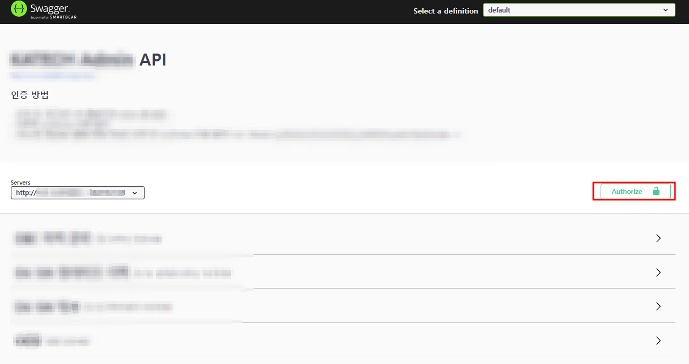

# Swagger 개념정리 

---

>[참고 유튜브](https://www.youtube.com/watch?v=Q27PGBYmHNA)
>
>[참고 사이트1](https://velog.io/@zinna_1109/Toy-Project-Swagger-Bearer-Token%EC%84%A4%EC%A0%95)
>
>[참고 사이트2](https://bugoverdose.github.io/development/swagger-auth-tutorial/)

## Swagger 

### 정의 

- REST api를 기반으로 하는 api 명세를 위한 도구이다. 
- 특정 프로그램에 존재하는 api(서비스 기능 ) **기능을 명세**하고 **테스트** 할 수 있도록 도와주는 도구이다. 

  - 즉, **백엔드와 연결**하여 **수정**시 해당 **서비스 기능에 필요한 파라미터**가 즉각적으로 변화하여 어떤 형태의 파라미터가 필요한지를 알수 있고, 파라미터로 **서버에 전송해 정상작동하는지 테스트**할 수 있는 도구라고 생각하면 된다. 
- `스웨거 허브` 나 local 에 모듈을 받아 사용할 수 있다. 

### 사용 조건 

1. 사용하고 있는 Server(백엔드) 에 어노테이션으로 Swagger 를 이용해야 한다. 
2. Swagger 어노테이션을 이용해 어려가지 정보를 기입해야한다. 
   1. 따라서 소스 코드에 관리해야할게 많아진다는 단점이 있다. 

### 주의할점

1. **인증 API Key 필요** 
   1. API 호출에 인증이 필요하다면 API 인증 Key 값을 넣어줘야 한다. 
   2. 인증값이 있어야 해당 운영 서버로 API Call 을 할 수 있기 때문이다. 
2. 인증값
   1. 인증값에는 사용 인증방법마다 앞에 넣어줘야 하는 값이 다르다. 
   2. 나같은 경우, JWT Token 을 사용했으므로 앞에 `Bearer` 를 붙여줬다. 
      1. 토큰을 입력하고 Authorize 버튼을 누르면 API에 대한 모든 요청이 HTTP 헤더에 토큰이 자동으로 포함된다.
   3. 예시 : Bearer [JwtToken]

### Bearer Token이란?

1. Bearer = 소유자
2. 토큰을 전송하는 방식 중에 하나
3. HTTP 인증 프로토콜 중에 하나로 클라이언트가 서버의 자원에 접근하고자 할 때 헤더에 Bearer token을 포함하여 요청하여 인증을 받는다
4. 일반적으로 OAuth나 JWT와 같은 프레임워크에서 사용된다

### JWT란?

1. 특정한 형식의 토큰을 정의하는 표준
2. Json web token : Json 포맷을 이용하여 사용자에 대한 속성을 저장하는 Web Token
3. Header, Payload, Signature의 3 부분으로 구성되며 각 부분은 Base64로 인코딩되어 표현된다 각 부분은 `.`을 구분자로 사용

### Swagger 어노테이션 적용 예시 

1. **Model** 

   ```java
   import io.swagger.annotations.ApiModelProperty;
   
   @Data
   @Builder
   @NoArgsConstructor
   @AllArgsConstructor
   public class TbCmCall {
   
       @NotNull
       @ApiModelProperty(value = "실시간 호출 ID")
       private String CallId;
   
       @NotBlank
       @Length(max = 12)
       @ApiModelProperty(value = "차량 ID")
       private String vehicleId;
   
       @ApiModelProperty(value = "도착 위도")
       private Double endLatitude;
   
       @ApiModelProperty(value = "도착 경도")
       private Double endLongitude;
   }
   ```

2. **Controller**

   ```java
   import io.swagger.annotations.Api;
   import io.swagger.annotations.ApiOperation;
   import io.swagger.annotations.ApiParam;
   import io.swagger.annotations.ApiResponse;
   import io.swagger.annotations.ApiResponses;
   
   @Slf4j
   @Api(tags = "실시간 호출")
   @RestController
   @RequestMapping("/call")
   public class Controller {
   	
   	@Autowired
   	TbcallServiceImpl tbcallService;
   	
       // GET
       @ApiOperation(httpMethod = "GET", value = "실시간 상세 조회", notes = "실시간 상세정보를 가져옴")
       @ApiResponses({ @ApiResponse(code = 200, message = "API 정상 작동"), @ApiResponse(code = 500, message = "서버 에러") })
       @PermitAll
       @GetMapping("/{callId}")
       public TbCmcall findTbcallById(@PathVariable("callId") @ApiParam(value = "실시간 호출 ID") String callId) {    	
           return tbCmcallService.findTbcallById(callId);
       }
       
      	// POST
       @ApiOperation(httpMethod = "POST", value = "불안감 등록",  notes = "{ headers: { 'Content-Type': 'multipart/form-data' } } 사용")
   	@ApiResponses({ @ApiResponse(code = 200, message = "API 정상 작동"), @ApiResponse(code = 500, message = "서버 에러") })
       @PostMapping("/anxiety")
   	public void requestAnxiety(@ApiParam(value = "불안감 등록", required = true) @RequestBody @Valid TbInsecurityInfo tbInsecurityInfo){
   		tbcallService.insertInsecurity(tbInsecurityInfo);
   	}   
   }
   ```

### 스웨거 허브 ( 웹 사이트 )  접속 방법

1. 웹 사이트를 이용해 swagger 를 사용할 수 있다. 

   1. 백엔드에 어노테이션으로 지정해 놓으면 Swagger 웹사이트가 해당 IP와 Port 에 설정되어있는 Swagger 어노테이션을 자동인식한다.  

2. 웹 사이트 주소 format

   ```html
   <!-- 구조 -->
   http://[사용자 서비스IP]:[Server Port]/swagger-ui/index.html#/
   
   <!-- 사용 예시 -->
   http://127.0.0.1:8080/swagger-ui/index.html#/
   ```

### 스웨거 허브 웹사이트




