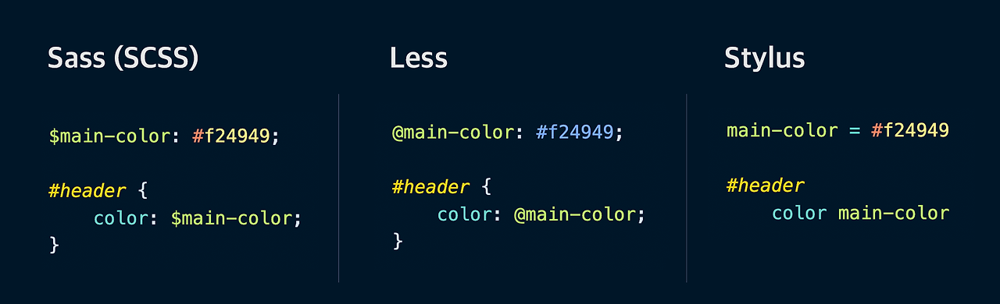
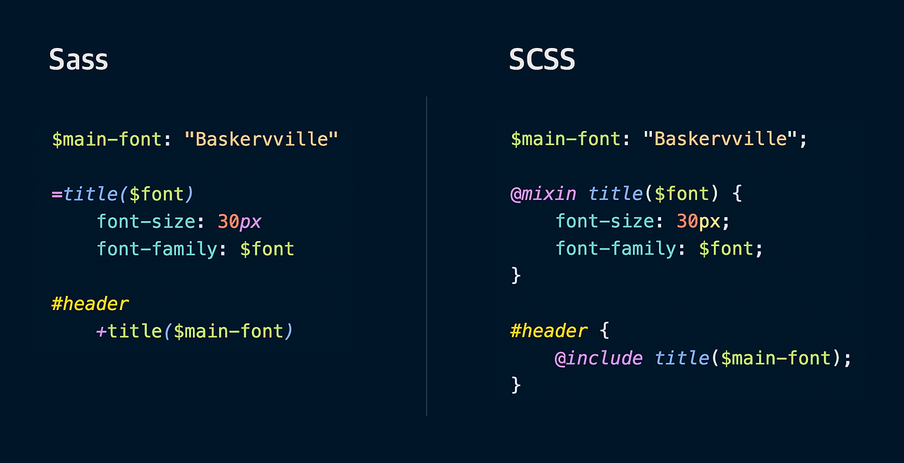

# Sass 라이브러리 

---

>[참고 사이트1](https://nykim.work/97)
>
>[참고 사이트2](https://velog.io/@kim98111/Sass)

## Sass 

### 정의 

1. **CSS를 더욱 효과적으로 사용할 수 있게 도와주는 라이브러리(도구)** 이다. 
2. Syntactically Awesome Style Sheets 의 줄임말로, "문법적으로 어썸한 스타일 시트" 라고 한다. 
3. Sass는 CSS 전처리기(Preprocessor) 라고도 한다. 
   1. CSS가 만들어지기 전에 일들을 처리해주기 때문
   2. Sass같은 전처리기에는 Less나 Stylus 등이 있다.


### 역할

1. Sass가 변수를 일반 텍스트로 바꿔주고, 반복문을 하나하나 작성해 CSS로 변환해준다. 
2. 즉, 개발자 - 브라우저 중간에 껴서 일을 해주는 게 CSS 전처리기인 Sass의 역할이다.

### 예시

1. CSS에 `$main-color: red;` 와 같이 변수만들 수 있다. 
2. 그럼 이걸 `h1 { color: $main-color; }` 나 `div { background: $main-color }` 처럼 사용할 수 있다. 
3. 변수뿐만 아니라 `@for`(반복문), `@if`(조건문) 같은 흐름 제어문이나 내장함수 등 다양한 문법들을 사용

```css
$_starType: ( default: 1.7rem, bbs: 1.8rem, total: 3rem );
 
@each $type, $size in $_starType {
    @if $type != default {
        .prdStar.type-#{$type} {
            .prdStarBack {
                width: $size * 5;
                height: $size;
                background-size: $size;
            }
 
            .prdStarIcon {
                background-size: $size;
            }
        }
    }
 
    @if $type == total {
        .prdStar.type-#{$type} {
            .prdStarScore {
                margin-left: .6rem;
                font-size: 3rem;
                font-weight: $mediumWeight;
                color: #000;
                line-height: 120%;
            }
        }
    }
}
```

### 장점

1. CSS 내 반복되는 내용은 줄이고 보다 효율적으로 스타일시트를 관리해 유지보수에 유리

### 전처리기 

1. Sass
2. Less
3. Stylus



### Sass 와 SCSS 

1. Sass 3 버전에서 좀 더 CSS에 호환될 수 있도록 도입된 것이 SCSS 문법이다. 
2. 그래서 SCSS를 쓰면 CSS를 쓰던 방식과 유사하게 Sass의 기능을 사용할 수 있다. 
3. 기존 Sass 구문은 들여쓰기 문법을 사용해야 했지만, 새로 나온 SCSS 구문은 대괄호와 세미콜론을 사용하고 있어서 좀 더 친숙하게 쓸 수 있는것이 장점이다. 
4. 즉, Sass 기능을 더욱 CSS 에 가깝게 사용할 수 있도록 발전한것이 SCSS이다. 



### Sass 확장자

1. 총 두가지 확장자가 존재. `.sass와 .scss`
2. 확장자로 .sass만 사용하면 .sass만 사용하고 .sass와 .scss 확장자 둘다 사용하면 .scss를 사용한다. 

### sass-loder

1. `sass-loader`는 웹팩 로더로서 빌드중 sass 파일을 만나면 "node-sass를 내부적으로 실행해준다. 
2. 빌드시 sass 파일을 만나게 되면 sass-loader가 css 코드로 먼저 변환한 이후에, css-loader와 style-loader가 순차적으로 실행된다. 

### node-sass

1. `node-sass`는 "Sass 코드를 CSS 코드로 컴파일(변환)"해주는 역할을 한다. 
2. **즉, Sass 로 되어있는 문장들을 컴파일러인 node-sass를 통해 브라우저가 읽을 수 있는 CSS로 변환한다.** 

### Dart-sass

1. node-sass 보다 성능이 좋아 node-sass보다 권장된다. 
2. 컴파일도 빠르고, npm 으로 배포도 가능하며, Dart 언어를 사용해 친숙하기 때문이다 . 

