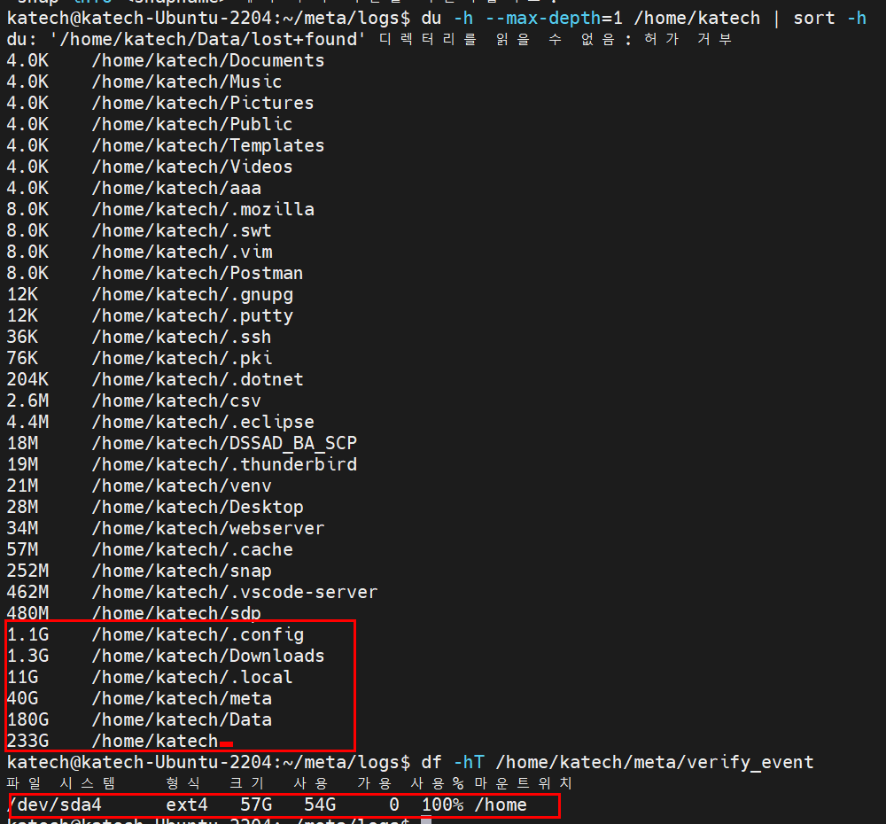

# ZIP 생성 멈춤 문제 정리  

---

>


## 1. 문제 요약

- 대용량 로그 파일(약 3.2GB)을 ZIP으로 압축하는 작업 수행
- ZIP 생성이 **첫 번째 파일 처리 중 중간에서 멈춤**
- 예외, 에러 로그 없이 작업이 정지된 것처럼 보임
- 원인은 스레드/Async 문제가 아닌 **디스크 공간 구조 문제**
  - `전체 물리 디스크 용량` vs `/home 파티션 용량 차이`


---

## 2. 핵심 원인 한 줄 요약

> **전체 물리 디스크에 여유 공간이 있어도  ZIP을 생성하는 경로(`/home`)에 할당된 파티션 공간이 부족하면  ZIP 생성은 중간에서 멈춘다.**

---

## 3. 디스크 구조 개념 정리

### 3.1 물리 디스크 (Physical Disk)

- 예: `/dev/sda`
- 실제 서버에 장착된 하드디스크 또는 SSD
- 전체 용량을 가짐 (예: 500GB)

### 3.2 파티션 (Partition)

- 물리 디스크를 여러 영역으로 분할
- 각 파티션은 서로 **독립된 용량 한계**를 가짐

```
/dev/sda1  → /boot
/dev/sda2  → /
/dev/sda3  → swap
/dev/sda4  → /home (57GB)
```

### 3.3 마운트 포인트 (Mount Point)

- 파티션을 실제 디렉토리에 연결
- `/home`은 `/dev/sda4` 파티션에 마운트됨
  - `/home` 아래의 모든 파일은 **/dev/sda4 용량만 사용 가능**


---

## 4. 장애 상황 분석

### 4.1 실제 상태

1. 전체 디스크 용량

   ```bash
   free -g
   ```

   

   

2. 파티션 별 할당 용량 

   ```bash
   # 전체 파티션 별 용량 확인 
   df -hT 
   
   # 디렉토리에 할당된 파티션 용량 
   df -h /home
   
   # 해당 경로에 차지하고있는 용량 
   du -h --max-depth=1 /home/katech | sort -h
   ```

   

   

```bash
# /home/ 디렉토리에 할당된 디스크 용량 (sda4 파티션 용량만큼만 할당됨)
Filesystem   Type  Size  Used  Avail  Use%  Mounted on
/dev/sda4    ext4   57G   54G     0   100%  /home
```

- ZIP 경로: `/home/katech/meta/verify_event/test2.zip`
- ZIP 대상 파일 크기: 약 **3.2GB**
- `/home` 파티션 가용 공간: **0MB**

### 4.2 왜 중간에서 멈췄나?

- `ZipOutputStream.write()`는 내부 버퍼에 먼저 기록
- OS 페이지 캐시로 인해 초반에는 정상 진행
- 일정 용량 이후 실제 디스크 flush 시점에서:
  - 디스크 공간 부족
  - write() 호출이 **blocking**
- Java 레벨에서는 즉시 IOException이 발생하지 않아 에러 없이 멈춘 것처럼 보임

---

## 5. Java 코드와 디스크 공간 측정 방식

```java
Path zipFile = Paths.get(zipFilePath);
long usableSpace = Files.getFileStore(zipFile.getParent()).getUsableSpace();
```

이 코드가 의미하는 것:

- `zipFilePath`가 위치한 **파일시스템(FileStore)** 기준
- 전체 디스크가 아닌
- **해당 경로가 속한 파티션의 사용 가능 공간**을 조회

---

## 6. 왜 “전체 디스크 여유”는 의미가 없나?

- `/home`은 `/dev/sda4` 파티션만 사용 가능
- 다른 파티션(`/`, `/data` 등)에 여유가 있어도
- `/home`에서는 절대 사용 불가
  - **디렉토리는 자신이 마운트된 파티션 용량만 사용한다**


---

## 7. 문제를 예방하는 방법

- ZIP 생성 전 공간 사전 체크 (필수)

```java
if (usableSpace < totalSize) {
    throw new IOException("ZIP 생성 공간 부족");
}
```

- 압축률을 기대하지 말고 **원본 총 크기 기준**으로 비교

### ZIP 경로 변경 (가장 확실)

- `/home` 
- `/mnt/data`, `/data`, `/var/lib/appdata` 

---

## 8. 한 줄 결론

> **ZIP 생성 멈춤 문제의 원인은 전체 디스크 용량이 아니라  ZIP을 생성하는 경로가 속한 파티션 용량 부족이다.**

이 문제는 스레드, Async, Scheduler 문제가 아니라  **리눅스 디스크 파티션 구조를 이해하지 못해서 발생한 장애**다.