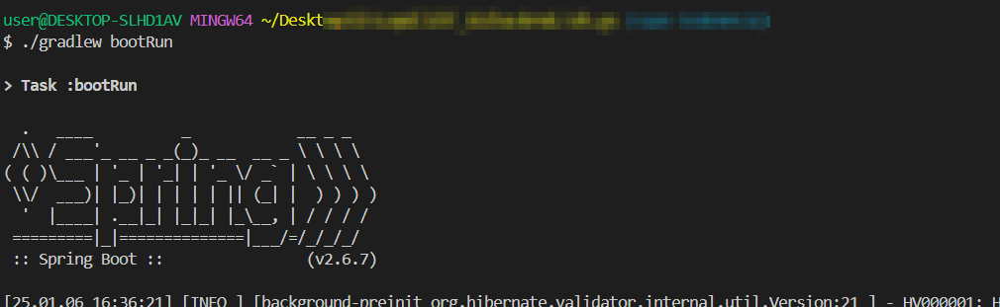

# vsCode 에서 Spring boot 실행(gradle이용)

---

>

## 실행방법

##### 1. VS Code 확장팩 설치 

1. 필수 확장 기능
   1. **[Spring Boot Extension Pack](https://marketplace.visualstudio.com/items?itemName=vmware.vscode-boot-dev-pack)**
   2. **[Gradle for Java](https://marketplace.visualstudio.com/items?itemName=vscjava.vscode-gradle)**
   3. **[Java Extension Pack](https://marketplace.visualstudio.com/items?itemName=vscjava.vscode-java-pack)**
2. 설치 후 VS Code를 재시작

##### 2. Gradle 확인 

1. 해당 프로젝트를 Gradle로 실행하기 위해선 전역으로 gradle 이 설치되어있어야 한다. 

   ```bash
   # 버전 및 설치 확인 
   ./gradlew --version 
   ```

2. gradle 설치 되어있지 않다면 

   1. 나의 경우엔 window여서 `chocolaty`  툴을 이용해 `gradle` 을 설치

   2. **주의할점!!** 

      1. powershell 에서 관리자 권한을 이용해 choco 를 사용해야함

      ```bash
      # window 인 경우 사용
      choco install gradle 
      
      # macOS 인 경우 사용 
      brew install gradle
      ```

3. Gradle Wrapper (`gradlew`)가 없을 경우 설치 명령어 

   ```bash
   ./gradlew wrapper
   ```

4. gradlew.bat vs gradlew

| 파일          | 설명                                              | 실행 환경    |
| ------------- | ------------------------------------------------- | ------------ |
| `gradlew.bat` | Windows에서 Gradle Wrapper 실행용 배치 스크립트   | Windows      |
| `gradlew`     | Linux/macOS에서 Gradle Wrapper 실행용 셸 스크립트 | macOS, Linux |

##### 3. 실행

1. gradle 이용해 spring boot 실행 

   ```bash
   # macOS / Linux 명령어 ( Bash, wsl, cmd 등등)
   ./gradlew bootRun  
   # or
   gradle bootrun
   
   # Windows 명령어 (powershell)
   gradlew.bat bootRun  
   ```



## 빌드 및 실행 명령어 정리 

| 명령어              | 설명                          |
| ------------------- | ----------------------------- |
| `./gradlew bootRun` | 애플리케이션 실행             |
| `./gradlew build`   | 프로젝트 빌드 (JAR 파일 생성) |
| `./gradlew clean`   | 빌드 폴더 정리                |
| `./gradlew test`    | 테스트 실행                   |

---

## 발생 에러 (gradle-wrapper.jar)

##### 에러 내용

1. **`gradle-wrapper.jar` 파일이 손상되었거나 존재하지 않아서 발생**하는 문제

```
Error: Could not find or load main class org.gradle.wrapper.GradleWrapperMain
Caused by: java.lang.ClassNotFoundException: org.gradle.wrapper.GradleWrapperMain
```

##### 해결 방법

1. `gradle-wrapper.jar` 파일 확인

   1. 프로젝트 루트에서 다음 명령어 실행

   2. `gradle-wrapper.jar` 파일이 없거나 크기가 0이라면  손상되었거나 삭제된 상태이므로 다시 다운로드해야 한다. 

      ```bash
      ls -l ./gradle/wrapper/
      
      # 정상적인 경우:
      -rw-r--r--  1 user  staff  123456  1월  3 12:34 gradle-wrapper.jar
      -rw-r--r--  1 user  staff     123  1월  3 12:34 gradle-wrapper.properties
      ```

2.  `gradle-wrapper.jar` 강제 재설치

   1. Gradle Wrapper 파일을 다시 생성하려면 **Gradle을 수동으로 실행**해야 합니다.

   2. Gradle이 설치되어 있는지 확인

      ```bash
      ./gradle -v

   3. Gradle이 설치되어있지 않다면 

      1. 나의 경우엔 window여서 `chocolaty`  툴을 이용해 `gradle` 을 설치 

         ```bash
         # window 인 경우 사용
         choco install gradle 
         
         # macOS 인 경우 사용 
         brew install gradle
         ```

   4. **Gradle이 설치되어 있다면:**

      ```bash
      ./gradle wrapper
      ```

   5. 이후 `gradle/wrapper/gradle-wrapper.jar` 파일이 정상적으로 생성되었는지 확인

3. (앞의 방법으로 안될경우) 강제 업데이트 

   1. 만약 `gradle-wrapper.jar`가 계속해서 생성되지 않는다면, 강제로 Gradle Wrapper를 업데이트

      ```bash
      rm -rf ./gradle/wrapper
      ./gradle wrapper --gradle-version 최신버전
      ```

4. 프로젝트 파일 구조 

   ```
   ├── gradlew         # Linux/macOS용 실행 스크립트
   ├── gradlew.bat     # Windows용 실행 스크립트
   ├── gradle
   │   ├── wrapper
   │       ├── gradle-wrapper.jar
   │       ├── gradle-wrapper.properties
   ```

## 발생 에러(gradle 파일 Lock)

##### 에러 내용

1. choco 이용 gradle설치 안됨

   ```bash
   $ choco install gradle 
   
   Failures
    - gradle (exited 1) - gradle not installed. An error occurred during installation:
    Unable to obtain lock file access on 'C:\ProgramData\chocolatey\lib\63b8' for operations on 'C:\ProgramData\chocolatey\lib\gradle'. This may mean that a different user or administrator is holding this lock and that this process does not have permission to access it. If no other process is currently performing an operation on this file it may mean that an earlier NuGet process crashed and left an inaccessible lock file, in this case removing the file 'C:\ProgramData\chocolatey\lib\63b8' will allow NuGet to continue.
   ```

##### 해결 방법  

1. **powershell  에서 관리자로 명령어 실행**  

2. 위 에러 메시지는 **Chocolatey가 Gradle을 설치하는 동안 파일 잠금(lock)이 발생**했기 때문에 **설치가 실패**한 경우로, 잠금 파일이 다른 프로세스에 의해 차단되었거나 이전에 문제가 발생한 경우, 설치가 진행되지 않는 상황이다. 

   ```powershell
   # powershell 에서 실행 
   choco install gradle
   ```

   

