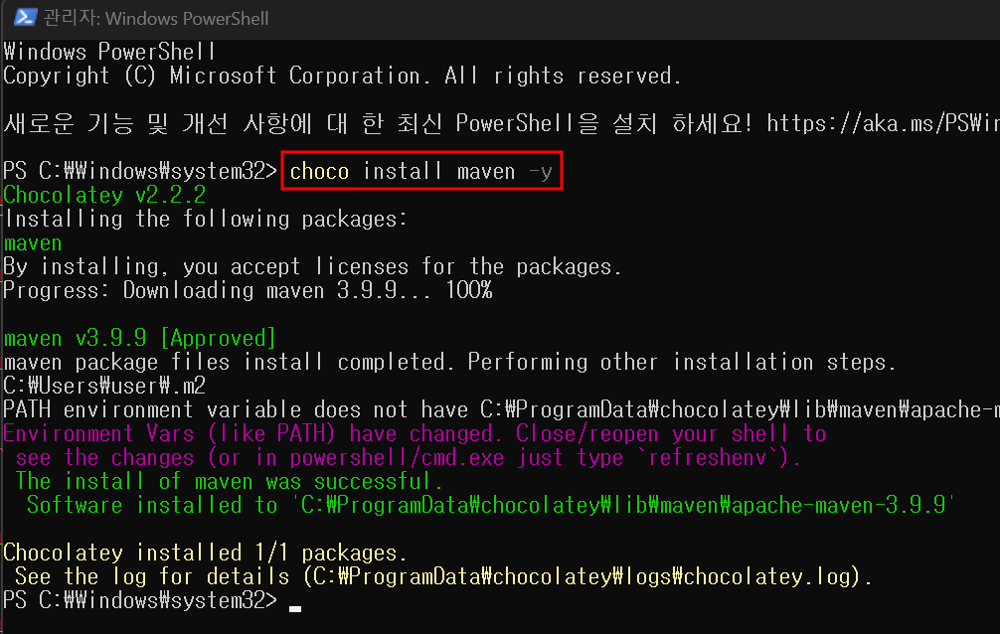

# vsCode 에서 Spring 실행(maven이용)

---

>


## 실행방법

##### 1. vsCode 확장팩 설치

1. "Language Support for Java™ by Red Hat"
2. "Spring Boot Extension Pack"
3. "Maven for Java" 

##### 2. maven 설치 

1. 프로젝트 내에 `mvnw`가 없다면 **전역 Maven을 설치**하고 실행하는 것이 가장 간단한 방법이다. 

   1. 설치는 `choco` 를 이용해 maven을 설치한다. 
   2. 이때 powershell 에서 관리자 권한으로 maven을 설치해야한다. 

   ```powershell
   # macOS
   brew install maven
   
   # Linux
   sudo apt update
   sudo apt install maven
   
   # window 
   choco install maven -y
   ```

2. 설치 확인 

   ```powershell
   mvn -v 
   ```

##### 3. 프로젝트 실행 

1. spring-boot 인 경우 

   1. 프로젝트가 Spring Boot 라면 쉽게 실행 가능하다. (내장되어있는 Tomcat 서버가 있기 때문에)

      ```bash
      mvn spring-boot:run
      ```

2. Spring Framwork 인 경우 

   1. Tomcat 설치 필요 (pom.xml에 tomcat 플러그인 추가)

      ```xml
      <build>
          <plugins>
              <!-- Tomcat 7 Maven 플러그인 -->
              <plugin>
                  <groupId>org.apache.tomcat.maven</groupId>
                  <artifactId>tomcat7-maven-plugin</artifactId>
                  <version>2.2</version>
                  <configuration>
                      <port>8080</port> <!-- 원하는 포트 설정 -->
                      <path>/</path> <!-- 프로젝트를 기본 경로에 매핑 -->
                  </configuration>
              </plugin>
          </plugins>
      </build>
      ```

   2. Tomcat 가동

      ```bash
      # jar 파일로 빌드 -> 프로젝트에서 백엔드로 사용할 포트 번호로 pom.xml의 tomcat port 바꿔야함 
      mvn clean install 
      
      # 빌드된 파일 tomcat에서 실행 
      mvn tomcat7:run
      ```




---

## 발생에러 (mvn: command not found)

##### 에러 내용

1. mvn 설치 후 다음 명령어 입력 

   ```bash
   $ mvn -v
   bash: mvn: command not found
   ```

##### 해결 방법

1. **설치 후 cmd나 powershell , vscode를 껏다 켜야 인식이 됨** 