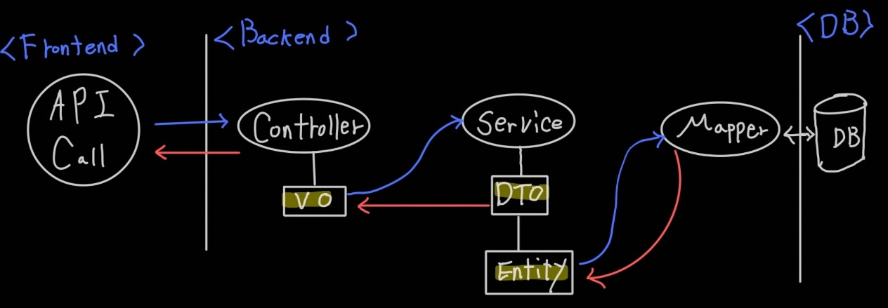

# Entity_DTO_VO 분리 설계와 API 호출 시 흐름 통합 정리

---

>[git repository-springboot Entity DTO Vo](https://github.com/wonyoung0207/SpringBoot_Entity_DTO_VO)

| 항목      | 내용 예시                                                    |
| --------- | ------------------------------------------------------------ |
| 목적      | 유지보수성, 유효성 검증, DB 독립성 위한 리팩토링             |
| Entity    | DB와 직접 연결되는 ORM 객체 역할                             |
| DTO       | Controller ↔ Service 간 전달용 데이터 객체                   |
| VO        | 값 자체를 나타내며 불변, equals/hashCode 구현 필요           |
| 흐름 예시 | 요청 → Controller → Service → DTO 데이터 조작 → Entity 로 변환 후 DB 조회 →  Entity 저장 →  DTO 로 변환후 결과 Controller 로 리턴 → API Call Response 형태로 응답 |
| 주의사항  | DTO에 Entity 로직 넣지 않기, VO와 DTO 혼용 금지 등           |
| 매핑 전략 | ModelMapper, MapStruct, BeanUtils 사용 여부 등               |

## 계층간 역할 구분 목표 

##### 1. Controller 

- API Call 받는 RequestVo 구성 ( Swagger 로 형태 확인할 수 있도록 Vo 구성 필요 )
- Service 이용해 데이터 조회 후 사용자 결과 return 
- Result Vo 생성해 원하는 형태의 swagger 적용 

##### 2. Service

- DTO 객체 이용 데이터 조작
- DB 조회시 Entity 객체 이용 데이터 전달 
- 조건부 로직 이용 재사용 가능하도록 구성 
- 하나의 메소드는 하나의 API Call 만 호출하는 것을 목표

##### 3. Mapper

- Entity객체 이용 DB 쿼리 조회시 필요한 파라미터 전달 
- 결과 Entity 객체로 Service 로 전달 

## 객체 역할 

##### 1. Request (VO)

- API Param 을 받는 역할 
- Swagger 설정으로 받아야 하는 값의 형태를 규정 할 수 있음 

##### 2. DTO

- 필요한 데이터 형태로 변형하는 역할 
- **재사용**을 위해 Extends 로 구현 

##### 3. Enum

- 규칙으로 정해져 있는 값들을 정규화 하는 역할
- 다른 곳에서 해당 형태의 값이 필요하면 Enum 이용해 값을 정규화 할 수 있음  

##### 4. Entity (VO)

- DB 조회시 필요한 Parameter 로 사용 & DB 조회 결과를 받는 Result 객체로 사용 
- DTO 를 이용해 Service 단에서 형태를 변형해 데이터 가공

##### 5. Response (VO)

- API Response 를 나타내는 역할 
- Swagger 설정으로 결과값에 대한 형태 표출 가능 