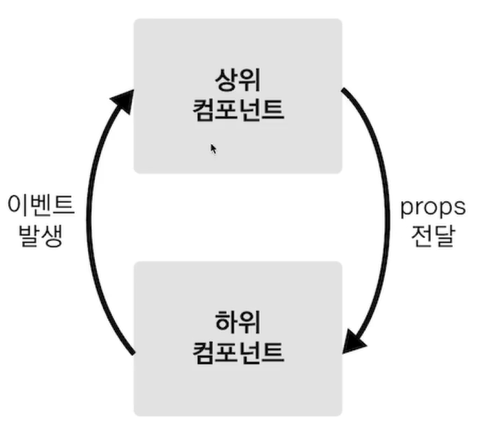

# Props와 Emit  개념정리 

---

>



## Props

### 정의

- vue는 컴포넌트라는 것들의 집합으로 이루어진다. 
  - 따라서 상위 컴포넌트 - 하위 컴포넌트 의 구조를 가진다. 
  - **가장 상위의 컴포넌트는 \<Root>** 이고 해당 컴포넌트 안에 여러 하위 컴포넌트들이 올 수 있다. 
- 이때 **'상위 -> 하위' 컴포넌트**로 **데이터를 전달**할 때 사용하는 속성이 Props이다. 

```html
<!-- <app-header v-bind:프롭스 속성 이름="상위 컴포넌트의 데이터 이름"></app-header> -->
<app-header :myprops="name">     </app-header>
<!-- 상위에서 myprops 라는 이름으로 app-header 컴포넌트로 name 값을 넘겨줌  -->
<!-- 하위 컴포넌트는  myprops라는 props로 데이터를 받는다.   -->

<script>
    var appHeader = {
        template : '<h1> {{ myprops }} </h1> ',
        props : 
        ['myprops']// root 로 부터 받은 데이터 
    }

    new Vue({ // root 컴포넌트 
        el : '#app',
        components : {
            'app-header' : appHeader, // root 밑의 하위 컴포넌트 
        },
        data : {
            'name' : 'wony',
        }
    })
</script>
```

### props의 데이터 옵션

- props를 받을 때 여러가지 옵션을 설정할 수 있다. 

  - 값이 들어와서 뿌려질때 **에러를 발생하는 것이 아닌 console 창에 warnning 이라고 표시**해준다. 

- 옵션 종류

  1. 타입
  2. 필수값 여부
  3. 디폴트값
  4. validation 체크

  ```js
  export default {
      props : {
          name : {
            type : String, 
            required : true,
         	  default : '0',
            validator : function(value){
                return value ==='1' || value ==='0'
            }  
          },
      }
  }
  ```

## props 내리는 방법

- 상위 컴포넌트 

  ```vue
  <template>
  	<div>
          <!-- 1. 개별 데이터로 props 내려주는 방법  -->
          <learning-resource 
             v-for ="res in storeResources" 
             :key="res.id" 
             :title="res.title" 
             :description="res.description" 
             :link="res.link"
      	>
      	</learning-resource>
          
          <!-- 2. 객체로 props 내려주는 방법 -->
          <learning-resource
             :resources="storeResources"
         	>    
      	</learning-resource>
      </div>
  </template>
  
  <script>
  import LearningResource from './components/learning-resources/LearningResource.vue';
  
  export default{
      components :{
          LearningResource
      }
      data(){
          return {
           	storeResource : [
                  {
                      id : "a",
                      title : "aTitle",
                      description : "Text ...",
                      link : "google.com"
                  },
                  {
                      id : "b",
                      title : "bTitle",
                      description : "Text ...",
                      link : "naver.com"
                  }
         		]   
      	}
      }
  }
  </script>
  ```

- 하위 컴포넌트 

  ```vue
  // 하위 컴포넌트 
  <template>
  	<!-- 1번방법 -->
  	<div>
          id : {{ id }}
          titile : {{ title }}
          description : {{ description }}
          link : {{ link }}
      </div>
  
  	<!-- 2번방법 -->
      <div
         v-for ="res in storeResources" 
         :key="res.id" 
         :title="res.title" 
         :description="res.description" 
         :link="res.link"
      >
      </div>
  </template>
  <script>
  	export default{
          // 1번방법 
          props : ['id', 'title', 'description', 'link'];
          
          // 2번방법
          props : ['resources'];
      }
  </script>
  ```


---

## Emit

### 정의

- Props와 반대로 **'하위 -> 상위' 컴포넌트**로 **데이터를 전달** 할 때 사용하는 속성이다. 

```html
<!-- <app-header v-on:하위 컴포넌트에서 발생한 이벤트 이름="상위 컴포넌트의 메서드 이름"></app-header> -->
<app-content @add="increaseNum"></app-content>  <br> 
<!-- 상위 컴포넌트 -> emit으로 올라온 이벤트를 받아서 increaseNum 메소드 실행 -->
<!-- add 는 하위 컴포넌트에서 발생한 이벤트, increaseNum은 상위 컴포넌트 Root 의 메소드 이다. -->
<script>
    var appContent = {
        template : '<button @click="addNum"> abb number</button>', // 하위 컴포넌트 
        methods : {
            addNum(){
                this.$emit('add');// add 라는 이름으로 이벤트 올리기 
            }
        }
    } 
    new Vue({ // root 컴포넌트 
        el: "#app",
        components : {
            'app-content' : appContent,
        },
        data : {
            'num' : 10,
        },
        methods: {
            increaseNum(){
                this.num = this.num + 1;
            }
        },
    })
</script>
```

