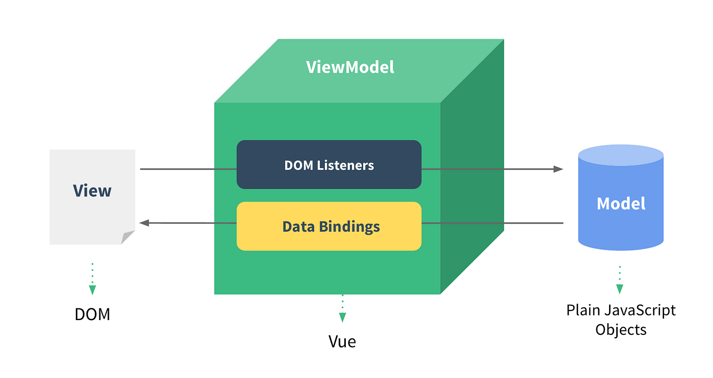
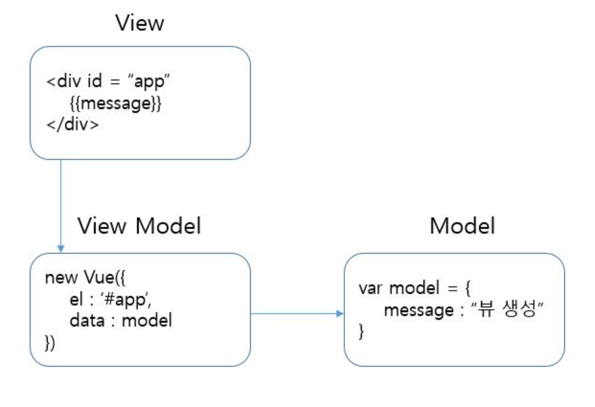
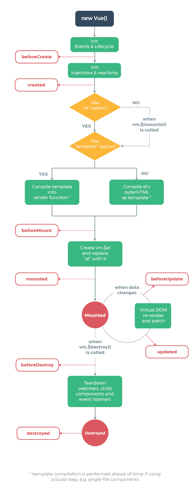

# Vue 개념정리 

---

>[참고 사이트1](https://velog.io/@bkdragon0228/Vue.js-Vue.js%EB%9E%80)
>
>[참고 사이트2](https://seungwongo.medium.com/vue-js-%EB%9E%80-8f865b34e53d)
>
>[참고 사이트3](https://wikidocs.net/17701)
>
>[Vue js 웹 서비스 개발에 필요한 지식 정리 공간](https://joshua1988.github.io/vue-camp/textbook.html)


## Vue

### 정의

- 웹 페이지 화면(**프론트엔드**)을 개발하기 위한 javascript **프레임워크**	
- React와 Angular 의 장점을 합쳐놓은 MVVM(Model - View - ViewModel ) 모델을 사용한다. 
- vue는 web-app 을 만들 떄 사용한다. 
  - **web-app 은 app처럼 부드럽게 전환되는 web 사이트**를 뜻한다. 
  - 리액트와 angular 의 특징을 가진다.  



### 동작 방법

1. **view**에서 일어나는 이벤트를 **Dom Listener**가 **감지**하고 **Model에 해당 사항을 반영**한다. model은 자바스크립트이다. 
2. 이때 model 의 값이 **바인딩되어있어 Vue의 Data Binding**이 일어난다. 
3. 데이터바인딩이 일어나면 **view의 내용이 자동으로 변경**된다.
4. **따라서 vuejs는 view와 model사이에서 Dom Listener 와 Data Binding을 처리한다.** 

### Vue의 목적

- **웹의 장점과 앱의 장점을 모두 수용할 수 있는 진화된 웹앱 애플리케이션을 만들수 있는 프레임워크를 제공**하는 것 
- **Angular** 
  - **데이터 바인딩** 에 대한 장점 ( Data Bindings )
  - **기존에 Javascript**는 웹화면에서 데이터와 이벤트로 인해 화면의 요소가 변해야할 때 해당 값을 처리하기 위해 사용되었다. 
    - 이에 대해 중복코드와 복잡한 자바스크립트 로직을 개발자가 하나하나의 페이지마다 구현해줘야했다. 
    - 이것을 해결하기 위해 나온것이 데이터 바인딩 개념이다. 
  - 예를들어 a라는 변수를 사용해 구현한 HTML 요소가 여러개 있다면, 데이터 바인딩 개념으로 인해 하나의 a값이 변하면 다른 a값들로 만든 요소들도 모두 변하게 된다.
- **React** 
  - **Virtual Dom** 에 대한 장점 ( Dom Listener )
  - 데이터 바인딩에 따른 잦은 페이지 로딩(Dom 트리구조 갱신)으로 인한 성능저하를 해결하고자 나온개념이 Virtual Dom 개념이다. 
    - 실제 Dom에서 직접 처리하는것이 아닌, 가상의 DOM을 만들어서 메모리에서 처리를 한 후 실제 DOM과 동기화하는 방식으로 처리 
  - 따라서 가상Dom과 실제Dom 을 비교하고, 가상돔에서 변경된 부분만 실제돔에 적용하여 부분처리한다. 

### 단방향 데이터 바인딩  vs 양방향 데이터 바인딩 

- 단방향 데이터 바인딩
  - 화면에 보이는 데이터와 브라우저 메모리에 있는 데이터를 일치시키는 것
- 양방향 데이터 바인딩 
  - 데이터의 변화를 감지해 템플릿과 결합해 **화면을 갱신**, 화면의 입력에 따라 **데이터를 갱신**하는 것

### React 와 Vue 차이점 

- **리액트**는 라이브러리이고 **Vue**는 프레임워크이다. 
  - 두가지의 차이를 간단하게 설명하면 **제어 흐름에 대한 주도성**이다. 
- **프레임워크**는 **전체적인 흐름을 스스로 쥐고 있으며** 사용자가 그 안에서 필요한 코드를 짜 넣고 
- **라이브러리**는 **사용자가 전체적인 흐름을 만들며** 라이브러리를 가져다 쓰는 것이다. 
- 쉽게 말해 프레임워크는 **틀**, 라이브러리는 **도구**인 것

### 용어

| 용어                        | 설명                                                         |
| --------------------------- | ------------------------------------------------------------ |
| 뷰(View)                    | 화면의 요소가 변경되거나 조작이 일어날 때 즉각적으로 반응하여 화면의 데이터를 갱신하여 보여주는 역할 |
| 돔(DOM)                     | HTML 문서에 들어가있는 모든 요소의 정보를 담고 있는 데이터 트리 |
| 돔 리스너(DOM Listener)     | 돔의 변경 내역에 대해 즉각적으로 반응하여 특정로직을 수행하는 장치 (Virtual Dom 의 특징) |
| 모델(Model)                 | 데이터를 담는 용기. 보통은 서버에서 가져온 데이터를 자바스크립트 객체형태로 저장 |
| 데이터 바인딩(Data Binding) | 뷰에 표시되는 내용과 모델의 데이터 동기화                    |
| 뷰모델(ViewModel)           | 뷰와 모델의 중간영역. **돔 리스너**와 **데이터 바인딩**을 제공하는 영역 |

### 특징 

1. **SPA** (Single Page Application ) 이다. 
   - 단일 페이지 어플리케이션 이라고도 한다. 
   - 제일 처음 웹사이트에 접속했을때, 웹사이트 전체에 필요한 모든 웹 자원(자바스크립트, CSS, 이미지 등)을 서버로 부터 가져와서 로딩한다. 
     - 그 후 페이지의 이동이 일어나게 되면 모두 재로딩 하는것이 아닌 **변경된 부분만을 다시 로딩**한다. 
   - 따라서 페이지 **전환 속도가 굉장히 빠르고**, 이미 로딩된 자원을 다시 서버로 부터 받아 올 필요가 없기 때문에 **웹 자원을 굉장히 효율적으로 관리**할수 있게 된다. 
2. Angular 의 **데이터 바인딩** 특징을 가져옴 
   - 데이터 바인딩이란, **데이터**와 **웹화면의 요소(HTML DOM)**가 서로 **양방향으로 연결**이 되어 있어서 어느 한쪽에 변경이 일어나면 연결되어 있는 **다른쪽에 자동으로 반영이 되는 것**을 의미
3. React의 **Virtual Dom** 특징을 가져옴 
   - Virtual Dom이란, DOM 문서를 추상화하여, **변화가 많은 화면**(View)을 DOM에서 직접 처리하는 방식이 아닌, **가상의 DOM**을 만들어서 **메모리에서 처리**를 한 후 **실제 DOM과 동기화** 한다. 
4. MVVM 패턴 사용
   - **M**odel-**V**iew-**V**iewModel의 약자
   - View와 Model 중간에 ViewModel을 둠으로써 데이터 바인딩 처리 및 가상 DOM을 통한 성능 및 개발의 편의성을 제공
5. Component 개념 사용
   - 컴포넌트란, Vue로 개발된 파일(.vue) 하나 하나를 뜻한다. 
     - 하나의 컴포넌트는 HTML+CSS+Javascript로 이루어져 있고, 다른 컴포넌트에서 import해서 바로 사용할 수 있다.
     - 예를들어, 다른곳에서도 반복되는 UI 부분( nav 바 )을 재사용할 수 있도록 하나의 vue파일로 만든것이Component 이다. 
   - 이러한 컴포넌트 개념을 사용해 **코드의 재사용성**을 늘렸다. 

### MVVM 패턴 이란?

- **M**odel-**V**iew-**V**iewModel의 약자
  - Model
    - 데이터를 가지고 운반하는 역할
    -  HTML 에서 JavaScript로 변수 생성 후 사용 
  - View
    - 사용자에게 보여주는 화면
    - html 태그를 뜻함 
  - ViewModel
    - Model 와 View 를 연결해주는 역할 
    - new Vue 를 사용한다. 

### 사용예시



```vue
<div id = “app”> <!-- vue로 연결할 태그 -->  
    {{message}} 
</div>

<script>
var model = { // 데이터로 사용할 값 생성 
    message : “뷰 생성”
}

 new Vue({ // vue 인스턴스 생성 
    el : ‘#app’, // 연결할 태그 이름 
    data : model // 연결할 데이터 이름 
})

</script>
```

- Vue 인스턴스 생성 
  - new Vue로 객체 생성
  - 객체 안에서 옵션을 설정하여 vue인스턴스와 태그를 연결한다. 
- vue 옵션 
  1. el
     - 태그에 지정한 (ID, 클래스명, 태그명)으로, **해당 태그와 vue 인스턴스를 연결**하는 옵션이다. 
  2. data
     - key와 value를 지정하는 json형식으로 데이터 입력 옵션이다. 
- vue와 html 태그를 연결하면 
  - html엘리먼트 내에서 vue의 기능(특징인 React와 Angular )을 사용할 수 있다.
  - 데이터 바인딩과 Dom Listener 효과를 사용할 수 있게 됨 

### vue 컴포넌트 

- 화면의 영역을 구분하여 개발할 수 있는 뷰의 기능 
- 컴포넌트 기반으로 화면을 개발하면 '재사용성으로 인해 빠르게 화면을 제작' 할  수 있다. 
- 영역을 구분했을 때 컴포넌트 간 관계가 생기게 된다. 

### 라이프사이클



- Vue 인스턴스는 크게 **생성**(create)되고, DOM에 **부착**(mount)되고, **업데이트**(update)되며, **없어지는**(destroy) 4가지 과정을 거친다.
  - 이 과정에서 Vue는 각각의 단계에서, Vue를 사용하는 사람들을 위해 **훅(Hook)**을 할 수 있도록 API를 제공한다.
  - 일반적으로 많이 사용하는 종류로는 `beforeCreate`, `created`, `beforeMount`, `mounted`, `beforeUpdate`, `updated`, `beforeDestroy`, `destroyed`가 있다.

### vue 인스턴스

- 컴포넌트를 new 를 이용해 생성한 경우 
  - 인스턴스를 생성하면 Root 컴포넌트가 된다. 
  - 따라서 가장 상위컴포넌트로 **\<Root> 가 있고, 컴포넌트를 추가하면 \<Root> 밑으로 하위 컴포넌트들이 추가**된다. 


### Vue 인스턴스 속성

```js
new Vue({
    el : , 
    templated : ,
    data : ,
    methods : ,
    computed : ,
    created : ,
    mounted : ,
    router : ,
    watch : , 
})
```

### 컴포넌트 통신 

- 상위 -> 하위 : props로 데이터 내려줌 
- 하위 -> 상위 : 이벤트를 통해 데이터 올려줌 
