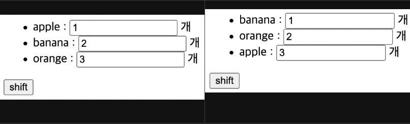

# in-place-patch 전략

---

>[참고 사이트1](https://mine-it-record.tistory.com/657)
>
>[참고 사이트2](https://goodteacher.tistory.com/525)

## in-place-patch

### 정의

- Vue는 메모리를 아끼기 위해서 DOM 최적화를 통해 DOM을 재사용 한다. 
  - 이 과정에서 **in-place patch** 전략이라는 것을 사용한다. 
- patch는 일종의 "땜빵" 을 의미하고 in-place는 현재 지점에서를 의미한다.
  - 따라서 in-place patch 전략이란, **현재 DOM에서 바뀌어야할 부분**만 땜빵해서 **처리**하고 **DOM을 재사용**한다는 내용이다.


### 사용되는 곳 

- v-for 사용시 key 를 바인딩해야 한다. key를 바인딩하는 이유는 in-place-patch 전략떄문이다. 
  - 이때 key는 반드시 고유값이여야 한다 .

### 예시

- 밑의 예시에서 li 태그가 반복적으로 생산이 되는데, 해당 태그안에는 크게 2가지의 내용이 들어가게 된다. 

  1. item 
  2. input 태그 

- 예를들어 item의 값이 변경되었을 경우, 

  1. key를 바인딩 하지 않는다면 
     - vue는 현재 Dom에서 변경해야 할 부분인 item 의 값만 바꾸게 된다. 
     - 이때 li 태그의 item 에따라 위치를 변경하는 이벤트가 발생한다면 
     - item 과 함께 뒤에있는 input 태그가 같이 이동하지 않고 item 만 위치가 변경된다. 
     - 즉, 반복문사용시 이 두개의 내용이 따로노는 상황이 발생할 수 있다. 
  2. key를 바인딩한 경우
     - item과 input이 하나의 key 로 묶어 만약 item에 따라 위치가 변경되면 input도 함께 위치가 바뀐다. 

  ```vue
  <li v-for="p in people" :key="item + '-' + item.age">
      {{item}} : <input type="number" /> 개
  </li>
  ```

  - key 바인딩 하지 않았을 떄의 예시 
    - 앞에있는 item 값의 위치만 변경되고 input 태그의 값들은 위치가 변경되지 않는다. 

  

### 결과

- Vue가 **각 노드의 ID를 추적하고 기존 요소를 재사용하고 재정렬할 수 있도록 힌트를 제공하려면 각 항목에 대해 고유한 키 속성을 제공**해야한다. 

