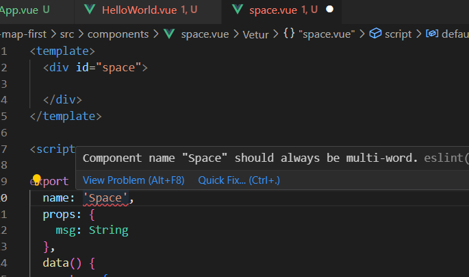
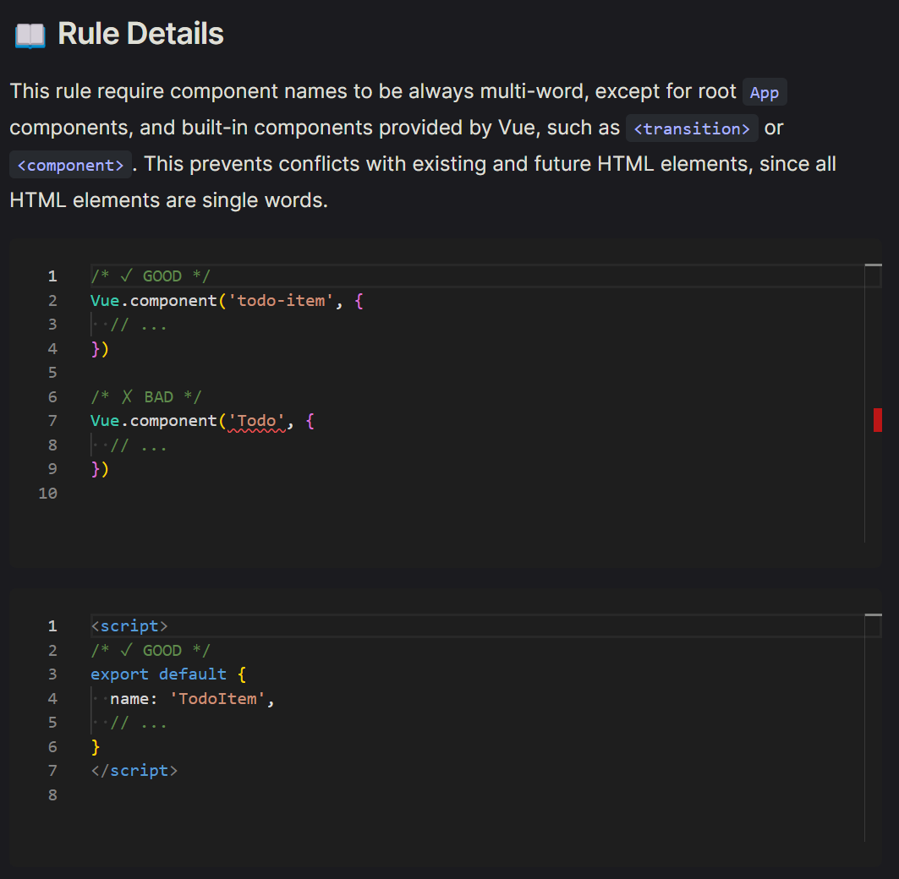

# vue Error [Component name should always be multi-word]

---

>[참고 사이트1](https://velog.io/@uxolrv/%EC%97%90%EB%9F%AC-%EC%9D%BC%EC%A7%80-Component-name-should-always-be-multi-word)

## 문제 

1. vue 파일 생성시 컴포넌트 이름에 대한 문제 

   1. `Component name should always be multi-word.`

   

2. 컴포넌트의 이름이 항상 여러 단어로 구성되어 있어야 한다고 한다.

## 원인 



1. [eslint-plugin-vue 공식문서](https://eslint.vuejs.org/rules/multi-word-component-names.html#vue-multi-word-component-names)에서 에러를 발생시킨 `vue/multi-word-component-names` 룰을 보면, 
2. **단일 단어로 구성된 HTML 엘리먼트와의 충돌을 방지하기 위해** vue에서 제공하는 빌트인 컴포넌트를 제외한 컴포넌트의 이름은 항상 여러 단어로 구성되어야 한다고 한다.

## 해결 

1. 단일 단어가 아닌 **다중 단어**로 이루어진 이름을 사용

   1. 이때 주의할점은  카멜 케이스든, 파스칼 케이스든, 케밥 케이스든 네이밍 컨벤션에 따라 단어를 구분해줘야만 여러 단어로 인식한다. 
   2.  Vue에서 보편적으로 사용되는 네이밍 컨벤션은 단어의 첫 글자를 대문자로 표기하는 **파스칼 케이스**이다.

   ```vue
   export default {
     name: 'SpaceWy',
     props: {
       msg: String
     },
   }
   ```

   