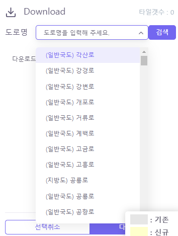
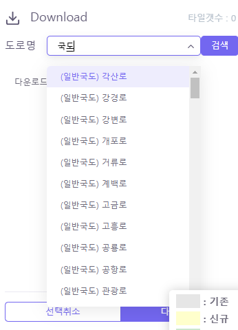

# vue 검색Store 기능개발(vue-select 라이브러리)

---

>[vue-select 라이브러리 - NPM](https://www.npmjs.com/package/vue-select)

## vue-select 

1. Vue.js를 위한 **유연하고 사용하기 쉬운 셀렉트 드롭다운 컴포넌트**를 제공하는 오픈소스 라이브러리
2. 검색 기능, 다중 선택, 비동기 데이터 로딩 등을 포함한 고급 기능을 제공한다. 

## 핵심기능

1. **vuexy Store 사용**
   1. 데이터 전역 관리 
2. **vue-select 라이브러리 사용**
   1. 검색시 미리보기 데이터 제공 
   2. 검색결과 없을시 텍스트 제공 
   3. options에서 선택한 데이터는 Object 형태로 v-model과 연결
   4. vuetify 에 있는 v-select 와는 아예 다르기 때문에 주의 필요 
3. bootstrap-vue 의 Grid 사용
   1. 화면 동적 변환 제공 
4. CSS 
   1. Bootstrap 의 SM 스타일 적용
   2. vue-select 는 vuexy Template와는 Style이 다르기 때문에 수동으로 맞춰줘야 한다. 

## 이용방법

1. select 박스를 클릭한다. 
2. 찾고싶은 도로명을 입력한다. 
   1. store에 있는 데이터들중 자동으로 검색되어 표출된다.  
3. 도로를 선택한다. 
   1. 선택한 도로정보가 Object 형태로 v-model 에 입력된다. 
4. 검색을 누르면 도로 타일이 추가된다. 

## 결과화면 



## 코드

```vue
<b-card-title class="mb-1">
  <b-row align-v="center">
    <b-col cols="2" class="pr-0">
      <h5 class="m-0">도로명</h5>
    </b-col>
    <b-col cols="10" class="pr-0">
      <b-row>
        <b-col cols="9" class="pr-0 text-right">
          <b-form-group class="input-group-merge m-0" variant="outline-primary">
            <v-select
              v-model="selectedRoadName"
              :options="storeTiles"
              label="text"
              placeholder="도로명을 입력해 주세요."
              clearable
              @input="changeRoadLevel"
              class="small-select"
            >
              <template #no-options>
                <div class="no-options-message">
                  검색 결과가 없습니다.
                </div>
              </template>
            </v-select>
          </b-form-group>
        </b-col>
        <b-col cols="3" class="pl-0">
          <b-button size="sm" variant="primary" @click="doSearchTile">검색</b-button>
        </b-col>
      </b-row>
    </b-col>
  </b-row>
</b-card-title>

<script>
import vSelect from 'vue-select'

setup(props, context) {
    // 전체 도로 타일 Store
    const storeTiles = computed(() => {
      return store.state.tile.DBTileArr
    });

    // 타일 스토어 저장 
     store.commit('tile/setDBTileArr', tiles);         
}
</script>

<style scope >
.small-select{
  height: 2.142rem;
  font-size: 0.857rem;
}
</style>
```

```js
// vuexy Store - index.js
export default {
    namespaced: true,
    state: {
        DBTileArr: [],
    },
    getters: {
        getDBTileArr(state) {
            return state.DBTileArr
        },
    },
    mutations: {
        setDBTileArr(state, val) {
            state.DBTileArr = val
        },
    },
    actions: {

    }
}
```

