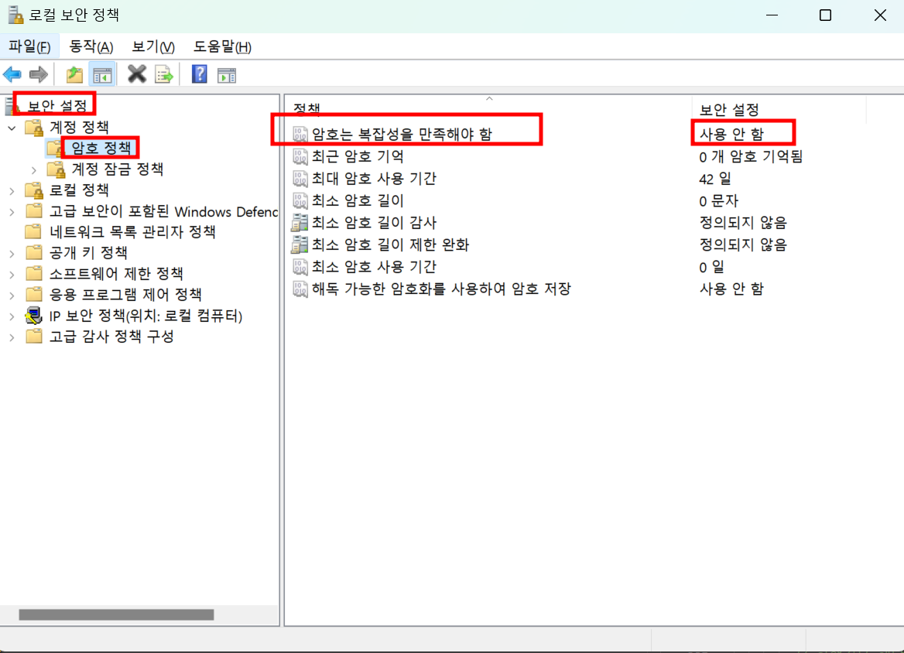

# Window 11 비밀번호 변경시 "암호는 복잡성 만족해야 함" 문제

---

>[참고 사이트1](https://blog.naver.com/vtechpia/221230340609)
>[참고 사이트2](https://xbb123.tistory.com/135)

## 비밀번호 정책

- 기본적으로 윈도우는 **비밀번호 정책이 활성화** 되어 있다. 
- 비밀번호 변경시 대소문자 섞기, 8자리 이상 등등의 비밀번호 정책이 존재한다. 
- 따라서 원하는 비밀번호로 변경하기 위해선 해당 기능을 **비활성화** 해줘야 한다. 

## 방법

1. "윈도우 키 + R " 

   1. 실행창 띄우기 

2. secpol.msc 입력

3. 계정 정책 -> 암호 정책 들어가기 

   1. "암호는 복잡성을 만족해야 함" 을 "사용 안 함 " 으로 변경 

   

4. 정책 업데이트 

   1. CMD 창을키고 다음 명령어 입력 

      ```cmd 
      gpupdate /force
      ```

      