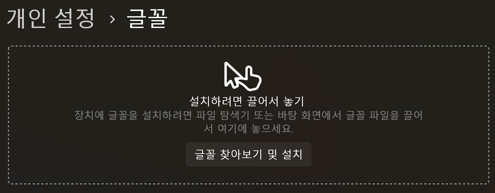
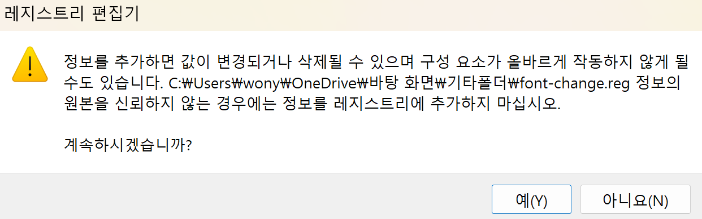
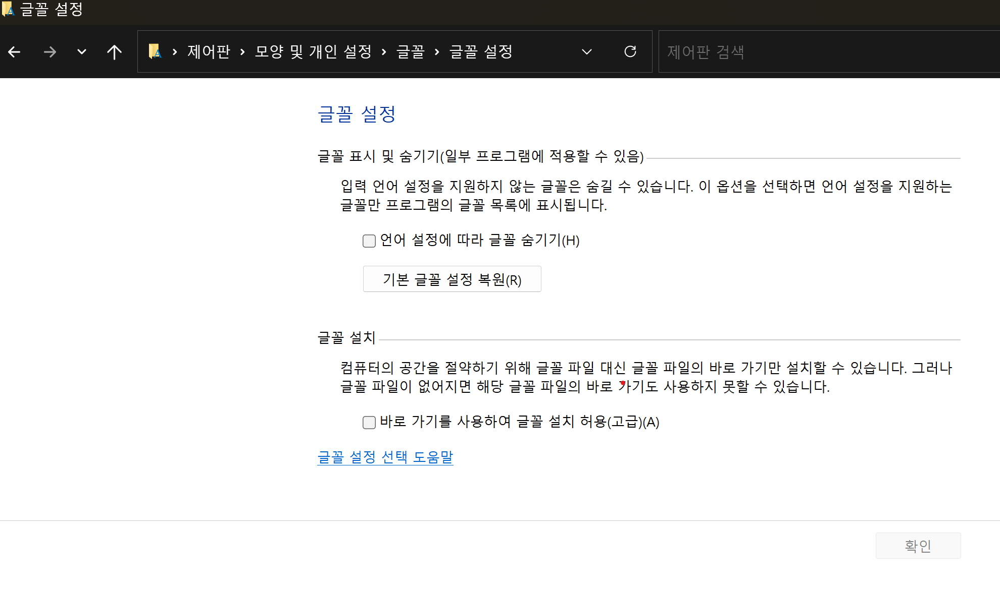

# window 기본 폰트 변경

---

> 윈도우 11 에서 기본 폰트를 바꾸려면 레포지토리를 변경해야 한다. 

## 방법

1. 먼저 사용하고자 할 폰트를 다운받는다. 

   - 네이버나 google 에 서치하면 된다. 
   - 폰트는 .ttf 파일을 사용할 것이다. 
   - 여기서는 네이버의 "나눔스퀘어 Bold.ttf" 를 사용할 것이다. 

2. 다운받은 폰트 파일인 .ttf 를 더블클릭하거나 "window - 설정 - 개인설정 - 글꼴 " 로가서 .ttf 파일을 올려놓는다. 

   

   - ttf 파일을 가져다 놓으면 자동으로 설치된다. 

3. 메모장에 해당 내용 복사 붙여넣기 

   ```
   Windows Registry Editor Version 5.00
   
   [HKEY_LOCAL_MACHINE\SOFTWARE\Microsoft\Windows NT\CurrentVersion\Fonts]
   "Segoe UI (TrueType)"=""
   "Segoe UI Bold (TrueType)"=""
   "Segoe UI Bold Italic (TrueType)"=""
   "Segoe UI Italic (TrueType)"=""
   "Segoe UI Light (TrueType)"=""
   "Segoe UI Semibold (TrueType)"=""
   "Segoe UI Symbol (TrueType)"=""
   
   [HKEY_LOCAL_MACHINE\SOFTWARE\Microsoft\Windows NT\CurrentVersion\FontSubstitutes]
   
   "Segoe UI"="NEW_FONT"
   ```

4. 메모장 파일 수정 및 파일 형태 변경

   - 메모장 파일 내용 수정

     - 맨 밑에있는 NEW_FONT 란에 자신이 사용할 폰트 이름을 정확히 기입한다. 
     - 여기서는 "나눔스퀘어 Bold" 로 작성할 것이다. 

     ```
     Windows Registry Editor Version 5.00
     
     [HKEY_LOCAL_MACHINE\SOFTWARE\Microsoft\Windows NT\CurrentVersion\Fonts]
     "Segoe UI (TrueType)"=""
     "Segoe UI Bold (TrueType)"=""
     "Segoe UI Bold Italic (TrueType)"=""
     "Segoe UI Italic (TrueType)"=""
     "Segoe UI Light (TrueType)"=""
     "Segoe UI Semibold (TrueType)"=""
     "Segoe UI Symbol (TrueType)"=""
     
     [HKEY_LOCAL_MACHINE\SOFTWARE\Microsoft\Windows NT\CurrentVersion\FontSubstitutes]
     
     "Segoe UI"="나눔스퀘어 Bold"
     ```

   - 파일 수정 

     - 메모장에서 "다른이름으로 저장 " 을 선택해서 파일의 이름을 ".reg" 로 변경후 "파일형식" 에서 "모든파일" 을 선택한다. 
     - 변경사항을 저장하고 파일위치를 확인한다. 

5. 레포지토리 파일 실행 

   - 작성한 .reg 파일을 더블클릭 하거나 "마우스 오른쪽 - 열기 " 를 눌러 실행한다. 

   - 이때 레포지토리는 시스템에 영향을 줄 수 있는 중요한 파일 이므로 주의를 요한다 .

   - 다음 팝업창이 뜨면 "예" 를 누르고 시스템을 재부팅한다.  

     

## 기본글꼴 원상복구 하기 

> 기본글꼴을 다시 원복하고 싶다면 제어판을 이용하면 된다. 

1. 윈도우 버튼 - 제어판 - 글꼴 검색 - 글꼴 설정 으로 이동한다. 

   

2. "기본 글꼴 설정 복원" 을 클릭해 복구한다. 
