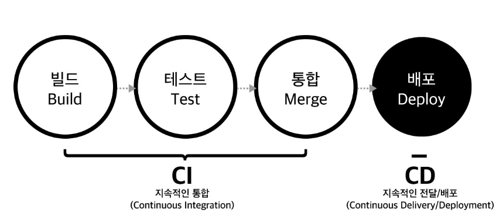

# CI/CD 개념정리 

---

>

## CI/CD

### 정의

1. CI/CD는 **지속적 통합**(CI), **지속적 서비스/지속적 배포**(CD) 를 뜻한다. 
2. CI ( **Continuous Integration** )
   1. 어플리케이션의 새로운 코드 변경 사항이 정기적으로 빌드 및 테스트 되어
      공유 레포지토리에 통합히는 것을 의미
3. CD ( **Continuous Delivery & Continuous Deployment** )
   1. 지속적 서비스 와 지속적 배포가 포함된 언어이다.

### CI/CD 등록

1. Github 
   1. Action 에서 해당 기능을 사용할 수 있다. 
2. GitLab
   1. CI/CD 목록에서 파이프라인을 등록할 수 있다. 
3. Teamcity 

## Teamcity 

1. CI/CD 를 하기 위한 도구(플랫폼)
   1. 개발자가 코드 변경사항을 저장소에 푸시할 때마다 **자동으로 테스트하고, 빌드하고, 배포하는 파이프라인을 구성**할 수 있는 플랫폼이다. 
2. 크게 2가지 구조로 구성된다. 
   1. Teamcity Web 
   2. Teamcity Agent 
3. **Teamcity Web** 
   1. 자동화할 작업들을 설정
   2. VCS 설정, Build Step, Tiggers 같은 작업을 하는 공간 
4. **Teamcity Agent** 
   1. 자원을 사용할 수 있는 **서버** 라고 생각하면 된다. 
   2. Teamcity Web에서 설정한 VCS 같은 일들을 Agent 에다가 위임하고, Build 같은 여러 작업을 Agent 가 처리하게된다. 

### Teamcity Web

1. VCS (Version Control System )
   1. **코드 저장소와의 통합을 관리한다.**
   2. 즉, **git, gitLab 같은 코드 저장소**를 TeamCity 프로젝트에 연결하는 설정이다. 
   3. 저장소 URL, 인증 정보, 브랜치 규칙 등을 지정할 수 있다. 
2. Build Step
   1. 빌드 프로세스에서 수행될 개별 작업들을 정의한다. 
   2. 즉. 여러 빌드 도구(Gradle or Maven) 와 스크립트를 실행하는 단계들을 설정하는 곳 
   3. 예를들어, 커맨드 라인 스크립트 실행, Maven, Gradle, Ant, Docker Image화 등 다양한 빌드 도구와의 통합이 가능합니다.
      1. step중 하나에다가 SSH를 이용해 원하는 IP 에서 Command를 실행시킬 수도 있다. 
3. Triggers
   1. 새로운 코드 변경 사항이 저장소에 푸시되었을 때, 자동으로 빌드를 시작하도록 설정하는 곳 
   2. 즉, 트리거처럼 이벤트 발생시 Teamcity 프로젝트를 실행하기 위해 사용된다. 

### Teamcity Agent 

1. **TeamCity 서버에서 할당된 빌드 작업을 실행하는 곳** 
   1. 빌드 작업에는 소스 코드를 가져오고, 컴파일하고, 테스트하고, 아티팩트를 생성하는 모든 단계가 포함될 수 있다.
   2. 서버는 빌드 큐에 작업을 쌓아두고, 에이전트가 사용 가능할 때 작업을 할당한다.
2. AWS 를 사용하는것도 '서버' 용도로 자원을 사용하기 위해서이다. 
   1. Build 및 여러 작업들이 자원을 사용할 수 있는 환경이 필요하고, 물리적 서버가 없다면 클라우드 서버인 AWS 를 이용하는 것도 방법이다. 
3. 즉, 여러 에이전트를 설치하고 **분산 빌드를 통해 병렬로 작업을 처리**하여 빌드 시간을 줄일 수 있게된다. 