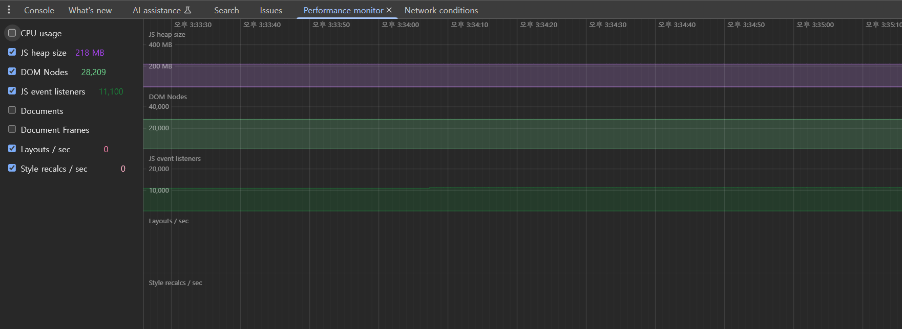
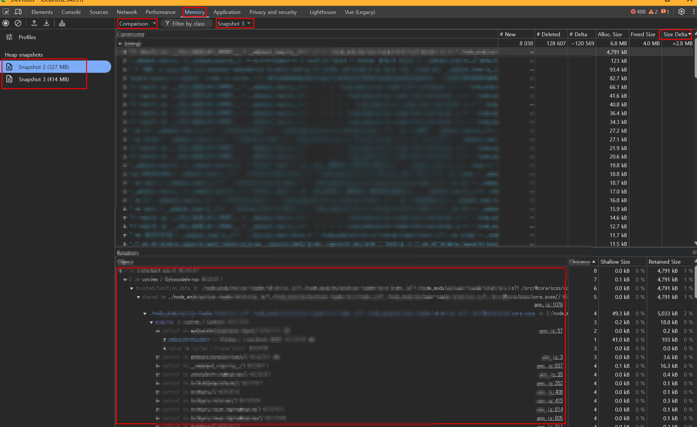

# Chrome 브라우저 OOM 문제 모니터링

---

>

## 문제 상황

1. 프로젝트 진행도중 크롬 브라우저에서 OOM 문제가 발생했다. 
2. 확인결과 `JS Heap Size` 가 지속적으로 증가해 결국엔 크롬 브라우저의 한계인 4GB 까지 가서 OOM을 나타내고 있었다. 

## 모니터링 방법

1. 브라우저 모니터링

   1. `DevTools -> Performance monitoring -> 그래프 이용 증가 여부 확인 `

   

2. 브라우저의 Snapshot 이용 

   1. `DevTools -> Memory -> 초기 snapshot 찍기 -> 문제상황 후 snapshot 찍기 -> 초기 snapshot -> 비교조건 -> 문제상황 후 snapshot 선택 -> Size Delta 증가분 비교 `

   

## snapshot 내용 해석

1. **Alloc. Size**

   - 새로 생성된 객체들이 차지한 Shallow Size의 합
   - “이 타입의 신규 인스턴스들이 얼마만큼 메모리를 잡아먹었는지”를 나타냄
   - **Alloc. Size**가 크다는 건 “객체를 많이 찍어냈다”는 의미이고,

2. **Freed Size**

   - 이 스냅샷 간격 동안 가비지 컬렉션으로 해제된 객체들이 차지하고 있던 Shallow Size의 합
   - **Freed Size**가 클수록 “많이 해제했다”는 뜻

3. **Size Delta**

   - Alloc. Size에서 Freed Size를 뺀 값으로, 실제로 메모리에 더 남은(늘어난) 양
   - 그 결과로 계산된 **Size Delta**가 “얼마만큼 순증가했나”를 나타낸다. 

4. **Distance** (필터를 요약으로 변경 후 봐야한다.)

   - **GC 후보 판단**
     - GC는 “Root에서 도달할 수 없는 객체”들을 해제
     - Distance가 “∞(Infinity)” 혹은 “—” 로 표시되는 객체는, Root로부터 전혀 참조되지 않는 것이어서 GC 대상이 됨
     - 반면 Distance가 1, 2, 3… 등으로 작게 표시될수록 Root에서 가까운(직접 혹은 간접적으로 참조되는) 살아 있는 객체이다. 
   - **메모리 누수 분석 시 우선순위 파악**
     - 메모리 누수가 의심될 때, Distance가 **작은(1·2 정도)** 객체는 “Root에 가까워서 뭔가 계속 참조(hold)되어 있으므로 해제되지 않는 것” 을 의미하기에, **먼저 의심해봐야 할 후보**가 된다. 
   - 즉, Distance 작은순위인것들은 GC 대상으로 잡히지 않는것일 수 있어 OOM시 가장 의심해봐야한다. 

   

## GC 수동 실행

- `performance -> garbage collector` 를 이용해 GC를 수동 실행할 수 있다. 