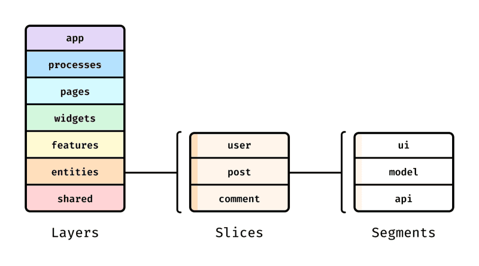

# FSD(프론트엔드 아키텍처)

---

>[FSD 소개 블로그](https://emewjin.github.io/feature-sliced-design/?utm_source=substack&utm_medium=email)
>
>[유튜브 참고 영상](https://www.youtube.com/watch?v=64Fx5Y1gEOA)

## FSD (Feature-Sliced Design) 란 ?

1. **기능 분할 설계** 라고한다. 
2. 프론트엔드 애플리케이션의 **기능 중심 아키텍처 설계 방법론** 이다. 
3. 프론트엔드 프로젝트를 기능별로 나누어 유지보수성과 확장성을 높이고, 팀 간 협업을 효율적으로 만드는 것을 목표로 한다. 
4. 즉, 폴더 구조를 3 뎁스로 고정해 불필요한 뎁스를 최소화하고 기능별로 나눌 수 있게된다. 

## 핵심 이론 

##### 1. 기능 중심 구조

- 프로젝트는 페이지(Page)나 컴포넌트(Component)가 아닌 "기능(Feature)"을 중심으로 구성됩니다.
- 각 기능은 독립적이고, 다른 기능과 느슨하게 결합됩니다.

##### 2. 7계층 아키텍처

1. FSD는 애플리케이션을 다음 7가지 계층으로 나눕니다.
   1. 이 계층들은 프로젝트의 구조와 각 레벨에서 해야 할 작업을 명확히 정의합니다.
   2. processes 나 entities 를 뺀 5계층 구조로 사용하기도 한다. 
2. 계층구조 
   1. 상위 계층은 하위계층의 **기능**을 Import 해서 사용할 수 있지만, 하위 계층은 상위 계층을 Import 해서 사용하면 안된다는 규칙이 있다. 
   2. 즉, Pages는 밑에있는 widgets 의 하위 컴포넌트들을 Import 해서 사용할 수 있지만, widgets의 하위 컴포넌트에서는 Pages의 하위 컴포넌트를 사용할 수 없다. 
3. Processes 는 많이 사용되지 않는다. 



1. **app**: 
   1. 애플리케이션 로직이 초기화되는 곳입니다. 
   2. 프로바이더, 라우터, 전역 스타일, 전역 타입 선언 등이 여기에서 정의됩니다. 
   3. 애플리케이션의 진입점 역할을 합니다.
2. **processes**: 
   1. 애플리케이션 전반의 비즈니스 로직
   2. 이 레이어는 여러 단계로 이루어진 등록과 같이 여러 페이지에 걸쳐 있는 프로세스를 처리합니다. 
   3. 이 레이어는 더 이상 사용되지 않는 것으로 간주되지만 여전히 가끔씩 마주할 수 있습니다. 
   4. 선택적 레이어입니다.
3. **pages**: 
   1. 특정 화면(URL)에 해당하는 컨테이너
   2. 이 레이어에는 **애플리케이션의 페이지**가 포함됩니다.
4. **widgets**: 
   1. 페이지 내에서 여러 Feature를 조합해 만든 UI 블록
   2. 페이지에 사용되는 **독립적인 UI 컴포넌트**입니다.
5. **features**: 
   1. 독립적으로 동작하는 단일 기능
   2. 이 레이어는 비즈니스 가치를 전달하는 사용자 시나리오와 기능을 다룹니다. 
   3. 예를 들어 좋아요, 리뷰 작성, 제품 평가 등이 있습니다. 선택적 레이어입니다.
6. **entities**: 
   1. 이 레이어는 비즈니스 엔티티를 나타냅니다. 
   2. 이러한 엔티티에는 사용자, 리뷰, 댓글 등이 포함될 수 있습니다. 선택적 레이어입니다.
7. **shared**: 
   1. 재사용 가능한 공통 요소
   2. 이 레이어에는 특정 비즈니스 로직에 종속되지 않은 **재사용 가능한 컴포넌트**와 유틸리티가 포함되어 있습니다. 
   3. 여기에는 UI 키트, axios 설정, 애플리케이션 설정, 비즈니스 로직에 묶이지 않은 헬퍼 등이 포함됩니다.

## 프로젝트 폴더 구조 

```
src/
├── app/                # 애플리케이션 초기화
├── processes/          # 비즈니스 프로세스 관리
├── pages/              # 각 페이지 정의
│   └── HomePage/
│       ├── index.tsx
│       ├── HomePage.module.css
│       └── ...
├── features/           # 기능 중심 모듈
│   ├── Auth/           # 인증 관련 기능
│   │   ├── index.tsx
│   │   ├── Auth.module.css
│   │   └── ...
│   └── SearchBar/      # 검색 바 기능
│       ├── index.tsx
│       ├── SearchBar.module.css
│       └── ...
└── shared/             # 재사용 가능한 모듈
    ├── components/
    ├── utils/
    └── types/
```

