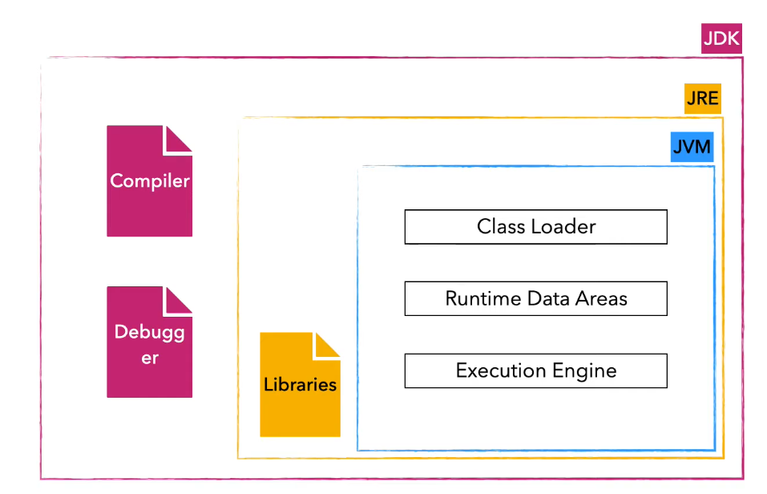

# JVM 기본구조 

---

>[JVM 내부구조 정리 사이트](https://inpa.tistory.com/entry/JAVA-%E2%98%95-JVM-%EB%82%B4%EB%B6%80-%EA%B5%AC%EC%A1%B0-%EB%A9%94%EB%AA%A8%EB%A6%AC-%EC%98%81%EC%97%AD-%EC%8B%AC%ED%99%94%ED%8E%B8)

## JVM ( Java Virtual Machine )이란? 

1. **Java 프로그램을 실행**하기 위한 가상 머신
2. Java 코드는 **바이트 코드(bytecode)**로 컴파일되는데, 이 바이트 코드를 실행하기 위해 JVM이 필요하다.

## 컴파일 vs 인터프리터

1. 컴파일
   1. 언어를 바이트 코드로 변환한다. -> 컴퓨터로 전달해 바로 실행한다. 
2. 인터프리터
   1. 언어를 그대로 전달한다 -> 별도 툴에 의해 언어가 번역된다. -> 컴퓨터가 실행한다. 

## 동작 방식

1. 자바코드
   1. 사람(개발자)이 작성한 언어
2. 컴파일러
   1. 자바코드를 .class 로 변경하기 위한 컴파일러
3. ByteCode
   1. 자바코드가 .class 파일로 변환된 것
4. JVM
   1. .class 코드를 실행시키는 주체 

```
Java Source Code (HelloWorld.java)
      ↓
Javac 컴파일러
      ↓
Bytecode (HelloWorld.class)
      ↓
JVM 실행 (해석 & 최적화)
```

## JVM , JRE, JDK 비교

1. JVM
   1. Java 프로그램을 실행하는 주체 
   2. 구성
      1. **Class Loader**
         1. 바이트 코드를 로드하는 역할 
         2. 로드된 바이트 코드(.class)들을 엮어서 JVM의 메모리 영역인 Runtime Data Areas에 배치한다
      2. **Rumtime Data Areas** (**JVM의 메모리 영역**)
         1. JVM이 운영체제로부터 할당받은 **메모리 공간**을 사용할 수 있는 **공간**
      3. **Excution Engine**
         1. 실행엔진으로, 자바를 살제 실행하는 곳
         2. 클래스 로더를 통해 런타임 데이터 영역에 배치된 바이트 코드를 명령어 단위로 읽어서 실행한다. 
2. JRE
   1. Java Runtime Envirment 로, 자바가 실행할 수 있는 환경을 말한다. 
   2. 즉, JRE만 있어도 Java 프로그램을 실행할 수 있다. 
   3. 구성
      1. JDK
      2. 기본 Java 라이브러리
3. JDK
   1. Java Development Kit 으로, 자바 개발에 필요한 모든 것이 들어가 있는 파일 



## JVM 구조 

```
JVM 내부
├── Class Loader (클래스 로더)
├── Execution Engine (실행 엔진)
│   └── Interpreter, JIT Compiler
└── Memory Areas (메모리 영역)
    ├── Heap (GC 관리 대상)
    ├── Metaspace
    ├── Stack
    ├── Native Method Stack
    └── Program Counter (PC Register)
```

##### 클래스 로더(Class Loader)

##### 실행 엔진(Execution Engine)

1. 인터프리터(Interpreter)
2. JIT 컴파일러(Just-in-Time)
3. 가비지 콜렉터(Garbage collector)  
   1. "JVM 내부"에 포함되지 않고 JVM에 의해 호출되어 동작하는 메모리 관리 시스템
   2. 힙 영역의 메모리를 관리한다. 

##### 런타임 데이터 영역 (Runtime Data Area)

1. 메소드 영역
2. 힙 영역
3. PC Register
4. 스택 영역
5. 네이티브 메소드

1. JNI - 네이티브 메소드 인터페이스 (Native Medthod Interface)
2. 네이티브 메소드 라이브러리 (Native Method Library)