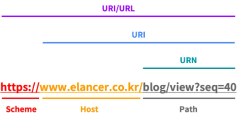

# URL과 URI ,URN 개념정리

---

> [참고사이트](https://www.elancer.co.kr/blog/view?seq=74)

## URI ( Uniform Resource Identifier ) : 식별자

### 정의

- 인터넷상의 리소스 **“자원 자체”**를 식별하는 고유한 문자열 시퀀스

### 구성

1. Uniform
   - 리소스를 식별하는 통일된 방식
2. Resource
   - URI로 식별이 가능한 모든 종류의 **자원(웹 브라우저 파일 및 그 이외의 리소스 포함)**을 지칭
3. Identifier
   - 다른 항목과 구분하기 위해 필요한 정보

### 예시

- github.com/wonyoung0207/TIL/ 가 URI에 포함된다. 
  - **리소스의 이름**만 나타내기 때문

---

## URL ( Uniform Resource Locator ) : 식별자+위치

### 정의

- 네트워크상에서 통합 자원(리소스)의“위치”를 나타내기 위한 규약이다.

  - 즉, 자원 식별자와 위치를 동시에 보여준다.

- URL은 프로토콜과 결합한 형태이다.
  - 즉, 어떻게 위치를 찾고 도달할 수 있는지까지 포함되어야 하기 때문에 URL은 "프로토콜 + 이름(또는 번호)"의 형태여야만 한다. 

### 예시 

-  ‘https://github.com/wonyoung0207/TIL/’은 URL이다. 
  - **이름과 더불어**, 어떻게 도달할 수 있는지 **위치**까지 함께 나타내기 때문(프로토콜 ‘https’ 포함)
- 따라서 특정 웹 페이지의 주소에 접속하기 위해서는 웹 사이트의 주소뿐만 아니라 프로토콜(https, http, sftp, smp 등)을 함께 알아야 접속이 가능한데, 이들을 모두 나타내는 것이 URL이다

---

## URI 과 URL 구조

1. **Scheme**
   - 리소스에 접근하는 데 사용할 프로토콜. 
   - 웹에서는 http 또는 https를 사용
2. **Host**
   - 접근할 대상(서버)의 호스트 명
3. **Path**
   - 접근할 대상(서버)의 경로에 대한 상세 정보

---

## URN (Uniform Resource Name)

### 정의

- URN은 리소스의 위치, 프로토콜, 호스트 등과는 상관없이 각 자원에 이름을 부여한 것
- 즉, **URL**은 어떤 **특정 서버에 있는 웹 문서**를 가리키는 반면, **URN**은 웹 문서의 물리적인 위치와 **상관없이 웹 문서 자체**를 나타낸다.

### 예시

- **URL**은 프로토콜인 https와 페이지 주소를 함께 포함한 ‘https://github.com/wonyoung0207/TIL/’ 이다.  
- 여기서 **URN**은 ‘/wonyoung0207/TIL/’ 이다. 

# [URI 와 URL ]

#### 1. URI

1. Uniform Resource Identifier ( 자원 식별자 )
2. Resource 는 자원으로, **하나의 File**이라고 생각하면 된다. 
   1. 도메인 다음 `/` 로 구분되어 File의 경로가 나오는데, 이때 해당 경로 밑의 파일을 뜻하는 것이 Resource 이다. 

3. URL 은 URL 에 포함되어있다. 

#### 2. URL

1. Uniform Resource Locator ( 자원 위치/경로 )

#### 3. 형태 

1. 구조
   1. `Protocol://Address:PortNumber/Path(or filename)?Parameter=value&Parameter...`
   2. `https://www.naver.com/course.do?cmd=search&search_keyword=Test`
   3. `www.naver.com` 은 Domain Name으로, Host 에 대한 주소가 된다. 웹 통신은 거의다 Port를 80 으로 사용하기 때문에 생략이 가능하다. 
   4. `Path`는 File의 경로를 나타낸다. 
   5. `Parameter=value` 는 전송되는 데이터이다. 
2. 즉, 
   1. `https://www.test.co.kr/originpath/course.do?cmd=search&search` => `www.test.co.kr` 이 도메인이고, `?` 전까지가 파일의 경로 및 호출되는 파일이다.