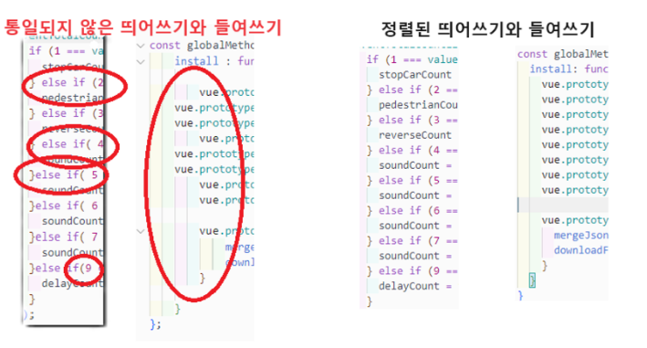

# VsCode ESLint 설정(Coding Convention)

---

>[짐코딩 강의 교안, ESLint ,Prettier](https://gymcoding.notion.site/ESLint-Prettier-0a2d35bab9254c26b4257e53bba218f7)
>
>[Vue.js 스타일가이드 한국어버전](https://ko.vuejs.org/style-guide/#%E1%84%80%E1%85%B2%E1%84%8E%E1%85%B5%E1%86%A8-%E1%84%87%E1%85%A5%E1%86%B7%E1%84%8C%E1%85%AE)
>
>[저장시 ESLint 적용법](https://www.aleksandrhovhannisyan.com/blog/format-code-on-save-vs-code-eslint/)
>
>[eslint 적용된 프로젝트]( http://10.1.1.28:8989/incubator/dt-3d-vue-cesium/-/tree/develop)

## 목차

1. ESLint란
2. ESLint의 주요 기능과 특징
3. ESLint 설치 및 사용방법

## ESLint란

1. **Visual Studio Code(VSCode)**에서 코드를 작성할 때, 코드의 오류를 발견하고, 일관된 스타일을 유지하기 위해 **ESLint**와 같은 도구를 사용하는 것이 좋습니다. 
2.  **ESLint**는 자바스크립트나 타입 스크립트의 코드 품질을 향상 시키기 위해서 사용합니다.
   1. ps - **Intellij** 같은 다른 툴도 적용 가능
3. 여기서 다루게 될 **Coding Conventions**은 **들여쓰기(Indentation), 공백 사용(Whitespace), 코드 구조(Code Structure), 세미 콜론 사용(Semicolon Usage)** 입니다.
4. 이외에도 **변수 명/함수 명(Naming Conventions) ,주석 스타일(Commenting)** 은 프로젝트 팀원과 협의하게 맞춰가야 합니다.

## ESLint의 주요 기능과 특징

1. 코드 품질 유지 (잠재적인 버그 방지)
   - **ESLint**는 코드에서 잠재적인 오류를 찾아 경고하거나 오류를 표시합니다.
   - 코드에서 사용되지 않는 변수나 선언되지 않은 변수 사용 방지가 가능합니다. 이는 특히 프로젝트 규모가 커질수록 중요합니다.
   - **ex)** **사용하지 않는 변수**, **선언 되지 않은 변수를 사용할 때**
2. 코드 스타일 일관성 유지
   - **ESLint**는 코드 스타일을 정의하고, 일관된 코드 스타일 유지가 가능합니다.
   - ***대규모 팀에서 협업 하는 프로젝트***에서 여러 개발자가 함께 작업하는 프로젝트에서는 코드 스타일이 일관되지 않을 수 있습니다. 
   - 자칫하면 **Git**의 **Commit**, **Push** 과정에서 **Complict** 초래할 수 있습니다. **ESLint 초기 설정**으로 팀 전체가 동일한 코딩 스타일을 따르게 해야 합니다.



3. 확장 가능성
   - **ESLint**는 플러그인 시스템을 통해 확장할 수 있습니다. 다양한 플러그인을 사용하여 **React, Vue.js, TypeScript** 등의 특정 **Framework** 언어에 맞춘 규칙을 적용할 수 있습니다.
4. Auto Format과 통합
   - 코드 저장 시 자동으로 **rules** 적용하여 코드를 포맷 할 수 있습니다.
   - **Prettier**와 **ESLint** 통합하여 코드를 자동으로 포맷하고 스타일 규칙을 적용할 수 있습니다.

## ESLint의 주요 기능과 특징

- (node 버전 16 이상, vue3 기준)

1. ESLint 설치

   ```bash
   npm install eslint --save-dev 
   ```

2. ESLint 설정 파일

   - ESLint 설정 파일 .eslintrc.js는 프로젝트 Root Directory에 위치합니다. 

   ```bash
   /**.eslintrc.js/**
   /* eslint-env node */
   require('@rushstack/eslint-patch/modern-module-resolution')
   
   module.exports= {
     root: true,
     extends: [
       'plugin:vue/vue3-essential',
       'eslint:recommended',
       '@vue/eslint-config-prettier/skip-formatting'
     ],
     parserOptions: {
       ecmaVersion: 'latest'
     },
     rules: {
       'vue/multi-word-component-names': 'off',
       'prettier/prettier': [
         'error',
         {
           singleQuote: true,
           semi: false,
           useTabs: false,
           tabWidth: 2,
           trailingComma: 'none',
           printWidth: 80,
           bracketSpacing: true,
           arrowParens: 'avoid',
           endOfLine: 'auto',
           bracketSameLine: true,
           singleAttributePerLine: true,
           htmlWhitespaceSensitivity: 'ignore'
         }
       ]
     }
   }
   ```

## 주요 설정 및 규칙  

1. **확장 설정 (extends) :** 다른 설정 파일을 상속 받습니다. Vue의 권장 설정과 ESLint 기본 설정을 확장합니다.

   ```bash
   extends: [
       'plugin:vue/vue3-essential',
       'eslint:recommended',
       '@vue/eslint-config-prettier/skip-formatting'
     ],
   ```

2. **파서 옵션 (parserOptions) :** 파서 옵션을 설정하여 최신 ECMAScript 기능을 사용할 수 있게 합니다.

   ```bash
   parserOptions: {
   	ecmaVersion: 'latest'
   }
   ```

3. **규칙 (rules) :** 프로젝트에 맞는 규칙을 설정합니다.

   ```bash
   rules: {
       'vue/multi-word-component-names': 'off',
       'prettier/prettier': [
         'error',
         {
           singleQuote: true,
           semi: false,
           useTabs: false,
           tabWidth: 2,
           trailingComma: 'none',
           printWidth: 80,
           bracketSpacing: true,
           arrowParens: 'avoid',
           endOfLine: 'auto',
           bracketSameLine: true,
           singleAttributePerLine: true,
           htmlWhitespaceSensitivity: 'ignore'
         }
       ]
   }
   ```

## Prettier와 통합

1. **Code Formatter**인 **Prettier**와 **ESLint** 사용하여 코드 스타일을 유지 할 수 있습니다.

2. `eslint-plugin-prettier`와 **`eslint-config-prettier`** 설치하고 설정 파일에 추가합니다.

3. Prettier 설치

   ```bash 
    npm install --save-dev prettier eslint-plugin-prettier eslint-config-prettier
   ```

4. Prettier 설정 파일 추가 

   1. 프로젝트 Root Directory에 **.prettierrc** 파일을 추가하여 Prettier 설정을 정의합니다.

   ```bash
   {
     "$schema": "https://json.schemastore.org/prettierrc",
     "semi": false,
     "tabWidth": 2,
     "singleQuote": true,
     "printWidth": 100,
     "trailingComma": "none"
   }
   ```

## VSCode와 ESLint 통합

1. VSCode에서 ESLint 효율적으로 사용하기 위해 ESLint 확장을 설치 및 확장이 가능합니다.

   1. 이 설정을 통해 파일을 저장 시 ESLint 규칙의 자동 적용으로 코드가 수정됩니다.

   ```bash
   {
      "eslint.validate": [
           "javascript",
           "javascriptreact",
           "typescript",
           "typescriptreact",
           // "html",  // 삭제
           "vue",
           "markdown"
       ],
       "editor.codeActionsOnSave": {
           "source.fixAll.eslint": "explicit"
       },
   
   }
   ```