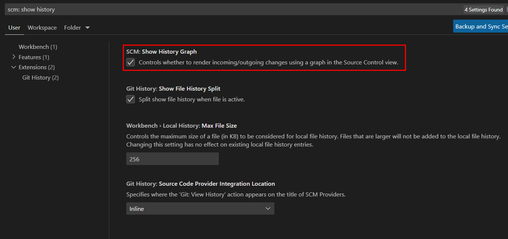

# VsCode git History Graph 문제 해결

---

>

## 문제점

1. 어느날 vscode의 git graph 페이지에 많은 커밋 기록 tree 가 표출됨 
2. incomming/outcomming 기록 정보가 tree 형태로 계속 표출
3. commit 기록 보기가 힘든 문제 발생

## 해결

1. `git graph` 라이브러리 확인 

   1. 플러그인인 `git graph` 로 인한 표출인지 확인 
   2. 확인결과 영향 없음을 확인 

2. vs code 의 설정값 확인 

   1. **source control** 에 의한 문제인것을 파악 
   2. `scm : show history graph` 설정값으로 변경 가능여부 확인 

   

3. `scm : show history graph` 의 값 off 

   

4. 결과 

   

