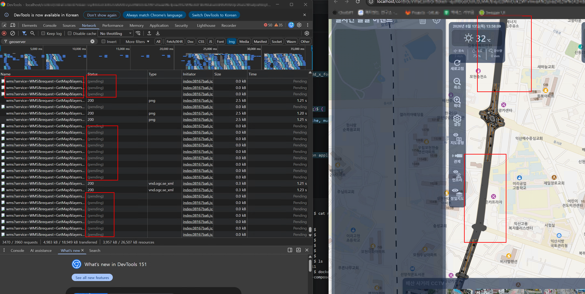
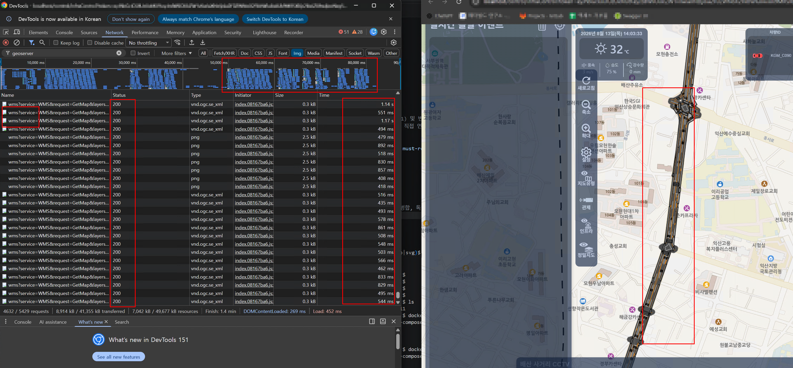

# Nginx 의 Upstream & Keepalive 기반 Geoserver 성능 최적화 

---

>

## 1. 문제점 

* **브라우저 동시 HTTP/1.1 커넥션 수 제한 (6개 제한)**

  * 크롬/엣지 등 주요 웹 브라우저는 동일 도메인(Nginx 주소)당 동시에 최대 **6개의 TCP 커넥션**만 생성하도록 제한됨.
  * 지도를 이동하거나 축척(Zoom)을 변경할 때 수십 개(20~50개)의 GeoServer WMS 타일 이미지 요청이 한꺼번에 쏟아져 7번째 요청부터 병목 현상 발생.

* **Nginx ↔ GeoServer 간 단발성 TCP 커넥션 오버헤드**

  * 기존 `proxy_pass http://127.0.0.1:8080;` 설정은 HTTP/1.0 방식으로 동작하여, **매 WMS 타일 요청마다 TCP Handshake(SYN-ACK) 및 연결 종료(FIN) 과정이 반복**됨.
  * 다량의 짧은 타일 요청 처리 시 TCP 소켓 소모(TIME_WAIT) 및 네트워크 latency(지연) 가중.

* **프록시 버퍼링 설정 부재**

  * PNG 이미지 타일 데이터 전송 시 프록시 버퍼 규격 미비로 스트리밍 처리 효율 저하.

* 기존 Nginx 설정

  ```js
  # Upstream 설정 없음 (기본값)
  server {
      listen 80;
      server_name localhost;
      # ... 생략 ...
      location /geoserver {
          # 호스트 모드로 실행 중인 GeoServer 주소 (8080 포트 직접 연결)
          proxy_pass http://127.0.0.1:8080;
          
          # 기본 프록시 헤더 4개만 설정
          proxy_set_header Host $host;
          proxy_set_header X-Real-IP $remote_addr;
          proxy_set_header X-Forwarded-For $proxy_add_x_forwarded_for;
          proxy_set_header X-Forwarded-Proto $scheme;
      }
  }
  ```




## 2. 현상

* **Network Request Pending 체류**
  * 브라우저 개발자 도구(F12) Network 탭에서 `/geoserver/wms` 요청의 Status가 **`pending` (대기 중)** 상태로 1~3초 이상 체류함.
* **지도 레이어 표출 지연**
  * 배경지도는 정상 로딩되나, 도로 인프라 및 정밀도로지도(GeoServer WMS) 레이어가 늦게 뜨거나 화면을 이동할 때마다 깜빡이고 느리게 렌더링됨.


## 3. 적용 내용 

- Nginx 설정 파일(`nginx.conf`)에 **Upstream 커넥션 풀** 및 **HTTP/1.1 Keepalive**, **프록시 버퍼링 최적화** 적용.
- `nginx.conf` 수정 내역

```nginx
# 1. GeoServer 전용 Upstream 및 Keepalive 커넥션 풀 구축
upstream geoserver_backend {
    server 127.0.0.1:8080;
    keepalive 64; # 64개의 상시 지속 연결(Persistent Connection) 유지
}

server {
    listen 80;
    server_name localhost;

    # ... 생략 ...

    # 2. GeoServer 프록시 위치 최적화
    location /geoserver {
        proxy_pass http://geoserver_backend;

        # HTTP/1.1 및 Connection Header 초기화 (Keepalive 활성화 필수 조건)
        proxy_http_version 1.1;
        proxy_set_header Connection "";

        proxy_set_header Host $host;
        proxy_set_header X-Real-IP $remote_addr;
        proxy_set_header X-Forwarded-For $proxy_add_x_forwarded_for;
        proxy_set_header X-Forwarded-Proto $scheme;

        # 프록시 버퍼링 및 타임아웃 최적화
        proxy_buffering on;
        proxy_buffers 8 64k;
        proxy_buffer_size 64k;
        proxy_read_timeout 60s;
        proxy_connect_timeout 10s;
    }
}
```


## 4. 개선된 점 

* **TCP 커넥션 재사용을 통한 RTT(Round Trip Time) 최소화**
  * 상시 개설된 64개의 커넥션 파이프라인을 재사용함으로 매 요청 시 발생하는 TCP Handshake 비용 완전 제거.
* **Network Pending 체류 시간 대폭 감소**
  * Nginx <--> GeoServer 구간의 응답 회신 속도가 향상되어 브라우저 큐 대기(`pending`)가 즉시 해소됨.
* **사용자 경험(UX) 개선 및 지도 렌더링 즉시성 확보**
  * 지도 이동 및 확대/축소 시 정밀도로지도 레이어가 끊김 없이 **즉시 표출**됨.

##### <개선 핵심 내용>

* **초기 로딩 시 (Cold Start)**
  - 최초 접속 시에는 Nginx Keepalive 커넥션 풀을 형성하는 단계 및 GeoServer의 공간 데이터 초기 메모리 로딩으로 인해 1회성 TCP Handshake가 발생하여 기존 속도와 유사함.
* **지속적 지도 조작 및 요청 시 (Warm State) -> 성능 개선 극대화**
  - 최초 연결 완료 후 미리 열려있는 64개의 커넥션 파이프라인이 즉시 재사용됨.
  - 지도 이동(Drag) 및 Zoom 조작 시 발생하는 연속적인 타일 요청이 핸드쉐이크 대기 시간 없이 **실시간으로 연속 수신**되어 성능 개선 효과가 극대화됨.




## 5. 요약 

| 항목               | 기존 (AS-IS)                                         | 개선 후 (TO-BE)                                   |
| :----------------- | :--------------------------------------------------- | :------------------------------------------------ |
| **통신 방식**      | 단발성 HTTP/1.0 (`proxy_pass http://127.0.0.1:8080`) | **Upstream Keepalive 커넥션 풀** (`keepalive 64`) |
| **TCP 소켓**       | 매 타일 요청마다 생성/소멸 (Handshake 반복)          | **상시 개설된 64개 커넥션 재사용**                |
| **네트워크 현상**  | `/geoserver` 요청의 **`pending` 큐 체류 현상**       | **`pending` 제거 및 즉시 응답**                   |
| **지도 표출 속도** | 지도 드래그 시 도로 레이어 늦게 뜸                   | **지도 이동 시 레이어 즉시 표출**                 |
