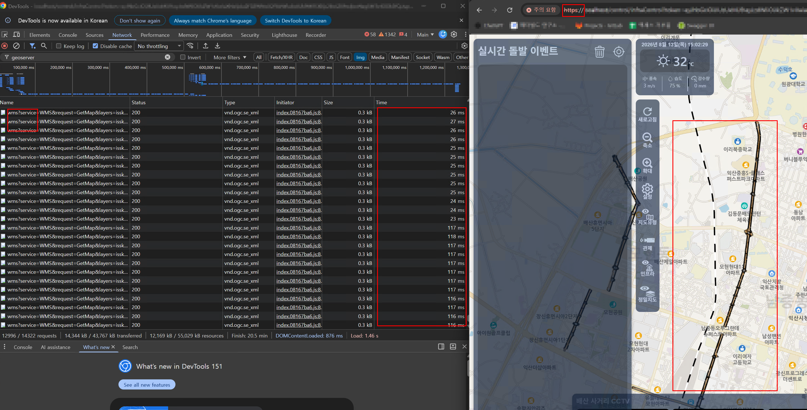

# Nginx 의 HTTP/2 멀티플렉싱(Multiplexing) 적용 성능 개선 

---

>

## 1. 개요 (Overview)

- 지도 타일맵 및 GeoServer WMS 정밀도로지도 레이어 호출 시 발생하던 브라우저 동시 요청 제한(6개 병목)을 해결하기 위해 **Nginx HTTP/2 멀티플렉싱(Multiplexing)** 기술을 적용한 내역을 정리


## 2. 문제점 

### HTTP/1.1의 구조적 한계점
* **동시 요청 채널 6개 제한**
  * 주요 웹 브라우저(크롬, 엣지)는 HTTP/1.1 규격상 동일 도메인(Nginx 주소)당 동시에 **최대 6개의 TCP 커넥션**만 허용함.
  * 지도를 드래그하거나 Zoom을 조작할 때 20~50개의 타일 요청이 동시에 발생하여, 7번째 요청부터 브라우저 큐에서 **`pending` (대기 중)** 상태로 체류함.

##### **해결 방법** 

* 1개의 TCP 커넥션 통로 안에서 수십 개의 타일 요청을 비동기 병렬로 주고받는 **HTTP/2 멀티플렉싱**을 도입하여 `pending` 병목을 해소하고 수신 채널 폭을 대폭 확장함.


## 3. HTTP/2 멀티플렉싱 핵심 동작 원리 (Mechanism)

| 구분          | HTTP/1.1 (기존)                                             | HTTP/2 멀티플렉싱 (적용 후)                        |
| :------------ | :---------------------------------------------------------- | :------------------------------------------------- |
| **차선 비유** | **1차선 국도 (최대 6개 동시 운영)**                         | **100차선 고속도로 (단일 파이프라인)**             |
| **전송 방식** | 1 커넥션 당 1 요청 순차 처리                                | **스트림(Stream) ID 기반 프레임 비동기 교차 전송** |
| **병목 여부** | 앞 요청 지연 시 뒤 요청 전체 대기 (`Head-of-Line Blocking`) | 앞 요청과 관계없이 **독립적인 병렬 즉시 전송**     |


## 4. 적용 내용 및 설정 코드 (Implementation)

##### 1. SSL/TLS 인증서 준비 (HTTP/2 필수 조건)
- 브라우저 정책상 HTTP/2는 **HTTPS (SSL/TLS)** 환경에서만 동작하므로, 개발용 자체 서명 인증서를 생성합니다.

```bash
# 인증서 생성 (server.crt, server.key)
openssl req -x509 -nodes -days 365 -newkey rsa:2048 \
  -keyout ./certs/server.key -out ./certs/server.crt -subj "/CN=localhost"
```

##### 2. `docker-compose.yml` 마운트 설정
- 인증서 폴더를 Nginx 컨테이너 내부로 마운트합니다.

```yaml
services:
  frontend-admin:
    image: nginx:alpine
    volumes:
      - ./certs:/etc/nginx/certs:ro # 인증서 마운트
```

##### 3.`nginx.conf` HTTP/2 멀티플렉싱 설정
- 443 포트 수신 및 `http2 on;` 지시어를 통해 멀티플렉싱을 활성화합니다.

```nginx
server {
    listen 80;
    listen 443 ssl;
    http2 on; # HTTP/2 멀티플렉싱 채널 확장 활성화
    server_name localhost;

    # SSL 인증서 지정
    ssl_certificate /etc/nginx/certs/server.crt;
    ssl_certificate_key /etc/nginx/certs/server.key;
    ssl_protocols TLSv1.2 TLSv1.3;
    ssl_ciphers HIGH:!aNULL:!MD5;

    root /usr/share/nginx/html;
    index index.html;

    # ... 이하 location 프록시 설정 ...
}
```


## 5. HTTP/2 적용 시 필수 체크사항 

1. **HTTPS (`https://`) 주소 접속 필수**
   * 브라우저는 `http://` 접속 시 HTTP/2를 무시하고 `http/1.1`로 자동 다운그레이드 된다. 
   * 반드시 **`https://localhost` (443 포트)** 로 접속해야 개발자 도구(F12) Network 탭 Protocol 항목에 **`h2`**로 표기되며 멀티플렉싱이 동작한다. 

2. **네트워크 전송(Transport) vs 백엔드 연산(Backend)의 구별**
   * HTTP/2 멀티플렉싱은 네트워크 전송 채널을 넓혀 **`pending` 대기 시간을 없애는 기술** 이다. 
   * GeoServer(Java) 내부에서 DB 데이터를 읽어 PNG 이미지를 렌더링하는 자체 계산 시간과는 독립적이다. 

3. **Cold Start vs Warm State**
   * 최초 1회 접속 시에는 SSL 악수(TLS Handshake)로 인해 초기 속도가 비슷하지만,
   * 연결이 수립된 후 지도를 드래그/확대할 때는 수십 개의 타일이 **단일 파이프라인을 통해 비동기 병렬로 즉시 수신**된다.


## 6. 요약

| 항목               | HTTP/1.1 (기존)             | HTTP/2 멀티플렉싱 (적용 후)                 |
| :----------------- | :-------------------------- | :------------------------------------------ |
| **동시 요청 채널** | 6개 제한 (병목 발생)        | **단일 TCP 파이프라인 내 무제한 병렬 수신** |
| **통신 방식**      | 1 커넥션당 1 요청 순차 처리 | **스트림 프레임 기반 비동기 교차 전송**     |
| **필수 접속 환경** | HTTP (`http://`) 가능       | **HTTPS (`https://`) 접속 필수**            |
| **네트워크 현상**  | 타일 요청 `pending` 체류    | **`pending` 큐 즉시 해소 및 비동기 수신**   |


