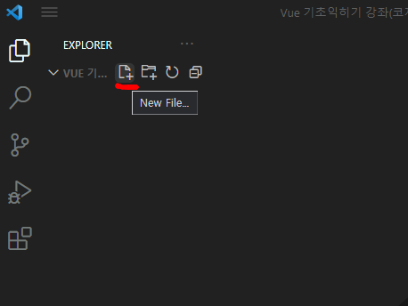
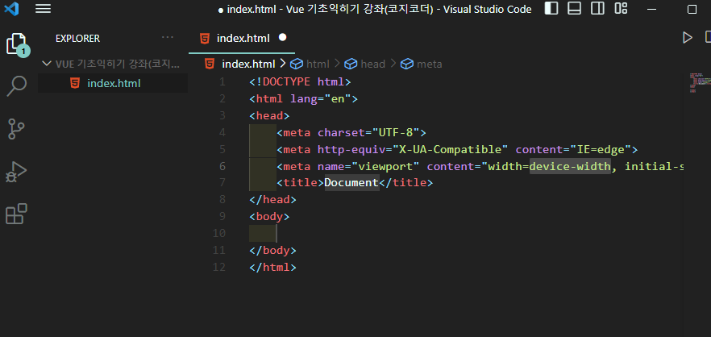

# 기본 html 구조 자동완성

---

> 해당 기능은 vsCode 에서 사용할 수 있다. 

## 구조 자동완성 기능 사용방법

1. 원하는 폴더에 "new file" 을 눌러 파일을 생성한다. 

   

2. 파일의 확장자를 .html 로 한다. 

3. **" ! + Tab "** 으로 설정되어 있는 자동 html 생성기능을 실행한다. 

   - ! 를 입력한 뒤 Tab 하면 됨 

   

4. 기본 html 구조가 자동으로 생성된 것을 확인할 수 있다. 

   