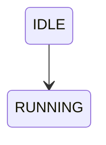
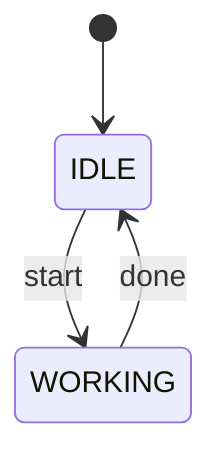

## Mermaid란?

- **Mermaid**는**텍스트로 다이어그램을 그리는 문법(DSL)** 이다.
  - 흐름도
  - 상태도(FSM)
  - 시퀀스 다이어그램
  - ER 다이어그램 
  - 같은 **설계 다이어그램을 자동으로 렌더링**해준다.
- 이미지를 직접 그리는 게 아니라 **“설계 = 코드”** 로 관리할 수 있는 게 핵심

------

## 사용 이유 

- 다이어그램을 **버전 관리(Git)** 할 수 있음
- 문서와 설계가 **코드와 함께 유지**
- 수정이 빠르고 충돌 관리가 쉬움
- README / Wiki / 노션 / Obsidian에서 바로 렌더링 가능

→ 개발자 친화적인 다이어그램 도구

------

## Mermaid의 기본 개념

- **입력**: 텍스트 (Markdown 안의 Mermaid 문법)
- **출력**: SVG / PNG 다이어그램
- **렌더링**: Markdown 뷰어가 처리

```
텍스트 → Mermaid 파서 → 다이어그램
```

------

## 문법

- Mermaid는 **다이어그램 타입 선언 → 관계 정의** 구조로 작성한다.

```
<diagram-type>
    요소 정의
    요소 --> 요소 : 설명
```

| 문법          | 의미        |
| ------------- | ----------- |
| `-->`         | 관계 / 전이 |
| `:`           | 조건 / 설명 |
| `[*]`         | 시작·종료   |
| `{}`          | 조건 노드   |
| `state {}`    | 하위 상태   |
| `participant` | 시퀀스 주체 |

---

## 사용 방법

##### 1. Markdown 안에서 사용



→ Markdown 뷰어가 다이어그램으로 렌더링

##### 2. 지원되는 주요 다이어그램 종류

- `flowchart` : 흐름도
- `stateDiagram-v2` : 상태 머신 (FSM)
- `sequenceDiagram` : 시퀀스 다이어그램
- `classDiagram` : 클래스 구조
- `erDiagram` : ERD
- `gantt` : 간트 차트

##### 3. 예시: 상태 머신 (FSM)



- 상태 간 전이 관계를 **명확하게 표현**
- 로봇 제어, 게임 로직, 워크플로우에 자주 사용

------

## 사용처 

- GitHub README / Wiki
- Obsidian
- Notion (플러그인)
- Mermaid Live Editor
- 일부 IDE 확장

**문서 + 설계 + 코드**를 한 곳에서 관리 가능

------

## Mermaid의 핵심 요약

- 다이어그램을 코드로 작성
- Git으로 관리 가능
- 설계 변경에 강함
- 개발 문서에 최적화

> “그림을 그리는 도구”가 아니라 **“설계를 표현하는 언어”**