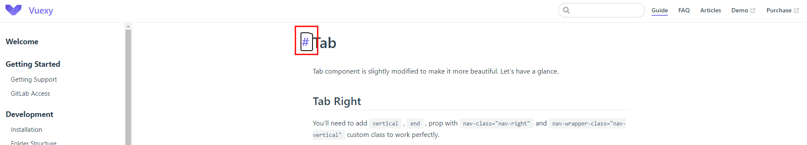
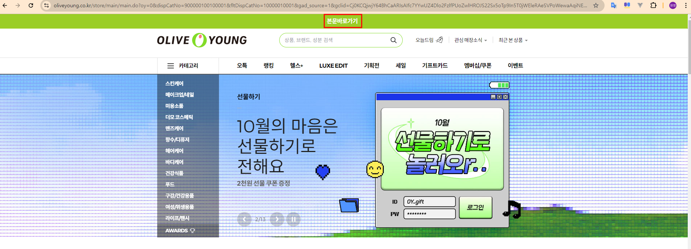
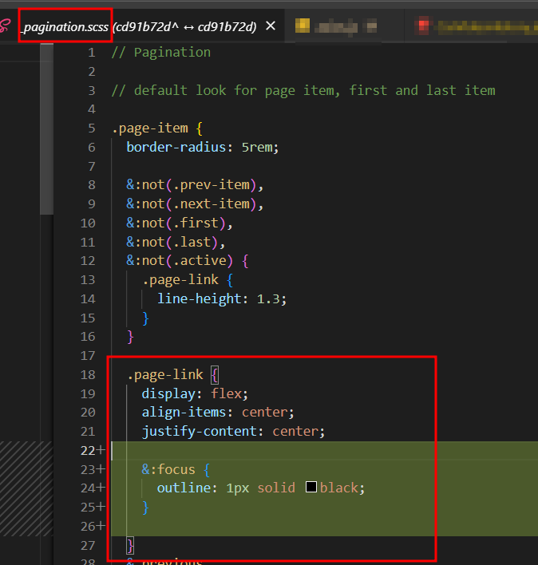

# 소프트웨어 접근성 개념정리

---

>

## 소프트웨어 접근성 ( SA : Software Accessibility )

### 정의

1. 정보통신접근성(웹접근성) 이라고도 한다. 
2. 정보통신 제품이나 시스템에서 실행되는 응용 프로그램이나 운영체제 등과 같은 **소프트웨어를 개발함에 있어서 장애인과 고령자 분들이 비장애인과 동등한 수준으로 사용**할 수 있도록 하기 위하여 설계 또는 구현에 **필요한 최소한의 사항을 규정**한 것
3. 즉, 소프트웨어가 장애인이 비장애인과 동등하게 사용할 수 있는 수준으로 만들어져야 한다는 최소한의 규칙같은것 

### 종류

1. Tab 이동

   1. Tab을 사용해 컨텐츠에 이동이 가능해야한다. 

   2. 이때 Tab 이동을 시각적으로 확인할 수 있어야 한다. 

      

2. 손쉬운 콘텐츠 이동 

   1. 바로 본문으로 이동할 수 있도록 바로가기 탭을 제공해야한다. 

   2. 예를들어, 올리브영 페이지같은 경우 URL에서 Tab을 눌러 진행하면 화면 가장 상단에 "바로가기" 라는 탭이 활성화되는것을 볼 수 있다. 이게 바로 "접근성" 기능 중 하나인 "콘텐츠 바로가기" 기능이다. 

      

3. 브라우저 명칭 동적 변경

   1. 이동하는 화면에 따라 브라우저의 탭 명칭이 페이지에 맞게 변경되어야 한다. 
   2. 나는 vue를 사용했기 때문에 `vue -> 라우터의 네비게이션 가드` 이용해 탭 명칭을 변경했다. 

## 예시

### Tab 이동

1. 대부분 링크 태그인 `a` 태그에 Tabindex가 적용되기 때문에 링크 태그의 스타일에 `outline` 스타일을 적용한다. 

2. SCSS를 이용해 a태그에 focus 됐을 경우 `outline` 스타일을 적용한다. 

   1. 이때 `border` 도 적용해봤는데 `outline` 으로 해야한다고 생각했음
   2. 왜냐하면 `border` 는 추가했을 경우 컨텐츠의 너비나 높이가 그려지는 선에 따라 달라지는데, `outline` 은 달라지지 않기 때문

3. 나같은 경우 전체 링크 태그에 스타일을 적용해야 됐기 때문에 `_navbar.scss or _navigation.scss` 같은 전체 스타일 파일에 해당 내용을 추가함 (bootstrap 을 사용했기 때문에 기본 제공됐던 scss에 적용함 )

   

   ```scss
   // 특정 클래스의 링크 태그에 focus 스타일 적용   
   .page-link {
       display: flex;
       align-items: center;
       justify-content: center;
   
       &:focus {
         outline: 1px solid black;
       }
   
     }
   
   // 특정 태그 밑에 있는 a 태그에 스타일 적용
     a {
       outline: none;
   
       // &:hover,
       &:focus {
         text-decoration: none;
         outline: 1px solid black;
         // border: 1px solid black;
         // outline-offset: 2px;
       }
     }
   ```

### 손쉬운 콘텐츠 이동

1. 특정 페이지의 가장 상단 태그에 링크 태그를 넣고 해당 링크를 본문과 연결시킨다. 

   1. 즉, 특정 페이지로 들어갔을 때 Tab 누르고 바로가기 누르면 본문으로 Scroll 된다. 

   ```vue
   <template>
     <div>
       <a href="#" class="skip-link" @click.prevent="scrollToActiveTab"
         >본문 바로가기</a
       >
       </div>
   
   	<!-- 날짜 선택 -->
       <tab-content  title="날짜 선택">
           <select-date ref="selectdate" @loadTmp="loadTmp" />
     	</tab-content>
   
   
     	<!-- 장비 선택 -->
     	<tab-content title="장비 선택" >
       	<select-device ref="selectdevice" />
     	</tab-content>
   
   </template>
   <script>
       scrollToActiveTab() {
         if (this.activeStepIndex === 0) {
           this.scrollToElement(this.$refs.selectdate.$el);
         } else if (this.activeStepIndex === 1) {
           this.scrollToElement(this.$refs.selectdevice.$el);
         } 
       },
           
       // 스크롤 처리 메서드
       scrollToElement(element) {
         if (element) {
           element.scrollIntoView({ behavior: "smooth" });
         }
       },
   </script>
   ```


### 브라우저 명칭 동적 변경

1. vue의 네비게이션 가드 이용
2. [vue 라우터 이용 브라우저 탭 명칭 변경 for wonyoung github](https://github.com/wonyoung0207/TIL/blob/master/Vue/vue%20%EB%9D%BC%EC%9A%B0%ED%84%B0%20%EC%9D%B4%EC%9A%A9%20%EB%B8%8C%EB%9D%BC%EC%9A%B0%EC%A0%80%20%ED%83%AD%20%EB%AA%85%EC%B9%AD%20%EB%B3%80%EA%B2%BD.md)