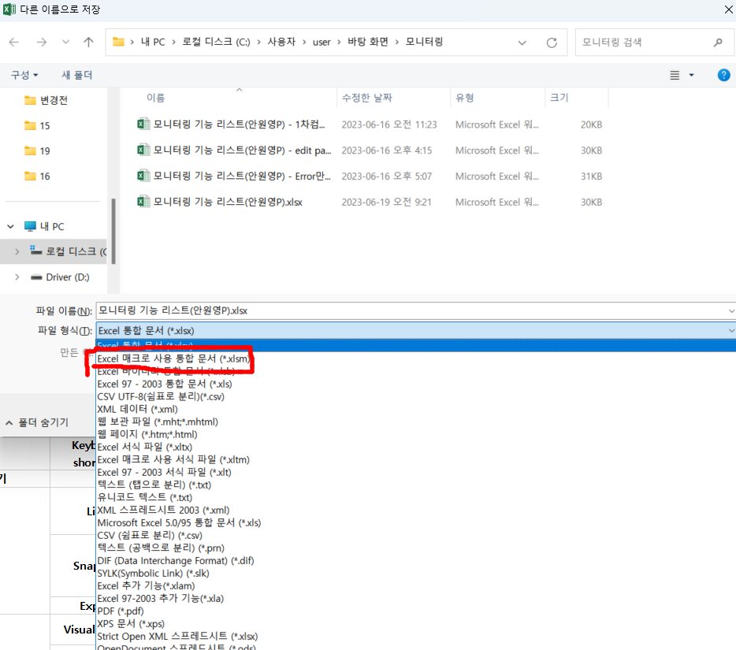

## 엑셀에서 마지막으로 수정한 날짜 나오게 하는 방법

---

>  [참고 사이트1](https://www.rowshare.com/blog/tips/displaying-last-modification-time-in-excel/)
>
>  [참고 사이트2](https://ko.extendoffice.com/documents/excel/3507-excel-last-saved-timestamp.html)

### 목적

- 다음 사용자 정의 함수를 사용하여 특정 워크 시트에 통합 문서의 마지막으로 저장된 타임 스탬프를 삽입하는 방법이다. 

### 방법

1. 워크시트에서 **alt** + **F11** :  **응용 프로그램 용 Microsoft Visual Basic** 창 실행

2. 메뉴 > insert >  > **모듈**

3. 그런 다음 다음 VBA 코드를 복사하여 코드 창에 붙여 넣기한다. 

4. **VBA 코드 : 워크 시트에 마지막으로 저장된 타임 스탬프 삽입**

   ```vba
   Function LastSave()
   LastSave = ThisWorkbook.BuiltinDocumentProperties("Last save time")
   End Function
   
   // 결과 형태 : 2023-06-19
   ```

   - 시간 형태 조절하고 싶다면 

     ```vba
     Function ModDate()
     ModDate = Format(FileDateTime(ThisWorkbook.FullName), "yyyy-m-d hh:nn ampm")
     End Function
     
     // 결과 형태 : 2023-06-19 10:21 오전
     ```

5. 저장시 "다음 기능은 매크로 제외 통합문서에 저장할 수 없습니다. " 라는 문구가 뜬다. 

   - "아니오" 를 눌러 **메크로 통합 문서**로 저장한다. 

   

   

6. 워크 시트로 돌아간다. 

7.  **빈 셀을 선택**하고 **수식을 입력**한다.

    ```
    = ModDate()
    = LastSave()
    ```

8. **숫자 셀을 날짜 시간 형식으로 변경**해야한다.

   


