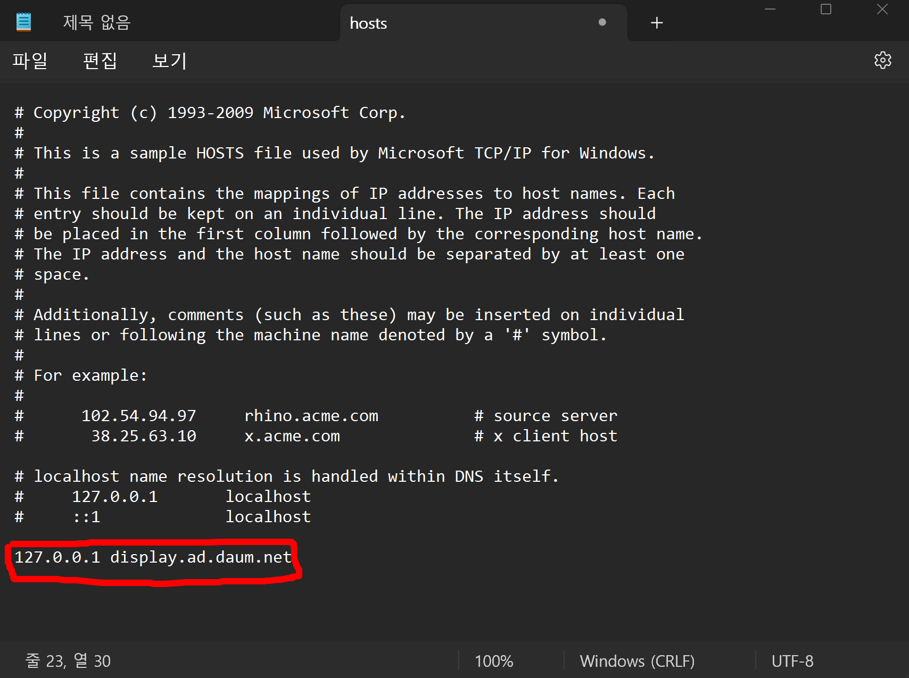

# KakaoTalk 광고제거하기 

---

> [참고 사이트1](https://jista.tistory.com/916)
>
> [참고 사이트2](https://malleus123.tistory.com/entry/PC-%EC%B9%B4%EC%B9%B4%EC%98%A4%ED%86%A1-%EA%B4%91%EA%B3%A0-%EC%A0%9C%EA%B1%B0-%EB%B0%A9%EB%B2%95)
>
> [참고 사이트3](https://goddaehee.tistory.com/90)

## 광고 제거 이유

- 실행시 오른쪽 밑에 배너 형태로 광고가 나옴

## 제거 방법 종류

1. 개발자가 만든 KakaoTalkAdBlock 파일을 이용한 방법 ( 추천 안함 )

   - [다운받는 Github사이트](https://github.com/blurfx/KakaoTalkAdBlock)
   - 해당 사이트에서 setUp.exe파일을 다운받아 차단한다. 

   

2. 메모장을 이용해 직접 차단하는 방법 ( 추천 )

   - hosts 파일을 찾아 내용을 추가해주는 방법으로, 쉽게 차단할 수있다. 
   - **카카오톡은 `display.ad.daum.net` 의 IP주소에서 광고를 가져온다. 따라서 해당 도메인에 접속했을 때 우회하는 방법으로 광고 불러오기를 막을 수 있다.** 
   - 해당 글에서는 이 방법을 사용할 것이다. 
   
     

## Hosts 파일 역할

-  **호스트 이름에 대응하는 IP 주소가 저장되어 있어서 도메인 이름 시스템(DNS)에서 주소 정보를 제공받지 않고도 서버의 위치를 찾게 해주는 파일.**
- 따라서 해당 파일에 입력한 도메인 주소로 접속했을 경우, DNS 서버에서 IP 주소를 찾는것이 아닌 해당 파일에 적힌 IP 주소로 바로 이동할 수 있게 도와주는 파일이다. 

## 제거 방법

1. 메모장을 관리자 권한으로 연다. 

   - hosts 파일을 변경하기 위해서는 반드시 관리자 권한이 필요하기 때문이다. 

   

   - 관리자 권한으로 실행하지 않았을 때 발생하는 문제 

     

2. 메모장의  '파일 -> 열기 -> `C:\Windows\System32\drivers\etc` ' 위치에 있는 hosts 파일을 찾는다. 

   - 파일 위치 

     ```
     C:\Windows\System32\drivers\etc
     ```

   - 이때 주의할 점은 hosts파일은 Text 형식이 아닌 파일 형식이기 때문에 파일의 형식을 '모든 파일' 로 변경해야한다. 

   

   

3. host 파일을 열고 해당 내용을 추가한다. 

   - 파일 내용

   

   - host파일에 광고 주소 입력 후 저장 

     - 내 PC에서 display.ad.daum.net 에 접속해 광고를 가져온다. 

     ```
     127.0.0.1 display.ad.daum.net
     ```

     - 따라서 입력한 주소로 접속했을 때, DNS 서버에서 IP 주소를 찾는게 아니라 앞에 입력한 IP 주소로 바로 접속하는 형식이다. 

     

   - `127.0.0.1` 은 내 IP 주소를 뜻한다. 

     - 따라서 뒤에적힌 `display.ad.daum.net` 의 주소로 접속했을때, DNS 서버에서 IP주소를 찾는것이 아니라 hosts 파일에 적힌 IP 주소로 바로 이동하게 한다. 
     - **`127.0.0.1`  은 내 IP 주소이기 때문에 광고에 사용되는 내용들을 불러올 수 없다. 따라서 광고가 나타나지 않게 된다.** 

4. 다른 도메인 주소의 광고도 제거할 수 있다. 

   ```
   127.0.0.1 display.ad.daum.net - 다음 메인 광고와 로그인 아래의 광고
   127.0.0.1 nv1.adcreative.naver.net - 네이버 메인 광고와 로그인 아래의 광고
   127.0.0.1 nv2.adcreative.naver.net - 네이버 메인 광고와 로그인 아래의 광고
   127.0.0.1 shopping.daum.net - 다음 쇼핑 하우
   127.0.0.1 i1.shop.daumcdn.net - 우측에 있는 쇼핑몰 상품들 이미지 창고
   ```


## 결과


- 광고가 사라지고 실행시 오른쪽 배너 형태로 나오던 광고도 제거된것을 확인할 수 있었다. 


 