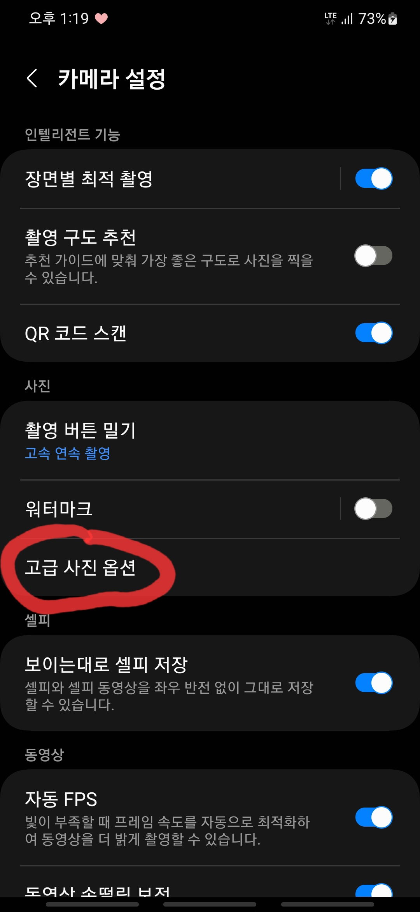
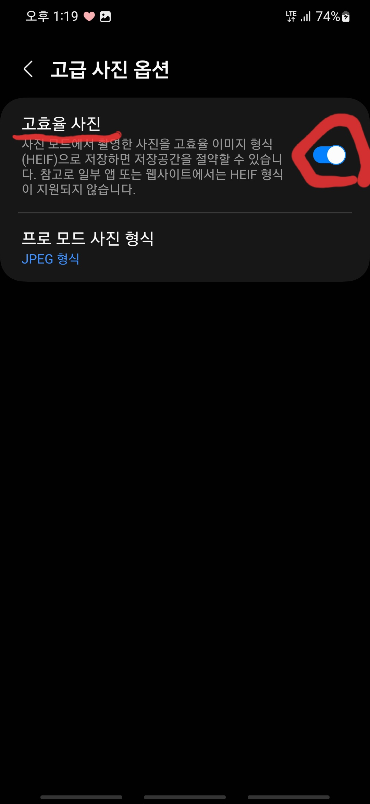
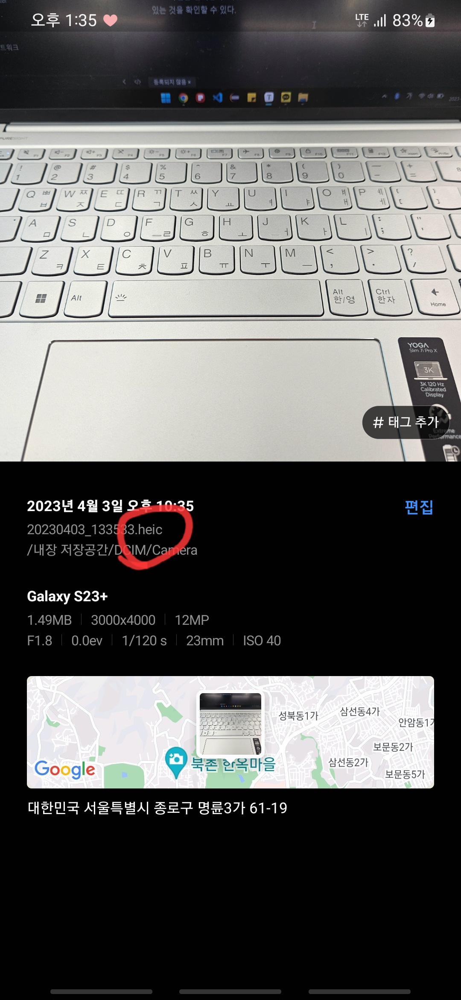
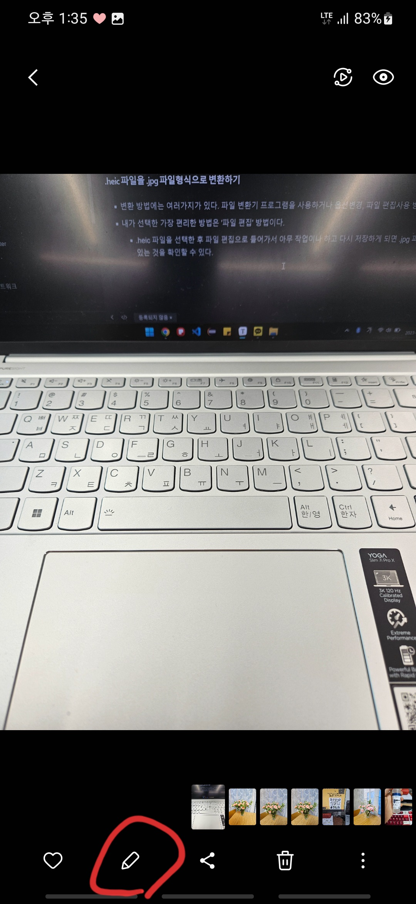
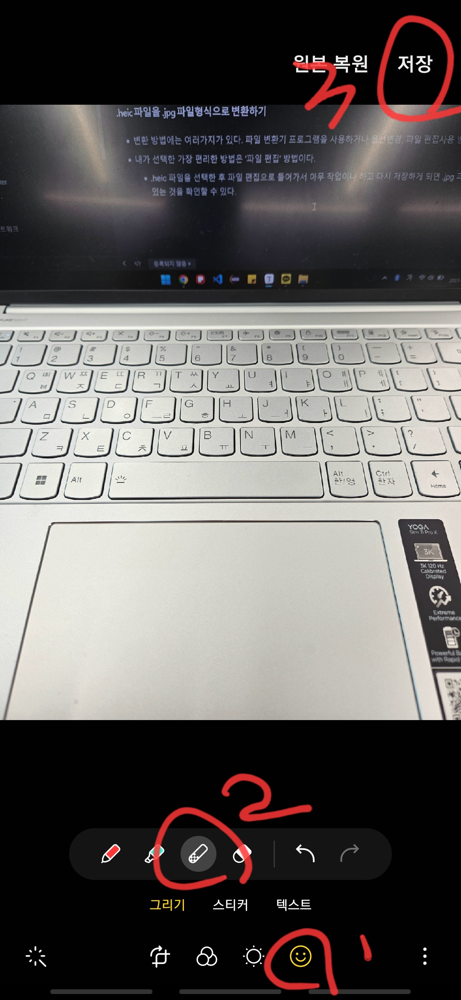
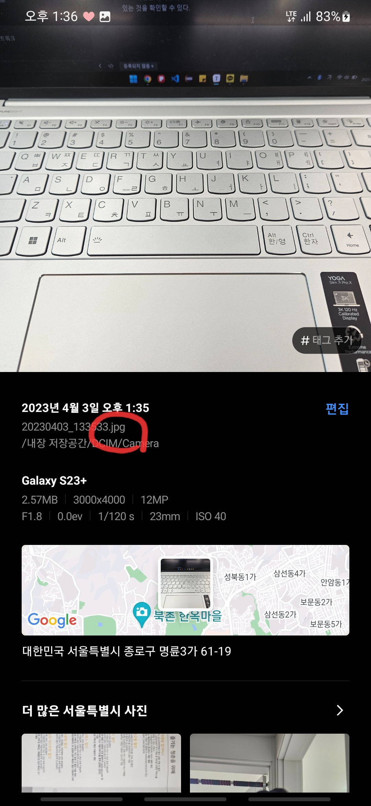

# 삼성 카메라 사진파일 .heic 

---

>[참고 사이트1](https://dailyhappyday.tistory.com/1119)

## 작성 이유

- 핸드폰으로 사진을 찍어 업로드 하는 과정에 파일 확장자를 지원하지 않는다는 문구를 보게 되었다. 
  - 확장자를 확인해보니 heic 라는 난생처음보는 파일 확장자로 되어있었다. 
- 해당 **파일 확장자가 무엇**인지 궁금하기도 하고 **jpg로 변환하는 방법**또한 궁금해 해당 글을 작성하게 되었다. 

---

## .heic 파일

### 정의

- **jpg를 대체할 차세대 이미지 파일 형식**으로 **압축효율을 높여 용량을 줄인 이미지 파일 형식**

### 출현배경

- 지금까지 디지털 이미지파일의 대명사는 JPG/JPEG 파일이었다.
  - JPG는 압축률이 높아 인터넷에서, 디지털카메라에서 주로 사용하곤 했다. 
  - 스마트폰으로 사진을 많이 찍다 보니 jpg 파일은 저장용량에 한계에 부딪쳤고, 이에 대한 대안으로 나온 것이 HEIF, HEIC 파일이다.

### 특징 

1. 아이폰은 heif, 갤럭시는 heic 확장자 가 붙는다. 
2. jpg 파일보다 2배이상 용량이 작다. 

### 단점

1. 아직까지는 **대중화되지 않아 호환성이 낮은 편**이다. 
   - 갤럭시나 아이폰에서 heic, heif로 찍어서 windows 로 옮겨 보면 보이지 않는 상황이 발생한다. 
   - windows 자체 사진 프로그램에서 아직 heic나 heif 파일 형식을 지원하지 않기 때문에 이런 상황이 발생한다고 한다. 
   - 따라서 아이폰은 SNS에 heif 사진을 업로드하면 자동으로 jpg 변환되어 업로드된다. 

### 삼성 핸드폰에서 .heic 파일로 저장되는 이유 

- 카메라 설정 중 "고효율 사진" 항목이 ON 으로 되어있을 때 .heic 파일로 저장이 된다. 
  - 만약 JPG 파일로 사진을 저장하고 싶다면 해당 설정을 OFF로 변경하면 된다. 
  - 다만 OFF 로 변경해 JPG로 저장된다면 사진 용량은 2배정도 늘어난다. 

- jpg 로 저장할 수 있게 변경하는 방법 
  - 카메라 -> 왼쪽 위 '설정 ' 클릭 -> '고급 사진 옵션' 항목 클릭 -> '고효율 사진' 옵션 OFF 

### .heic 파일을 .jpg 파일형식으로 변환하기

- 변환 방법에는 여러가지가 있다. 파일 변환기 프로그램을 사용하거나 옵션변경, 파일 편집사용 방법등등이 있다. 
- 내가 선택한 가장 편리한 방법은 '파일 편집' 방법이다. 
  - .heic 파일을 선택한 후 파일 편집으로 들어가서 아무 작업이나 하고 다시 저장하게 되면 .jpg 파일로 변경되있는 것을 확인할 수 있다. 

1. .heic 파일을 선택한다. 

   

2. 파일 편집을 클릭한다 .

   

3. 편집을 진행하고 저장한다.

   - 나의 경우엔 아무 변화도 안주고 싶어 지우개 옆 '모자이크 / 패턴 팬 ' 을 살짝 터치한 후 저장했다. 

   

4. 파일 형식이 JPG로 변경된 것을 확인할 수 있다. 

   

---

### 결론

- 어쩌다가 발견한 .heic 파일에 대해 알아가는 알찬 시간이였다. 
  - 이제 jpg 파일과 heic 파일 두가지를 구분할 수 있을것 같다.
- **jpg파일또한 압축율이 좋아 많이 사용되었지만, 이제는 핸드폰 사진용량이 화질성장만큼 커졌기 때문에 더 고효율로 압축할 수 있는 기술인 .heic 파일을 사용한다.** 