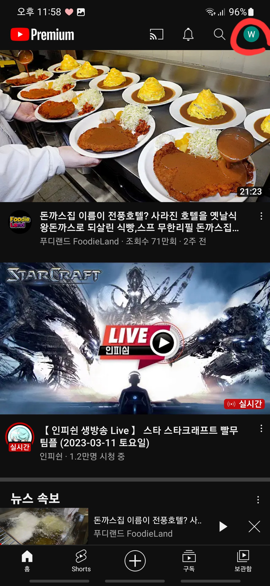
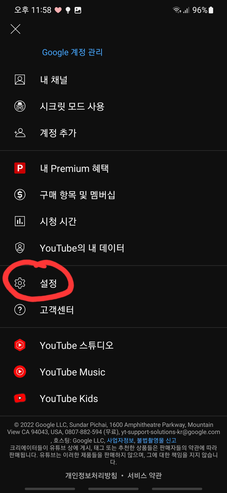
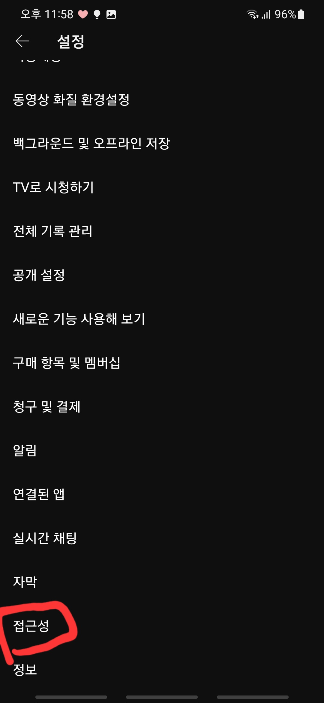
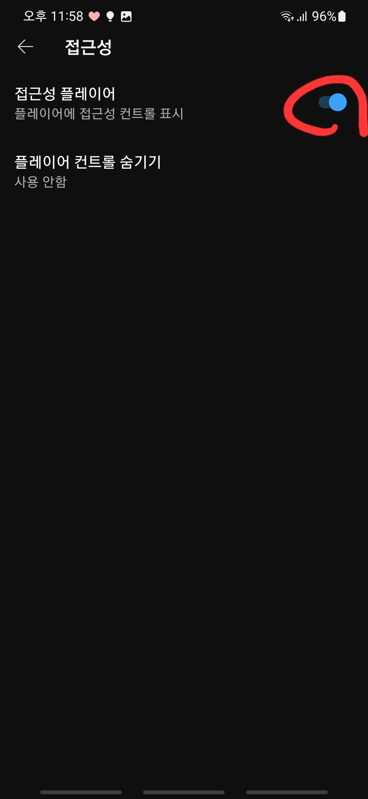
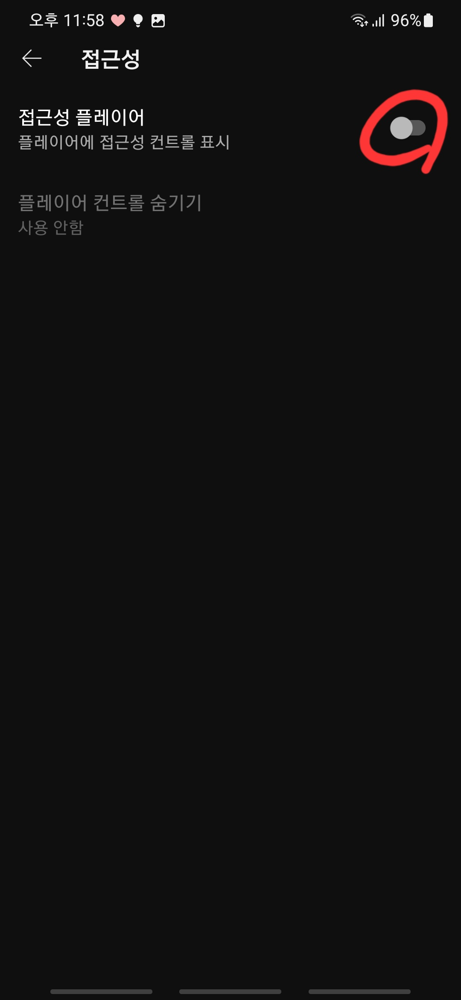

# 안드로이드 유뷰브 x표시 버튼 없애기

---

>[참고 사이트1](https://gooditstory.tistory.com/52)

## 원인 

- 유튜브를 새로 설치하니 오른쪽 상단에 x 표시가 생겼다. 해당 x 표시는 컨트롤러를 표시하는 화면을 끄는 역할을 하는것 같았다. 
- 문제는 x표시를 누르지 않으면 영상 컨트롤러들 ( 자막, 설정, 재생버튼, 전체화면 등등 ) 이 계속 표시되어 영상시청하는데 방해가 됐다. 
- 서칭결과 해당 문제는 **"접근성 컨트롤 표시" 의 활성화** 문제였다. 

## 해결

1. 먼저 유튜브 계정을 클릭한다. 

   

2. 창이 하나 뜨는데, 밑에보면 "설정" 버튼이 있다. 클릭한다. 

   

3. 맨 밑으로 스크롤 하면 " 접근성 " 항목이 있다. 클릭한다.

   

4. "접근성 플레이어" 가 활성화 되어있는 모습을 볼 수 있다.  클릭해서 해제해준다. 

    

## 결과

