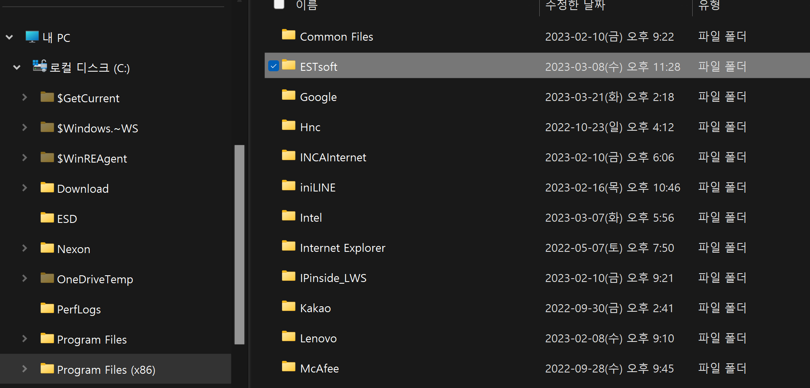
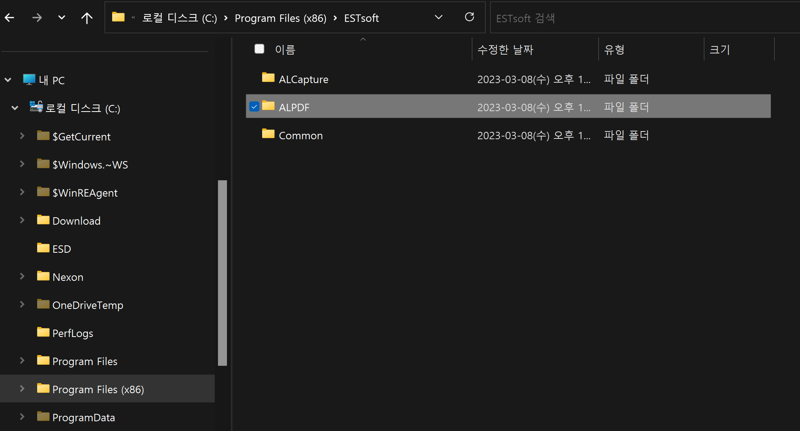
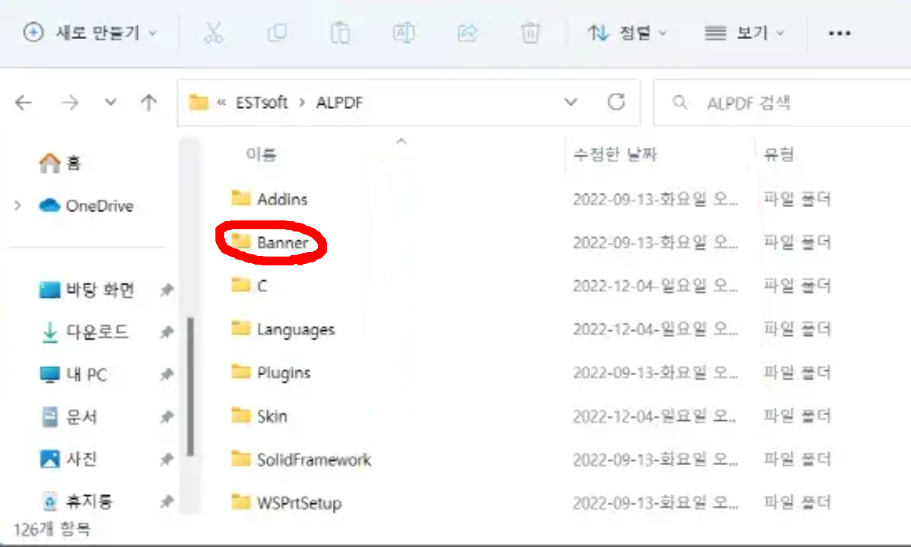
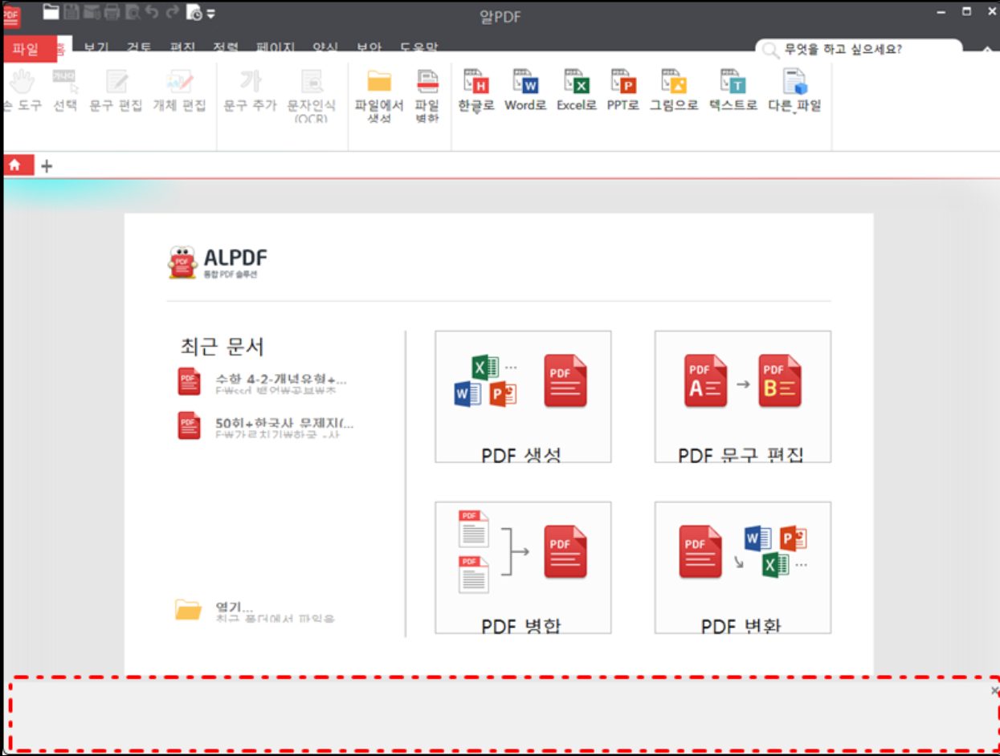
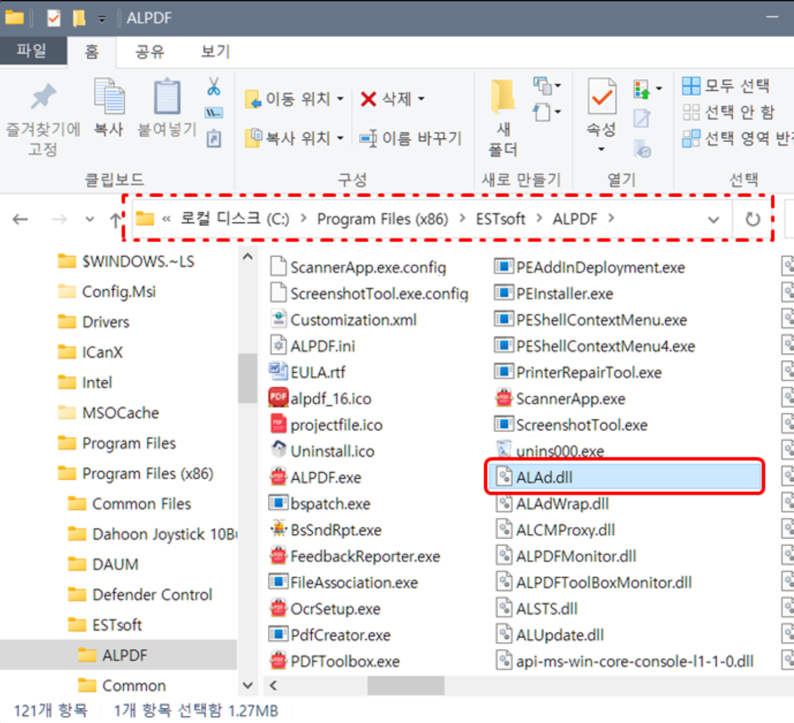
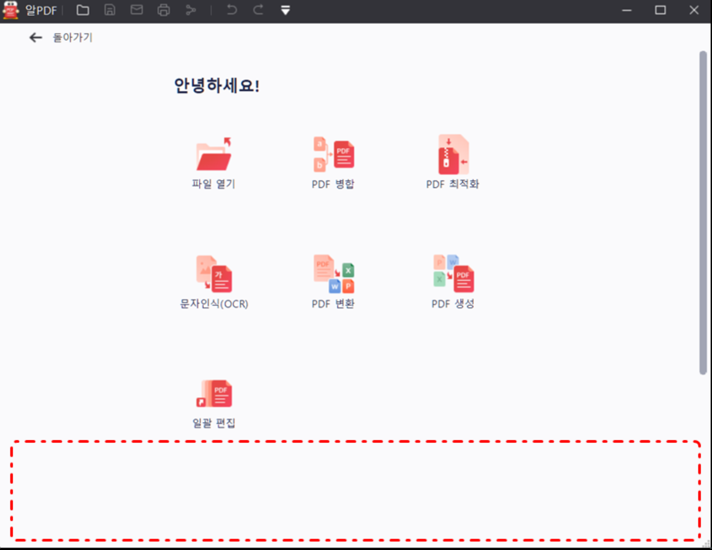

# 알PDF 광고제거하기 

---

>[참고 사이트1](https://blog.naver.com/PostView.naver?blogId=tableset10&logNo=222139976012&parentCategoryNo=&categoryNo=20&viewDate=&isShowPopularPosts=false&from=postView)
>
>[참고 사이트2](https://addplus.tistory.com/entry/%EC%95%8C%ED%88%B4%EC%A6%88-%EC%95%8CPDF-%ED%95%98%EB%8B%A8-%EB%B0%B0%EB%84%88-%EA%B4%91%EA%B3%A0-%EC%A0%9C%EA%B1%B0%ED%95%98%EA%B8%B0)

## 알 PDF 광고 제거이유 

- 알PDF는 adobe 와 다르게 무료로 PDF 편집 시스템을 제공하기 위해 광고를 넣는다. 
- 광고가 많기 때문에 사용하는데 불편함이 존재할 수 밖에 없다. 따라서 광고를 제거해보고자 한다. 
- 해당 방법은 알툴즈 전체 (알캡쳐, 알약, 알PDF 등) 의 같은 소프트웨어에서도 사용할 수 있는 방법이다. 

---

## 광고 제거 방법 

### 1. 내 pc의 로컬디스트 -> Program file(x86) 으로 이동 

### 2. ESTsoft 클릭 -> 광고 제거할 프로그램 이름 선택 ( 해당 글에서는 알PDF 선택) 

### 3. 더 깔끔하게 이용하기 위해서는 Banner 폴더 삭제

- banner 파일 삭제 

- banner파일 삭제 

### 4. ALAD.dll 파일 삭제 

- **알PDF**가 3.0 버전으로 업데이트 되면서 **배너 폴더**를 삭제해도 이미지는 나오지 않지만 인터넷이 연결되어 있으면 광고 문구가 나오기 시작한다. 
- 해당 파일은 **알툴즈** 에서 광고를 관리하기 위한 파일로, **자동으로 업데이트를 하기 위한 파일**이다. 

### 5. 결과 화면 

