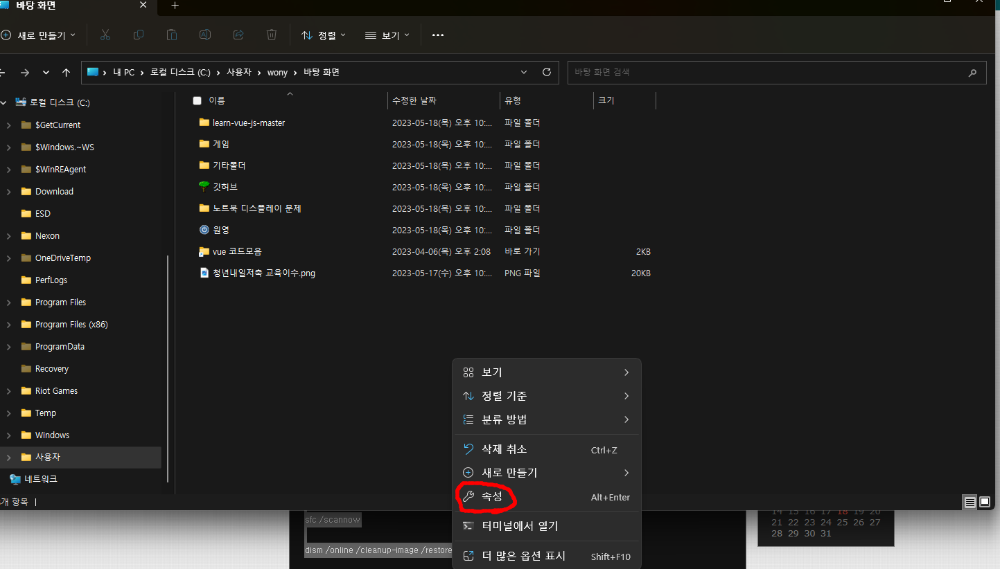
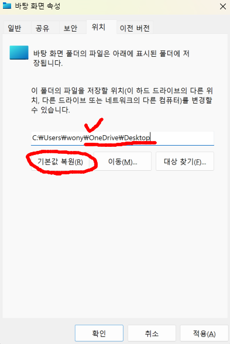
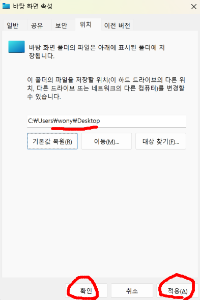

# 윈도우 폴더 자동 새로고침 안됨 해결방법

---

>[참고 사이트1](https://coepi.tistory.com/1)

## 문제

- 바탕화면에 파일을 다운받았는데 **파일이 바로 안보이는 현상**이 발생했다. 
- 그래서 폴더로 확인해본 결과, 파일은 잘 다운받아져있었다. ( 바탕화면 ( 이것도 폴더임 ) 에 파일 표시가 안보이는 것 뿐임)
- **새로고침**을 해야 보인다. -> **자동 새로고침**이 안되는것임 

---

## 해결 실패 방법 종류

- 나는 아래 방법1 ~ 방법4 까지 모두 수행했지만 **해결되지 않았다.** 

### 방법1) 레지스트리 키 추가 하기

1. 실행 창을 연다(윈도키+R)
2. 레지스트리 편집기 실행(regedit)
3. 아래 경로를 찾아간다.
   - HKEY_LOCAL_MACHINE\SYSTEM\CurrentControlSet\Control
4. Update 폴더가 있는지 확인하고 없으면 생성한다. 
   - 이때 Update 키가 없으면 마우스 오른쪽 클릭 키를 추가
5. 키 이름을 UpdateMode 로 설정한다. 
6. 키 마우스 오른쪽 -> DWORD 16진수 0 -> 으로 설정 후 재부팅한다. 

### 방법2)

- 폴더옵션
- 모든폴더표시 체크

### 방법3)

1. 바탕화면에서 마우스 오른쪽 클릭
2. [개인설정] 클릭
3. [테마] 클릭
4. [바탕화면 아이콘 설정] 클릭
5. [기본값 복원] 클릭 - 확인

### 방법4)

- ※ 시스템 파일 검사기(SFC)를 이용한 점검 및 복구

- 윈도키+X > 명령 프롬프트(관리자)(A) 선택 -> 아래의 2줄 명령어를 차례로 입력 후 실행

  ```
  sfc /scannow
  dism /online /cleanup-image /restorehealth
  ```

---

## 최종 해결 방법

- 혹시나해서 전부터 이상했던 **바탕화면 경로**에 주목하게 되었다. 
  - 바탕화면의 경로가 '**C:\Users\사용자\OneDrive**' 에 있는 '바탕화면' 으로 되어있었음
  - 나는 이게 항상 이상했다. 왜 '**C:\Users\wony\Desktop**' 밑에있는 바탕화면이 아닌가...
    - 원래라면 Desktop 밑에 있어야한다. 
- 그래서 경로를 변경해봤다. 

1. 바탕화면 경로로 들어간다. 

2. 마우스 오른쪽 -> 속성 

   

3. 바탕화면 속성 -> 위치 -> 경로 확인 

   - 내 경로는  'C:\Users\사용자\OneDrive\' 이였음 

     

4. 기본값 복원 선택  -> 적용

   - **C:\Users\wony\Desktop**' 으로 변하는것을 확인할 수 있다. 

5. 적용하면 파일들을 다 옮길거냐고 뭍는다. 

   - 허락하면 현재 oneDrive 의 바탕화면에 있는 모든 폴더를 자동으로 옮긴다. 
   - 시간 꾀 많이 걸림 

6. 변경 후 확인해보면 위치가 **C:\Users\wony\Desktop**' 으로 변경된것을 확인할 수 있다. 

   

7. 이렇게하고 문제가 해결됨 

## 정리 

- 내 생각엔 Window 설치 시 자동으로 OneDrive 로 바탕화면이 잡힌거 같다. 
- 계속 불편했는데 해결하고 나니 기분이 좋다. 