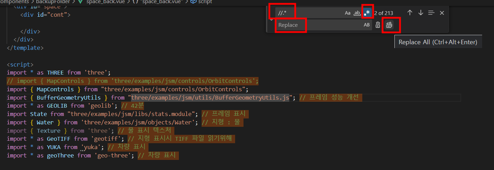

# 파일 모든 주석 제거 방법

---

>[참고 사이트1](https://westpl4.tistory.com/249)
>
>[참고 사이트2](https://gist.github.com/dongbum/1672ebeffd3005d8763c237073a74e08)
>
>[참고 사이트3](https://artwook.tistory.com/287)

## 사용 이유 

1. 프로젝트 진행시 이해하기 위해 많은 주석문을 추가함 
2. 또한 테스트 할 코드들을 한번에 제거하고 싶었다. 

## 방법

1. 글자 변환에 정규식을 이용해 주석을 제거 한다. 

## 변환 방법 



1. vsCode 같은 코드 편집기 툴의 '글자 찾기' 기능을 켜준다.

   1. 나 같은 경우는 vsCode라 파일에서 'Ctrl + F' 를 눌렀다. 

2. 정규식 이용 글자 변환 

   1. '글자 찾기 모드' 에는 대소문자 찾기, 완전 일치 찾기, 정규식 찾기 기능이 있다. 

   2. 여기서 정규식 찾기 아이콘인 '.*' 을 클릭한다. 

   3. 정규식은 다음과 같은 값으로 입력해준다. 

      ```js
      1. // 로된 주석 제거 
      //.*
      
      2. /* */ 로된 주석 제거 
      /\*[(\x00-\xff)|(ㄱ-ㅎ가-힣)]*?\*/
      
      3. 주석제거시 줄바꿈 지우기 (동작 이상할 수 있어 주의 필요)
      ^.*//.*\n 
      ```

3. 그 후 대체할 문자 Replace에 빈값을 넣어준다. 


