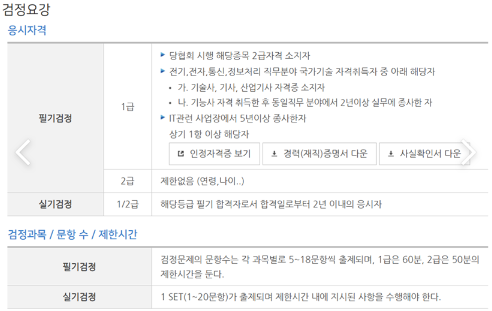
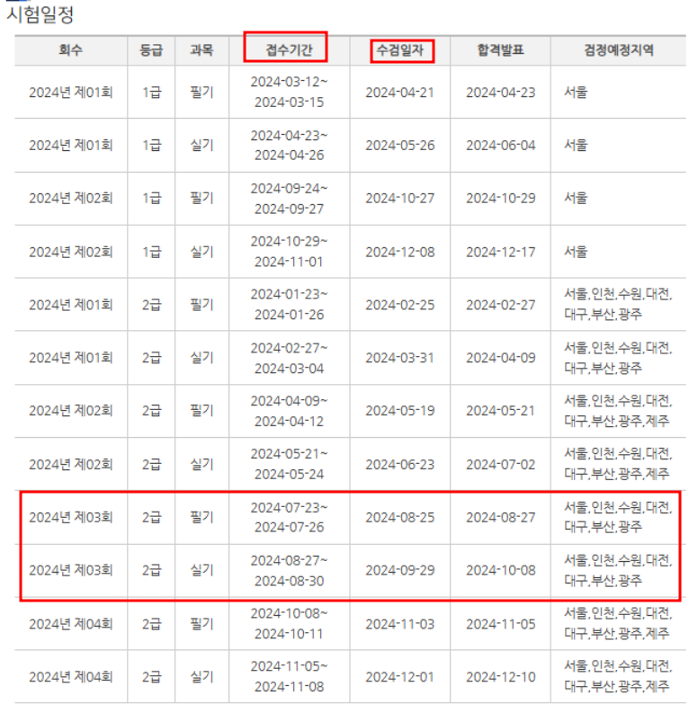

# 네트워크 관리사 2급 준비 

---

>[참고 사이트1](https://ohaengsa.tistory.com/entry/%EB%84%A4%ED%8A%B8%EC%9B%8C%ED%81%AC%EA%B4%80%EB%A6%AC%EC%82%AC-2%EA%B8%89-%EC%8B%A4%EA%B8%B0-%EB%8F%85%ED%95%99-%EA%B3%B5%EB%9E%B5%EB%B2%95)
>
>[참고 사이트2](https://bio-kcs.tistory.com/entry/%EC%9E%90%EA%B2%A9%EC%A6%9D-2023%EB%85%84-11%EC%9B%94-%EB%84%A4%ED%8A%B8%EC%9B%8C%ED%81%AC-%EA%B4%80%EB%A6%AC%EC%82%AC-2%EA%B8%89-%ED%95%84%EA%B8%B0-%ED%95%A9%EA%B2%A9-%ED%9B%84%EA%B8%B0-4%ED%9A%8C-%EC%9D%B8%EA%B0%95-X)

## 준비 이유 

1. iot 사물인터넷에 관심이 생겨 첫 시작을 네트워크로 해보려고 선택함 

### 검정요강

### 시험일정 

