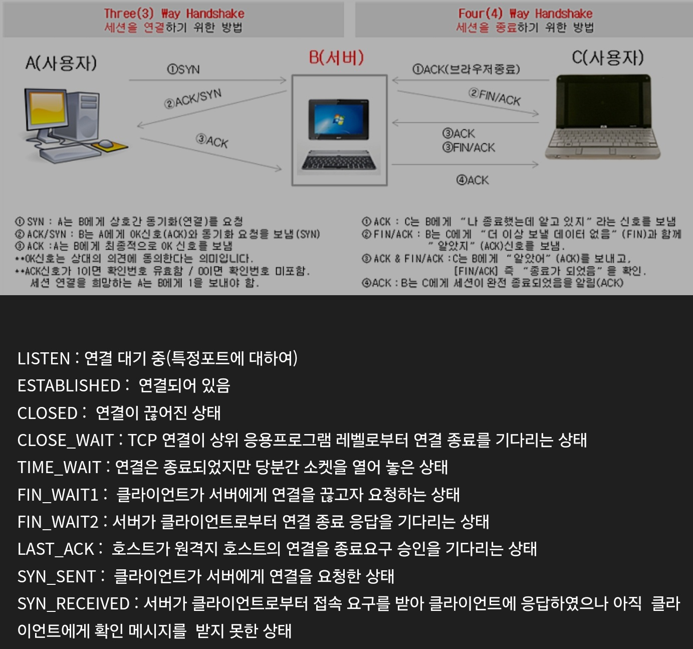

# [ OSI 7계층 ]

## 물리

1. 리피터, 허브 
2. 비트
3. RS-232
4. Hub : 입력된 데이터를 모든 포트로 복제하여 전송해 전송 중인 데이터가 충돌할 수 있다. 
5. 리피터 : 신호 전송시 전송 거리가 멀면 감쇄현상이 발생하는데, 이때 리피터 이용해 신호를 증폭해 더 멀리 보낼 수 있다. 

## 데이터링크

1. 스위치, 브릿지, 랜카드
2. 프레임, 이더넷
3. 에러 탐지와 네트워크 부하 발생하지 않도록 흐름제어(Flow 제어: 흐름제어로, 패킷의 부하 제어)
4. Mac주소 이용해 데이터 전달 
5. 네트워크에서 통신하기 위한 관리와 에러관리, 목적지까지의 데이터 전송을 위한 주소체계 제공 
6. 충돌 도메인을 나눠준다. 
7. 접속 기기간 통신을 관리하며 신뢰도 높은 전송로로 변경하는데 사용 

## 네트워크

1. 라우터 
2. 패킷
3. IP, IPSec, ICMP , IGMP, ARP
4. TCP/IP환경이다. IP는 비연결형, 비신뢰성인UDP사용
5. 패킷 분할 및 병합기능만 재공. 패킷 재전송, 에러,흐름제어 x 
6. 패킷 : 일정 크기로 분할된 데이터와 제어정보를 포함하는 데이터 블록 
7. 두 노드 간 오류 없는 데이터 전송하고 논리적 주소를 사용 
8. 메시지를 짧은 패킷으로 나누어 전송 
9. 장애발생시 패킷 우회전송 가능. 패킷 전송시에만 전송로 사용해 설비 효율 좋음 
10. 다중화 이용해 복수 상대방과 통신가능 
11. ICMP 는 포트 없음 (IP네트워크의 일부이다)
12. IGMP가 대표적 비대칭 프로토콜로, TTL제공함 
13. 패킷 교환 방식
    - 가상회선 방식 : 연결혈
    - 데이터그램 방식 : 비연결형 

## 전송

1. 게이트웨이 
2. 세그먼트
3. TCP, UDP
4. TCP,UDP에는IP가 필요하다.
5. 로드벨런싱 사용 ( 부하분산으로, 특정 루트로 부하 발생하지 않도록 분산) 
6. 종단간 에러 탐지와 재전송 방법으로 에러 해결 
7. 송수신자 간에 통신를 위해 동기화 신호 주고받음
8. 다른 네트워크로 들어가는 입구 역할 
9. QOS(대역폭 조절해 서비스 효율 증가) 서비스 이용해 통신 품질, 지연시간, 데이터 손실률 보장 

## 세션

1. 메시지
2. SSH
3. 암호화, 복호화 

## 표현

1. 메시지
2. JPG , MPEG, PAP
3. 메시지 압축해 전송량 최소화
4. 스니핑통해 메시지 훔쳐볼수 있어 암호/복호, 인증, 압축 기능 수행

## 응용 

1. 메시지
2. HTTP, FTP, DNS, SMTP, SNMP
3. 프로그램 있는 계층 
4. 인터넷, 파일 업로드/다운로드, 네트워크 모니터링 위한 SNMP , 메일 발송을 하기위한 프로토콜들이 있다. 

## < DNS >

1. HTTP와 함께 TCP와 UDP사용하는 양다리 프로토콜 

## < TCP/IP 프로토콜 4 계층>

1. 패킷 통신 방식의 인터넷 프로토콜인 IP와 전송 계층의 TCP 프로토콜로 이루어진 프로토콜이다. 
2. IP프로토콜은 패킷 전달 여부를 보증하지 않아 보낸 순서와 받는 순서가 다르다. 
3. TCP프로토콜은 IP위에서 동작하는 프로토콜로, 데이터의 전달을 보장하며 순서대로 받을 수 있게 한다. 

## < TCP/IP 프로토콜 4 계층>

- 1 : 네트워크 액세스 계층 ( 물리, 데이터링크)
- 2 : 인터넷 계층 ( 네트워크 )
- 3 : 전송계층 ( 전송 ) 
- 4 : 응용계층 ( 세션, 표현, 응용 )

## < 계층별 스위치 > 

1. L2 스위치 : 데이터 전달에 MAC 주소 사용 
2. L3 스위치 : 데이터 전달에 IP주소 사용
3. L4 스위치 : IP와 PORT를 통해 데이터와 로드벨런싱 담당
4. L7 스위치 : 데이터 전달, 로드벨런싱, 햐킹 보안성기능 수행 

