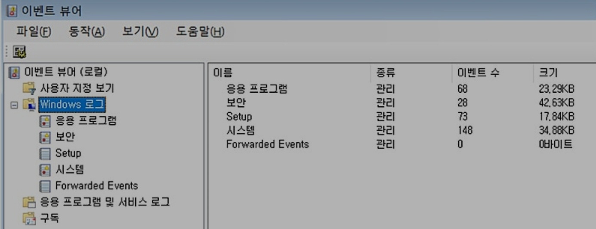

# [ Apache 웹서버 ]

## < Httpd.conf > 

- 아파치 **웹서버 운영**시 서비스에 필요한 여러 기능들을 설정하는 파일 

## < KeepAlive > 

- 한 프로세스가 특정 사용자의 요청을 지속적으로 허용하며 처리할지 여부를 설정. 기본은 off 

## < Timeout 시간초> 

- keepAlive가 on 일때 사용
- Timeout시간을 설정해 시간초 지나면 세션 종료 
- 기본 시간은 15초 

## < StartServers number >

- 아파치 시작시 생성되는 프로세스 수 

## < Listen > 

- 아파치 **웹서버의 서비스 포트**를 지정하는 부분 
- 기본 포트는 80
- www의 기본포트가 80

## < 상태 코드 > 

- 100 : 정보 제공 응답 
- **200** : 성공적 응답 
- 300 : 리다이렉트 
- **400** : **클라이언트**측 에러 메시지
- **500** : **서버**측 에러 메시지
  - 500 : 서버쪽에서 클라이언트 요청을 서비스 못함
  - 501 : 클라이언트 요청 내용 중 수행 불가 내용있음
  - 502 : Bad gateway 로 게이트웨이 경로 잘못지정 
  - 503 : server unavilable 서버 이용 불가

## < IIS 관리자 : Internet Infomation Service 관리자 > 

- **웹 서버를 관리**하기 위해 사용함 
  - 인터넷 정보 서비스 관리자 
  - 인터넷 기반 서비스 모임 

- 웹 서버를 설정하고 관리하는데 필요한 다양한 기능을 이용할 수 있다. 
  - 웹서버나 FTP서버 등을 구성하고 운영할 때 사용됨
  - FTP, SMTP, SNTP, HTTP/HTTPS(WWW) 를 포함한다. 
  - 웹 사이트의 웹문서 폴더 변경 가능 
  - 웹문서 추가 및 순서 조절 가능 

- 가상 디렉토리 이름은 실제 디렉토리 경로와 일치하지 않아도 된다. 즉, 논리 경로를 통해 다른 서버 폴더에 접근가능 
- 디렉터리 검색기능 이용하면 기본문서 없을 때 파일 목록표출 

# [ 윈도우 관련 서버 ]

## < 이벤트 뷰어 > 

- 윈도우의 로그를 통해 운영체제 관리하는 것
- 이벤트 생성 항목에 대해 **로그를 관리**하고 볼 수 있다. 
- **로그 종류 :**
  1. 시스템 , 
  2. 응용 프로그램(application), 
  3. 보안, 
  4. Setup, 
  5. Forward(해결책) Events 
- **이벤트 유형 :** (오정경 성실성)
  1. 오류, 
  2. 정보, 
  3. 경고, 
  4. 성공감사, 
  5. 실패감사, 
  6. 성공상세
- code 6005 : 부팅시
- code 6006 : 정상종료시 

## < FSRM : File Server Resource Management > 
- 파일 서버에 저장된 데이터를 관리 및 분류하는데 사용하는 윈도우 서버의 서비스이다. 

## < NTLM : NT Lan Management > 
- 윈도우즈에서 제공하는 인증 관련 프로토콜 중 하나 
- Challenge-Response 라는 인증 프로토콜 사용 

## < 메모리 : RAM > 
- 하드웨어보다 빠른 메모리로, 저장장치(HDD) 와 CPU(계산) 을 이어준다. 
- Swap : 가상메모리로, 하드디스크의 일정 부분을 지정하여 RAM 처럼 사용한다. 

## < FAT32 > 
- 윈도우즈 파일 포멧 유형 

## < NTFS > 
- 파일 시스템 중 하나로, 볼륨사이즈가 256TB
- FAT32의 업그레이드 버전 

## < ReFS : Resilient File System >
- 마이크로소프트의 스토리지 기술
- 탄력적인 파일 시스템
- NTFS 의 업그레이드 버전 
- 볼륨 사이즈 4.7제타바이트 

## < RAID > 
- 여러개의 물리적 디스크를 하나의 논리 디스크로 만드는 방법 

## < LVM >
- 리눅스의 디스크를 구성하는 기술 
- 리눅스도 RAID 지원 

## < Multihoming >
- 하나의 이더넷 포트에 여러개의TCP/IP주소를 갖게 함 
- 즉, **인터넷에 다중접속**하게 하는 기술로, 한 대의 서버로 여러개의 도메인 운영이 가능함
- 멀티호스팅, 멀티노딩, 멀티호밍 모두 같은의미

## < 방화벽 : firewall > 
- 외부 네트워크와 내부 네트워크 사이를 지나는 **패킷을 미리 정한 규칙에 따라 차단하거나 보내주는 기능** 
- 접근제어, 로깅과 감시추적, 메시지 인증, 사용자 인증, 클라이언트 인증 등을 수행 

## < BitLocker > 
- ms 윈도우와 서버에서 사용하는 완전한 **디스크 암호화 기능** 
- AES암호화 알고리즘 사용 

## < TPM : Trusted Platform Module > 
- 신뢰 플랫폼 모듈로, 컴퓨팅 환경에서 암호화 키를 저장할 수 있는 보안 처리자를 자세히 기록하는 기술
- ms윈도우에서 사용하는 디스크 암호화인 비트로커에서 사용하는 기술이다.
- 운영체제의 볼륨을 암호화하고 인증기능을 제공 

## < 계정 생성 >
- 운영체제 설치시 기본적으로 생성되는 계정 종류

1. Administrator : 관리자 
2. Guest : 로그아웃하면 삭제됨
3. DefaultAccount
4. Users : 기본 소속 그룹으로, 시스템 권한 변경시 root 또는 sudo 그룹에 속해야한다. 
   1. 자동 생성 x 
   2. Root : 리눅스 시스템의 관리자 계정으로, 자동생성 안됨

## < 도메인  그룹 >

1. 글로벌 그룹 : Global group 
   1. 로컬 도메인의 사용자만 가입 가능 
   2. 로컬 및 다른 도메인 자원사용가능 

2. 도메인 로컬 그룹 : Domain group
   1. 로컬 도메인과 다른 도메인 사용자 가입 가능 
   2. 다른 도메인 자원 사용 불가 

3. 유니버셜 그룹 : universal group 
   1. 1번과 2번 장점 가진 그룹 
   2. 그룹 가입이 모든 도메인에 개방됨
   3. 모든 그룹의 자원 사용 가능 
   4. 단점은 부하(Global Catalog)를 높이는 원인이 된다 

## < 도메인 Active Directory 구조 > 

1. Domain : 사용자 계정정보와 DNS 이용해 구별되는 하나의 object 단위 
2. Tree : 연속되는 영역 이름을 가진 하나 이상의 도메인
3. Forest : 연속되지 않는 영역 이름을 가진 하나 이상의Tree 
4. 트러스트 : 도메인이나 포레스트가 상호간 신뢰할지 여부를 나타내는 값 

# [ 윈도우 명령어 ]

## < eventvwr.msc > 
- 이벤트 뷰어 실행

## < compmgmt.msc > 
- 컴퓨터 관리 실행 
- Computer Management

## < secpol.msc > 
- 로컬 보안정책 관련 명령어
- Security
- policy : 정책 

## < certmgr.msc > 
- 인증서 관련 실행

## <devmgmt.msc > 
- 장치 관리자 실행 

## < diskmgmt.msc > 
- 디스크 관리자 

## < fsmgmt.msc >
- 공유폴더 관리

## < hdwwiz.cpl > 
- 장치관리 

## < wbadmin.msc > 
- 윈도우 백업 

## < msconfig > 

- 시스템 구성 유틸리티

## < ipconfig : Internet Protocol Configuration > 
- 로컬 컴퓨터의 설정된 **네트워크 값 정보**를 확인하는 명령어 
- ip, Gateway, SubnetMask 확인 가능 
- /release : DHCP 서버로 **IP 주소 반환** 
- /renew : 새로운 IP주소 받음 
- /flushdns : 시스템상 등록된 **dns 캐시 정보 비우기** (flush : 비우다 )
- /setclassid : 지정된 로컬 영역 어댑터에 Classid설정해 DHCP 를 테스트
- /all : 모든 정보 확인(MAC정보도 확인 가능) 
- 리눅스에서는 ifconfig 사용

## < ds 관련 명령어 : Directory Service > 
- 도메인 사용자 계정을 관리하기 위한 명령어 
  - dsadd : 디렉토리에 개체 유형 추가 
  - dsget : 디렉토리 개체 표시 
  - dsmod : 개체 수정 
  - dsrm : 개체 삭제 
  - dsquery : 검색조건에 해당하는 개체 찾기 
  - dsmove : 개체 이동 

## < nslookup [도메인이름]>
- **DNS조회**를 수행하는 명령어
- **IP주면 DNS정보 주고, DNS정보주면 IP정보 줌** 
- 도메인 이름 입력시 IP주소 알려줌

## < ping >
- 네트워크에 있는 호스트들 상대로 **상태 점검**할 때 사용 
- 패킷 왕복 시간으로 이상 여부 확인 
- 네트워크 오류 여부만 확인 가능 

## < tracer > 
- **패킷 경로** 살피는 명령어 
- 라우터 지날때마다 특정 메시지 보내서 라우터 존재 및 지연시간 검사 
- 접속하려는 호스트 정보까지 추적 가능 

## < pathping> 
- **ping + tracer** 
- 패킷 목적지로 보낼때 중간 경로의 라우터에서 리턴되는 패킷 결과 계산해 출력 
- 패킷 손실률과 중간 라우터까지 도착시간 포함 