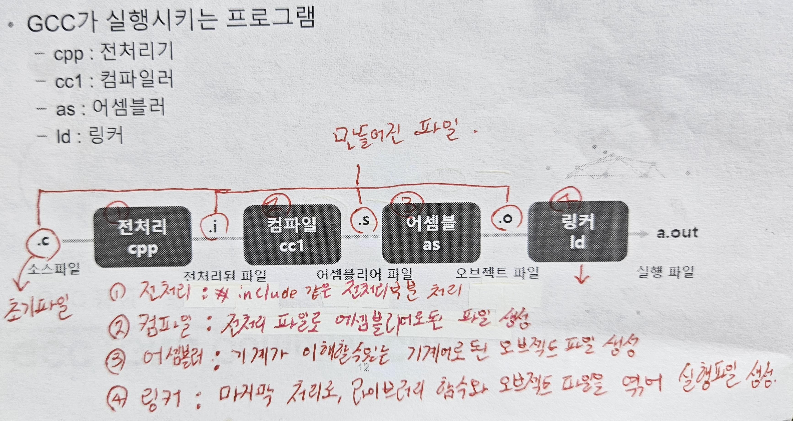

# GCC와 실행파일에 대한 개념정리 

---

>[참고 사이트1](https://80000coding.oopy.io/d5fa7c87-192f-4c68-95eb-aa4af5b9dbf5)

## GCC  ( GNU Compiler Collection )

### 정의

- **GNU 컴파일러 모음**의 약자
- GNU 프로젝트의 일환으로 개발되어 널리 사용되고 있는 컴파일러이다. 

### GNU 프로젝트

- GNU's Not Unix 의 재귀약자로, "**GNU는 유닉스가 아니다** " 라는 의미를 가진다. 
  - 리처드 스톨먼이 각종 자유 소프트웨어들이 번영할 수 있는 생태계를 구축하기 위해 시작한 프로젝트 
- 따라서 유닉스와 호환되고 **GPL (General Public License )** 을 따르는  더 강력한 운영체제 계발을 목표로 하는 프로젝트이다. 

### 컴파일러 

- 어떤 언어의 코드를 다른 언어로 바꿔주는 프로세스 

### 옵션

- 각 단계별로 처리된 파일을 저장할 수 있다. 


```
1. gcc -E 파일이름.c -o 파일이름.i          =>          .c파일을 -E의 옵션으로 .i 파일로 변경. ( -E 옵션만 모양이 특이함 )

2. gcc -S 파일이름.c          =>          컴파일러로 .s 파일을 생성 

3. gcc -C 파일이름.c           =>          어셈블러로 .o 파일 생성 

4. gcc -o 파일이름.c           =>          링커로 실행파일 생성 

5. gcc 파일이름.c -o 파일이름           =>          .c파일을 GCC를 이용해 -o 옵션을 이용해 실행파일로 만들고 파일명으로 프로그램 실행 
```

### 소스코드가 실행파일이 되는 과정 

- 총 4가지 단계를 거처 실행파일로 변한다. 
  1. 전처리 단계
  2. 컴파일 단계
  3. 어셈블 단계
  4. 링크 단계 



1. 전처리 단계

   - \# 으로 시작하는 특정 파일의 내용을 처리하는 단계 

     - 전처리기에 의해 **.c** 파일을 통해 **.i** 파일이 생성된다 .

   - 전처리 과정 실행

     ```c
     # 전처리 과정 실행
     gcc -E main.c -o main.i
     ```

2. 컴파일 단계 

   - 전처리된 파일을 컴파일러를 통해 **어셈블리어**로된 **.s**파일을 생성한다. 

   - 어셈블리어
     - 기계어와 같은 저급 언어
     - 기계어는 컴퓨터가 바로 읽을수 있는 o,1인 반면, 어셈블리어는 기계어와 명령어가 1:1로 대응되는 단어들로 구성되어 기계어를 보완하기 위해 나온 언어이다. 
     - 저급언어라 실행이 빠르다는 장점이 있다. 

   - 컴파일 과정 실행

     ```c
     # 컴파일 과정 실행 [ *.c -> (*.i) -> *.s ]
     gcc -S main.c
     ```

3. 어셈블 단계 

   - 어셈블리어 파일인 **.s**를 기계어로 된 **오브젝트 파일** **.o** 파일로 변환한다. 

   - 즉, 컴퓨터가 읽을 수 있는 0과 1로 이루어진 2진수로 변환

   - 어셈블 과정 실행

     ```c
     # 어셈블 과정 실행 [ *.c -> (*.i) -> (*.s) -> *.o ]
     gcc -c main.c
     ```

4. 링커 단계 

   - printf, scanf 와 같은 라이브러리 함수와 오브젝트 파일들을 연결하여 실행파일로 생성

   - .o 파일을 이용해 실행파일을 생성 (hello.o → hello)

     - -o 옵션으로 실행파일 만들 수 있음 

   - 링커 단계 실행

     ```c
     # 링크 단계 [ *.c -> (*.i) -> (*.s) -> (*.o) -> excutable ]
     gcc -o main main.c func.c
     ```

### 한번에 실행파일 만들기 

- makefile을 만들어 한번에 -o 옵션과 -c 과정을 수행 후 실행파일 생성


