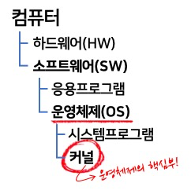
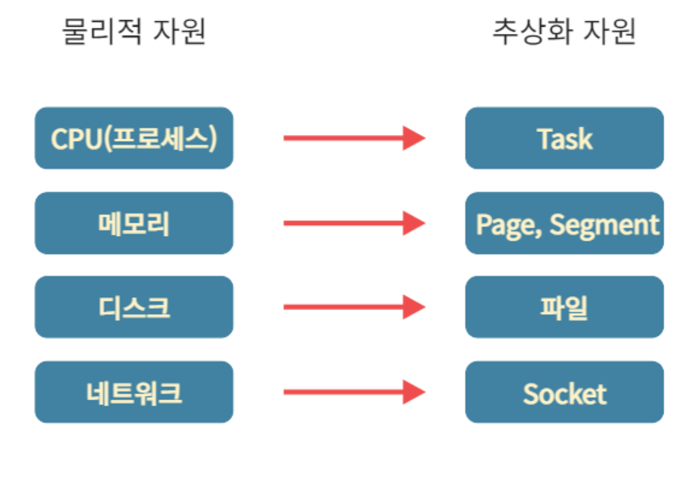

# Kernel 개념정리 

---

>[참고 사이트1](https://kingofbackend.tistory.com/100)
>
>[참고 사이트2](https://5equal0.tistory.com/entry/Linux-Kernel-%EC%BB%A4%EB%84%90%EC%9D%98-%EA%B0%9C%EB%85%90%EA%B3%BC-%EC%BB%A4%EB%84%90%EC%9D%98-%EA%B5%AC%EC%A1%B0)

## Kernel

 

### 정의

- 운영체제 맨 하층에서 작동되는 소프트웨어로, **OS의 중추 역할** 을 한다.
  - 따라서 **물리적 자원을 추상화하여 사용자가 보다 쉽게 접근할 수 있도록 도와주는 것**이 커널의 역할이다. 
  - 여러 개의 프로세스들을 관리하기 위한 스케줄링이 대표적인 커널이 하는 역할이다. 
- 사용자가 system call을 통해 컴퓨터 자원을 사용할 수 있게해주는 **자원 관리자**

### 커널 vs 시스템 프로그램 

- 커널은 항상 컴퓨터 자원들만 바라보고 있으며 사용자와 **직접적인 상호작용은 하지 않는다.** 
- 사용자와 상호작용을 하기 위해 필요한 것이 바로 **시스템 프로그램**이다. 

### 추상화란?

- 물리적으로 하나 뿐인 하드웨어를 여러 사용자들이 번갈아 사용하게 중재함으로써, 마치 한 개의 하드웨어가 여러 개인 것처럼 보여지도록 하는 기술
  - 커널이 하는 역할로, 스케쥴링과 연관이 있다. 

### 주요 기능 

1. 디바이스 관리
   - **디바이스 드라이버**라는 하드웨어 입출력을 제어하는 **소프트웨어**를 이용하여 **장치를 관리**한다.
2. 프로세스 관리(Task 관리)
   - 프로그램 실행시 해당 실행 파일이 메모리에 적제되고, CPU를 할당받으면 프로세스가 된다. 
     - 하나의 CPU로 여러개의 프로세스를 실행하기 위해 CPU 사용시간을 분배하게 된다. => 추상화의 대표적인 예  
     - 이때 각각의 프로세스에는 PID(process id)가 부여되며 커널은 이 PID를 통해 프로세스를 관리한다. 
3. 메모리 관리
   - 프로그램이 실행 될 때 메모리에는 프로그램뿐만 아니라 **프로그램이 이용하는 데이터 영역 또한 메모리에 할당**된다. 
   - 따라서 메모리 영역을 분배하거나 이용이 끝난 메모리 영역 회수 등을 담당하는 것이 커널이다. 
4. 시스템 콜 제공
   - 표준 출력이나 파일을 쓰는 write, 읽어들이는 read, 프로세스를 포크하는 기능 등을 가고 있어 사용자 프로그램에서 액세스 할 수 있도록 도와준다. 

### 물리적 자원과 추상화 자원의 대응관계 

- 커널이 추상화하여 관리하는 물리적 자원들과 이를 추상화한 자원을 칭하는 용어 간 대응 관계는 아래와 같다. 
  - 따라서 커널은 물리 자원과 추상 자원들을 관리(Manage) 하는 역할을 한다.  

### 구성요소

1. 태스크(Task) 관리자
   - 물리적 자원인 CPU를 추상적 자원인 태스크로 제공 
2. 메모리(Memory) 관리자 
   - 물리적 자원인 메모리를 추상적 자원인 페이지나 세그먼트로 제공
3. 파일 시스템(File System) 관리자 
   - 물리적 자원인 디스크를 추상적 자원인 파일로 제공
4. 네트워크(Network) 관리자
   - 물리적 자원인 네트워크 장치를 추상적 자원인 소켓으로 제공
5. 디바이스 드라이버(Device Driver) 관리자
   - 각종 외부 장치에대한 접근 

### 자원 관리하는 이유 

- 사용자가 물리적인 하드웨어에 접근하고 사용할 수 있도록 매개하기 위해서
  - 컴퓨터만의 언어와 규칙으로 하드웨어 접근하고 통신해야 하는데 일반 사용자들은 이러한 언어와 규칙을 모른다
- 따라서 커널은 사용자와 하드웨어 사이에서 상호작용 할 수 있도록 도와주는 **'번역가' 같은 역할**을 한다고 보면 된다. 