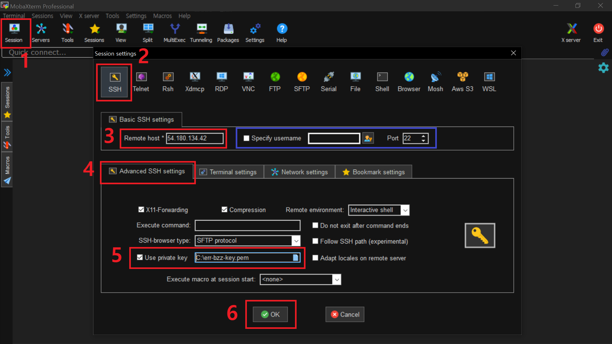
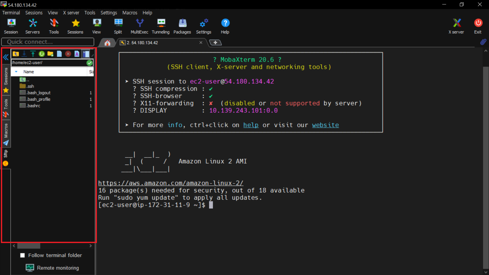

# MobaXterm 개념정리

---

>[참고 사이트1](https://err-bzz.oopy.io/223a9c02-7ac2-498c-afde-01db6cf873ae)
>
>[참고 사이트2](https://securityspecialist.tistory.com/141)

## MobaXterm

### 정의

- SSH, RDP, SFTP 등 다양한 네트워크 클라이언트와 터미널을 제공하는 툴
- 다른 네트워크 클라이언트 프로그램들에 비해 훨씬 강력하고 편리한 세션 연결을 지원
  - Putty를 사용하는 것보다 훨씬 더 편리

### SSH ( Secure Shell ) 이란?

- 네트워크 상의 **다른 컴퓨터에 로그인**하거나 **원격 시스템에서 명령을 실행**하고 다른 시스템으로 **파일을 복사**할 수 있도록 해주는 응용 프로그램 또는 프로토콜

### 이용방법

1. Session 클릭
2. 2.SSH 클릭
3. 접속하려는 서버의 퍼블릭 IP 입력
4. Advanced SSH settings 클릭
5. Use private key 체크 후 EC2 Key (.pem) 업로드]

### 동작 화면 

