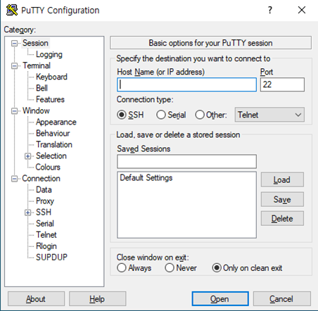
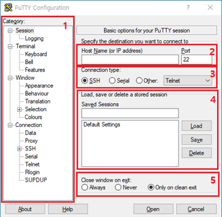
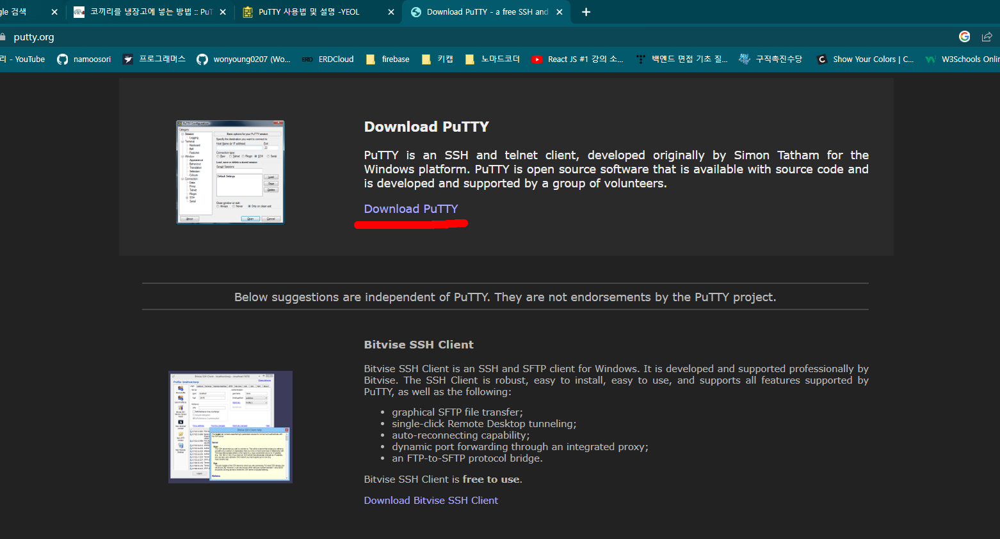
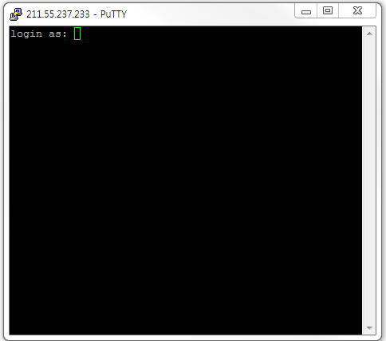

# Putty 개념정리

---

>[참고 사이트1](https://maro-matta.tistory.com/entry/PuTTY%EA%B0%80-%EB%AD%90%EC%9E%84)
>
>[참고 사이트2](https://yeolceo.tistory.com/72)
>
>[참고 사이트3](https://dololak.tistory.com/24)

## Putty

### 정의

- 서버에 접속하여 명령어를 전송하는 **원격 서버 접속 프로그램**
  - 서버에 접속할 때 물리적 단말기가 아닌 윈도우 등의 운영체제에서 가상의 단말기를 사용하여 ssh, Telnet, raw tcp 방식으로 원격 접속을 제공하는 **무료 응용프로그램**
- 따라서 서버에 접속하기 위한 **원격 서버 접속 프로그램**이다. 

### 이름 유래

-  PuTTY라는 이름에는 특별한 뜻이 없으나 tty는 **유닉스 전통의 터미널의 이름**을 가리키며 **teletype**를 짧게 줄인 것

### 구성

1. PuTTY
   - 텔넷/SSH 클라이언트 본체, 실제 우리가 알고 있는 프로그램
2. PSCP
   - 명령줄에서 실행가능한 SCP 클라이언트, SSH 프로토콜을 활용한 원격 cp 명령
3. PSFTP
   - SFTP 클라이언트, FTP 와 매우 유사하지만 SSH 프로토콜을 사용한다.
4. PuTTYtel
   - telnet 전용 클라이언트
5. Plink
   - 명령줄에서 제어할 수 있는 putty 백엔드
6. Pageant
   - PuTTY, PSCP, Plink에서 사용할 수 있는 SSH 키 인증 관리자
7. PuTTYgen
   - RSA/DSA 키 생성 도구

### 이용 설명

1. putty를 사용하는데 필요한 설정 및 기능 목록
2. 서버 ip 및 포트번호를 적는 곳
3. 서버를 접속할 방식을 선택하는 곳
4. 서버 목록
   1. 자주 접속하는 서버의 설정을 저장하고 불러올 수 있다.
   2. putty에서는 호스트 서버 프로필을 세션단위로 표현
5. 연결이 끊기면 창을 닫을지 안닫을지 정상적으로 끊긴 경우에만 창이 닫힐지 선택할 수 있다.

### 이용방법

- [Putty 다운로드 하는 곳](https://www.putty.org/)

1. 위 설명에서 2번의 Host Name 란에 서버의 주소 또는 호스트네임을 적는다.
2. 위 설명에서 3번의 접속 방식을 선택
3. Open을 눌러 접속
4. 접속에 성공하면 다음과 같이 터미널이 나온다.
   - 이때부터는 평소의 **서버 터미널**처럼 사용하면 된다. 
5. 종료는 우측 상단의 x 를 눌러 종료

