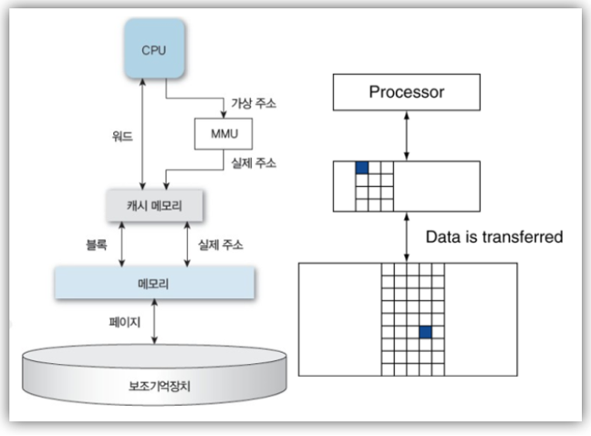

# 기억장치에 대한 개념정리 

---

>[참고사이트1](https://beenii.tistory.com/101)
>
>[참고사이트2](https://mindstation.tistory.com/156)
>
>[참고사이트3](https://kkhipp.tistory.com/168)

## 기억장치 종류

- CPU는 기억장치가 아니라 연산장치이다. 

1. 고속 기억(버퍼) 장치
   - 레지스터
   - 캐시
2. 주기억장치
   - ROM
   - RAM
3. 보조기억장치
   - HDD
   - SSD

---

## 1. 고속 기억(버퍼) 장치

1. 레지스터
   - CPU 안에서 동작하는 가장 빠른 메모리 
   - 캐시로부터 데이터를 읽어들여 레지스터에 저장한다음 레지스터 사이로 데이터를 전달하면서 CPU에서 연산을 수행 
     - **CPU가 요청을 처리하는 데이터의 임시저장 공간**
     - CPU는 데이터를 저장할 수 없기때문에 레지스터를 이용해 보완한다. 
2. 캐시
   - CPU와 주기억장치 사이에 위치한 메모리
   - **자주 사용하는 데이터나 값을 복사해 놓는 임시 저장소**
     - CPU 에 비해서 상대적으로 속도가 느린 메인메모리로부터 데이터를 불러 들이는 시간을 단축하기 위해서 한번 활용한 데이터의 내용이나 램에서의 위치를 저장해 놓는 **임시 기억장치**이다. 
   - CPU와 별도로 회로를 **독립적으로 형성**한다. 
   -  L1, L2, L3 캐시로 나뉘어지는데, CPU에 가까운 캐시일수록 작고 비싸고 빠르다.
     - L1 이 가장 뻐름
3. 버퍼와 캐시 차이점
   - 버퍼는 캐시와 마찬가지로 **속도에 차이가 있는 두 장치 사이에서 그 차이를 완화하는 역할**을 한다.
   - **캐시**는 **처리속도를 최대한 올리기 위한 기술로 주로 빠른 속도의 장치를 보조**한다
   - **버퍼**는 **처리속도가 떨어지는 걸 방지하는 기술로 주로 느린속도의 장치를 보호**한다
     - 그래서 캐시와 버퍼는 주로 읽기/쓰기 부분에 사용된다. 

## 2. 주기억장치 (메인메모리)

- 보조기억장치(HDD) 보다 빠르지만 레지스터와 캐시보다는 느린 기억장치이다. 
- CPU에서 직접 접근이 가능한 메모리로 ROM과 RAM으로 나뉨 

1. RAM (메인메모리)
   - 휘발성 메모리 ( 전원공급이 중단되면 삭제되는 데이터를 저장하는 곳 )
   - **SRAM** ( Static RAM ) : DRAM 보다 일반적으로 용량이 작지만 속도가 빠르고 가격이 비싸다. 
   - **DRAM** ( dynamic RAM ) : SRAM 보다 용량이 크지만 SRAM 대비 속도가 느리다. 대신 가격이 싸다. 캐퍼시터를 통해 데이터를 저장하는 방식을 사용한다.
2. ROM
   - 비휘발성 메모리 ( 전원을 꺼도 삭제되지 않는 데이터 저장하는 곳 )
   - BIOS (Basic Input and Output System ): 컴퓨터 하드웨어와 운영체제를 연결하는 역할을 한다. 
     - 컴퓨터가 켜질 떄 가장먼저 동작함 

## 3. 보조기억장치 

- 물리적인 디스크가 연결되어있는 기억장치
- 컴퓨터의 전원을 끄더라도 저장된 데이터가 사라지지 않는다. 

1. HDD
   - 물리적인 디스크를 고속으로 회전시켜 데이터를 저장 
2. SSD
   - Solid State Drive의 줄임말로 전기적으로 데이터를 저장한다. 
   - HDD에 비해 속도도 빠르고 소음도 발생하지 않는다. 

---

## DMA와 MMU

### DMA ( Direct Memory Access )

- 데이터의 전송을 CPU의 간섭없이 진행해 CPU를 조금이라도 쉴 수 있도록 하기위한 기능이다. 
  - 주변장치( 하드디스크, 그래픽 카드 등 )들이 CPU의 관여 없이 **메모리에 직접 접근**하여 읽거나 쓸 수 있도록 하는 기능 
- 따라서 원래는 주변장치간의 데이터 전송을 모두 CPU가 해야했지만 DMA가 그 역할을 대신하여 CPU의 효율을 늘릴수 있게되었다. 

### MMU ( Memory Management Unit ) : 메모리 관리 장치 

- 실제 메모리와 가상 메모리 사이에서 주소 변환 역할을 하는 장치 
  - 실제 메모리에 있는 프로그램이 MMU를 거쳐 가상주소인 메모리 공간을 할당받는다.  그 반대도 가능
- 우리가 프로그램을 사용할때 해당 프로그램의 모든 메모리를 할당받아 사용하지 않는다. 이때 가상 메모리 개념이 사용되는데, 실제 메모리들을 필요한 부분만 가져와 가상 메모리 공간에 올려 프로그램을 동작시킨다. 

1. 가상 메모리 주소
   - 논리 주소
   - cpu가 만들어 내는 주소이며 우리가 **프로그래밍시에 쓰는 주소**
   - 모든 프로세스의 시작은 0번지 부터로 차곡차곡 주소를 할당받는다. 
2. 실제 메모리 주소 
   - 물리 주소 
   - **실제 데이터나 프로그램이 저장되는 공간**의 주소  
   - 프로그램의 시작주소가 다 다름 