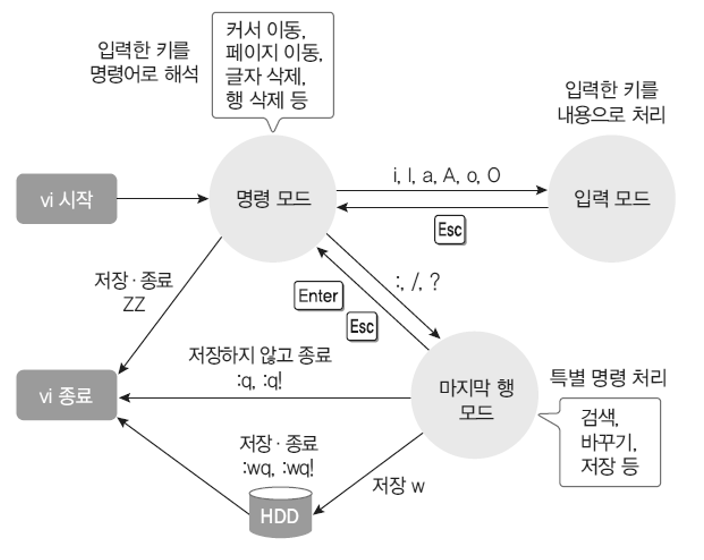

# 리눅스와 우분투 개념정리 

---

>[참고 사이트1](https://brunch.co.kr/@uxstar/7)
>
>[참고 사이트2](https://story.pxd.co.kr/743)

## 리눅스 ( Linux )

### 개발배경

- 소프트웨어의 상업화에 반대해 **'모두가 공유할 수 있는 소프트웨어 '** 를 만드는 것을 목표로하는 **'GNU 프로젝트'** 에 의해 완성되고 만들어졌다. 
- GNU 프로젝트
  - GNU's Not Unix 의 약자로, "**GNU는 유닉스가 아니다** " 라는 의미를 가진다. 
  - 따라서 유닉스와 호환되고 **GPL (General Public License )** 을 따르는  더 강력한 운영체제 계발을 목표로 하는 프로젝트이다. 

### 정의

- 리눅스 커널을 사용하는 오픈소스 운영체제 (OS) 이다
  - 유닉스 계열의 OS이다. 
  - 유닉스보다 좋은 운영체제를 만들자라는 목표에서 시작되어 개발됨 
- PC와 서버측 두곳에서 모두 사용이 가능한 OS이다. 
  - PC는 거의 윈도우를 사용하고, **서버는 리눅스 만이 사용함** 

### 특징

1. 유닉스 기반
2. **다중 사용자와 다중 프로세스**
   - 여러 사용자가 동시에 사용 가능 
   - 여러 플로그램이 동시에 실행가능 
3. 강력한 네트워킹
   - 네트워크에 최적화된 운영체제이다. 
4. 쉘 프로그래밍
   - 명령어의 실행을 프로그램화할 수 있다. 
5. GPL 방식을 따라 모든 소스가 공개됨
6. 대부분 C 언어로 작성되어 뛰어난 이식성을 보인다. 

### 장점

1. 오픈소스 소프트웨어 
2. 유닉스와의 완벽한 호환성
3. 강력하고 안정적인 성능
4. 인터넷 서버 운영에 적합 

### 구조 

- 커널
  - 리눅스의 핵심 (중심)
  - 운영체제의 핵심적인 부분으로 **컴퓨터 자원을 제어 및 관리**하는 프로그램들
- 쉘 
  - 사용자의 **명령을 입력받아 해석**하는 사용자 인터페이스 
    - 입력한 문장을 읽어 요청을 실행하며 결과 수행 후 다른 프로그램이나 커널로 전송 
  - bash 셀을 기본으로 사용 
  - **사용자와 커널의 중간다리 역할** 수행 
- 응용프로그램
  - 각종 개발도구나 컴퓨터 응용을 위한 프로그램들 

### 문서 편집기 ( Vi )

- 리눅스에서 가장 일반적으로 사용되는 문서 편집기 
- Visual edit 의 약자로, 키보드로 모든것이 가능하다는 장점이 있다. 
- 모드 
  1. 명령모드
     - 입력한 키를 **명령어로 해석** 
     - 커서이동, 페이지 이동, 글자 삭제 , 행 삭제 등의 동작을 수행 
  2. 입력모드 
     - 입력한 키를 **내용으로 처리** 
  3. 마지막 행 모드 
     - 특별 명령 처리로, **명령모드에서** " :   /   ? " 의 키를 사용해 **검색, 바꾸기, 저장 등의 기능을 수행** 

---

## 우분투 ( Ubuntu )

### 정의

- 데스크톱에서 쉽게 사용할 수 있도록 리눅스에서 파생되어 배포된 운영체제 
- 윈도우와 마찬가지인 또 다른 운영체제 중 하나가 리눅스
  - 리눅스 중 파생되어 나온 것이 바로 우분투 리눅스
  - 유닉스를 발전시키기 위해 나온것이 리눅스 

### 철학

- 남아프리카의 반투어인 '우분투'라는 말에서 따와 사람들간의 관계와 헌신에 중점을 둔 정신이다. 

### 특징 

1. 개인용 , 데스크톱 환경에 최적화
   - 서버용으로 사용되는 리눅스와는 다르게, 우분투는 개인 사용자와 데스크탑 환경에 최적화 되도록 개발됨 
2. 자유 소프트웨어에 기반 
   - 누구나 무료로 다운받아서 사용할 수 있다. 
3. 우분투 정신
   - 소프트웨어 사용이 공짜이어야 하고, 소프트웨어 도구는 모든 사람들의 모국어로 사용되어야 하며 어떠한 장애를 가진 사람도 이용할 수 있어야 한다.
   - 자유롭게 소프트웨어 수정하고 변경할수 있다. 

### 사용이유

1. 무료
2. 사용자층이 두터움
4. 어려워서 오히려 개발 역량 기르기에 좋다.