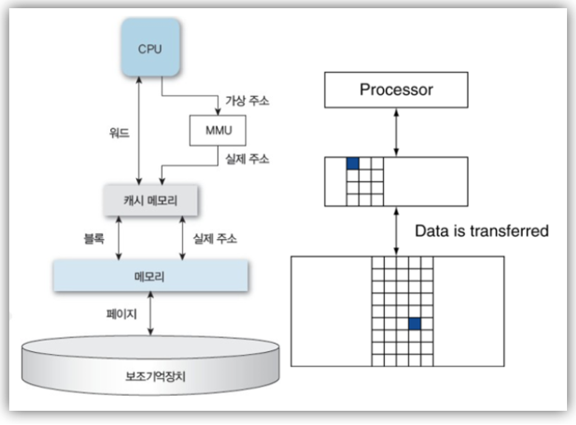

# 프로세스 개념정리 

---

>[참고사이트1](https://beenii.tistory.com/101)
>
>[참고사이트2](https://mindstation.tistory.com/156)

## 프로세스 ( Process )

### 정의

- 프로그램이 실행된 상태 
- CPU를 할당받아 실행중인 상태 

### 프로그램

- 컴퓨터가 이해할 수 있는 명령어들과 명령을 수행하기 위한 데이터를 포함하는 실행 가능한 객체 

### 프로세스 되는 과정 

1. 프로그램 실행 시 운영체제가 보조기억장치(HDD)에 위치한 프로그램을 읽는다. 
2. 읽은 프로그램을 주기억장치(캐시)에 복사한다. 
3. CPU가 메인 메모리에 있는 데이터를 읽어야 할 때 캐시메모리를 먼저 검색한다. 
   1. 만약 원하는 정보가 캐시메모리에 있으면 바로 전달
   2. 데이터가 없다면 메인 메모리에서 블록 단위로 가져옴

4. 가져온 데이터를 CPU를 할당받아 실행한다. 

### 기억장치 종류

- CPU는 기억장치가 아니라 연산장치이다. 

1. 고속 기억(버퍼) 장치
   - 레지스터
   - 캐시
2. 주기억장치
   - ROM
   - RAM
3. 보조기억장치
   - HDD
   - SSD

