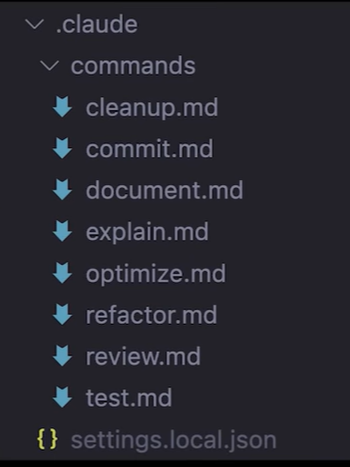

# Claude Code 정리

---

>[내용참고1](https://goddaehee.tistory.com/372)
>
>[클로드 코드 설치 방법 - 유튜브 챗과장](https://www.youtube.com/watch?v=J0IWxZXczxs)
>
>[클로드 설치 방법](https://goddaehee.tistory.com/370)
>
>[https://www.youtube.com/watch?v=xtvynO05AoA](클로드 사용방법 - 유튜브 챗과장)
>
>[클로드 코드 주요 명령어 정리 - 챗과장](https://principled-learning-2c9.notion.site/216dc93a597c80f6953ef4d048d55926)
>
>[클로드 코드 사용법 - 노마드 코더 ](https://www.youtube.com/watch?v=-8JTwRH23VY)

## Claude Code란?

- Claude Code는 CLI 방식 (즉, 터미널 방식)
- 터미널에서 바로 사용하는 Anthropic의 agentic 코딩 도구, 자연어 명령만으로 코드 작성부터 디버깅까지 모든 개발 작업을 처리할 수 있는 CLI 기반 AI 도구이다.

## 특징

1. 터미널 네이티브 : 
   1. 새로운 IDE나 확장프로그램 설치 불필요
2. 전체 코드베이스 이해 : 
   1. 프로젝트 구조와 컨텍스트를 자동으로 파악
3. 직접 액션 실행 : 
   1. 파일 편집, 명령어 실행, Git 작업까지 자동화
4. MCP 지원 : 
   1. Google Drive, Slack, Jira 등 외부 도구와 연동
5. Claude (현시점) 4.0 기반: 
   1. 최신 AI 모델의 강력한 추론 능력

## 설치 명령어

- Windows에서는 일부 제약이 있었지만, 이젠 Windows 네이티브 지원으로 WSL도 필요 없고, Node.js만 있으면 바로 시작할 수 있다.
- npm 사용시 버전 11 부터 사용가능 

```cmd
# npm 11 버전 install
npm install -g npm@11.6.3

# Claude Code 설치 
npm install -g @anthropic-ai/claude-code

# 클로드 코드와 함께 하고싶은 프로젝트 디렉토리로 이동한다.
cd your-project
claude
```

## 모델 선택

- Claude Code를 실행하면 가장 먼저 어떤 모델을 사용할지 선택 할 수 있다.
  - Sonnet / Haiku / Opus 등이 실제 작업 처리

1. Default
   1. 자동 모델 선택
2. Claude Sonnet 4
   1. 빠르고 효율적
3. Claude Opus 4
   1. 최고 성능, 복잡한 추론

```cmd
# 실행 시 모델 지정
claude --model claude-opus-4-20250514
claude --model claude-sonnet-4-20250514

# 실행 중에 모델 변경
/model claude-opus-4
/model claude-sonnet-4

# 현재 모델 확인
/config
```

## 사용방법

- `Claude >` 프롬프트에 자연어로 명령을 입력하거나 슬래시 명령어를 사용할 수 있다.
- 취소는 습관적으로 commnad + c 또는 ctrl + c 를 누를 텐데 **esc를 입력**하면 된다.

## 명령어 종류 

- Claude Code는 두 가지 방식으로 명령을 내릴 수 있다:
- 슬래시 명령어 vs 자연어

1. 자연어 명령

   ```bash
   # 파일 생성/수정
   package.json에 새로운 의존성을 추가해줘
   
   # 코드 분석  
   이 함수에서 성능 병목이 있는지 확인해줘
   
   # 버그 수정
   TypeError가 발생하는 이유를 찾아서 고쳐줘

2. 슬래시 명령 

   - 클로드 설정 및 컨트롤 

   ```cmd
   /clear 
   ```

## CL 슬래시 명령어

```cmd
claude --continue		# 최근 대화 이어서 하기 
claude --resume		# 대화 목록 확인 

/clear          # 기존 대화 내역 삭제
/cost           # 현재 세션 토큰 사용량과 비용 확인
/status         # Claude Code 상태 (버전, 모델, 계정, API 연결 상태)
/help           # 사용 가능한 모든 슬래시 명령어 목록
/compact		# 대화 기록을 요약 (기존 대화 내역 삭제)

/init           # 프로젝트 초기 설정 (CLAUDE.md 자동 생성)
/terminal-setup # 터미널 키바인딩 설정 (Shift+Enter 등)
/claude-md      # 프로젝트 메모리 파일(CLAUDE.md) 생성
/config         # Claude Code 설정 보기/변경
/model          # 사용할 모델 변경 (Opus 4, Sonnet 4 등)
/permissions    # 권한 설정 관리
```

## CLI 단축키

```cmd
Ctrl + c			# 내용 전체 삭제 
Ctrl + U			# 한줄 삭제
alt + Enter 		# 줄바꿈
shift + Enter		# 줄 바꿈 (전송 안함)
```

### tip 

- `#` 을 붙이고 말하면 `/init` 으로 만든 CLAUDE.md 에 내용이 추가됨 
- `@` 을 이용해 파일 불러올 수 있음 
- `.claude` 의 commands 폴더를 이용하면 자주 사용하는 명령어를 사용할 수 있다. 
  - 


## 모드 변경

- `Shift + Tab` 이용해 모드변경 가능 

##### Default Mode

- 클로드 수정시 나에게 허락을 구함 

##### Edits Mode

- 수정시 자동으로 적용함 

##### Plan Mode

- 계획모드로, 프로젝트 설계시 유용한 모드 

