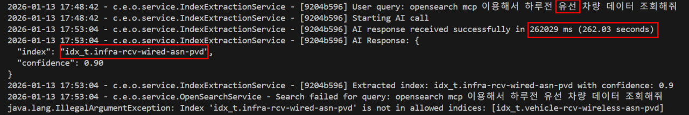
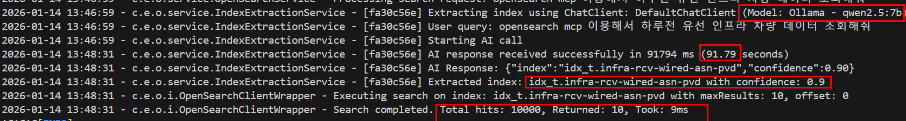

# Ollama model 성능비교

---

>

## 필요 명령어 

- `ollama pull` : 모델을 로컬(컨테이너 내부)에 다운로드

```bash
docker exec -it ollama ollama pull qwen2.5:7b
docker exec -it ollama ollama pull deepseek-r1:7b
docker exec -it ollama ollama pull gemma3:4b


# model 리스트 확인 
docker exec -it ollama ollama list
```

## 테스트 작업 목록

1. 한글로 작성된 Prompt 를 이용해 opensearch 조회 가능한 Index 추출 
2. opensearch MCP 이용 요구조건 데이터 조회 

---

## 1. llama3 

- prompt 이용 Index찾기 : 262초 
- 성능이 Cloud genAI 비교 150 배 느림.



## 2. gemma3:4b

- prompt 이용 Index찾기 : 42초 
- opensearch mcp 이용 조회 : 결과 도출 실패 ( prompt Role 을 따르지 않고 다른 결과 만들어냄 )


## 3. Quen2.5:7b

- prompt 이용 Index찾기 : 90초 
- opensearch mcp 이용 조회 : 9초 



## 4. deepseek

-  prompt 이용 Index찾기 : Read timed out