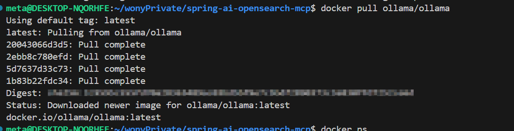
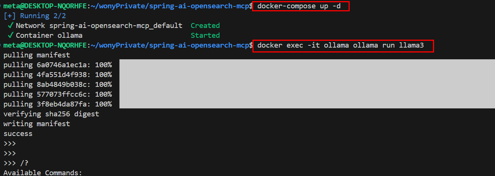
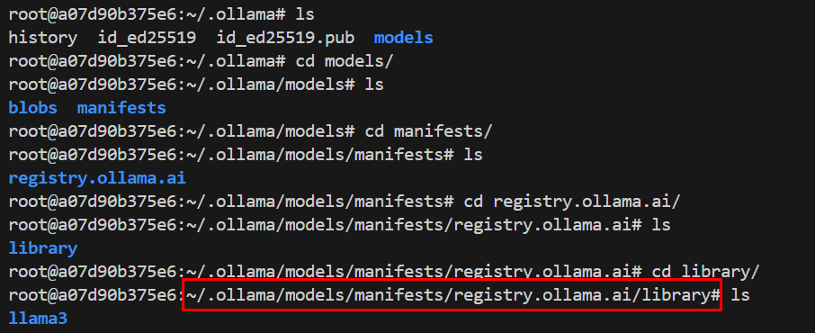
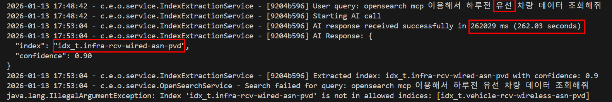

# Spring AI 이용한 Ollama LLM 연동

---

>

## 요약

1. Ollama는 Docker 컨테이너로 띄우고 Spring AI는 `localhost:11434`로 질의한다.

## Docker 이용 설치



```bash
# 이미지 받기 
docker pull ollama/ollama

# 컨테이너 실행 
docker run -d \
  --name ollama \
  -p 11434:11434 \
  -v ollama:/root/.ollama \
  ollama/ollama
  
# docker compose 이용 실행 (docker-compose.yml 파일 경로에서 실행)
docker-compose up -d
```

| 옵션                      | 의미                   |
| ------------------------- | ---------------------- |
| `-p 11434:11434`          | 호스트 → 컨테이너 포트 |
| `-v ollama:/root/.ollama` | 모델/캐시 영구 저장    |
| `-d`                      | 백그라운드 실행        |

---

## 컨테이너 정상 실행 확인

```bash
docker ps
curl http://localhost:11434
```

- 정상 응답:

```
Ollama is running
```

---

## Ollama 모델 다운로드 (컨테이너 안에서)

```bash
docker exec -it ollama ollama pull llama3
docker exec -it ollama ollama pull mistral

# model download List 
docker exec -it ollama ollama list
```

## 모델 실행 테스트

```bash
docker exec -it ollama ollama run llama3
```



- model 설치 위치 



## Spring-ai 

##### properties 설정

```yml
ai:
# Disable ChatClient auto-configuration for manual multi-model setup
chat:
  client:
    enabled: false
# Disable automatic retries to prevent duplicate calls during timeouts
retry:
  max-attempts: 1
  on-http-endpoints: false

# Ollama Configuration
ollama:
  base-url: http://localhost:11434
  chat:
    options:
      model: llama3
      # model: llama3.2
      # 답변을 얼마나 자유롭게(랜덤하게) 만들지 조절
      temperature: 0.3
```

##### ChatClientConfig 설정

```java
// 디폴트 prompt 
@Value("${ai.prompt.system}")
private Resource systemPromptResource;

@Bean
@Qualifier("ollamaChatClient")
public ChatClient ollamaChatClient(
        OllamaChatModel ollamaChatModel,
        @Value("${spring.ai.ollama.chat.options.model}") String model,
        @Value("${spring.ai.ollama.chat.options.temperature}") Double temperature
) throws IOException {
    String systemPrompt = systemPromptResource.getContentAsString(StandardCharsets.UTF_8);

    // Add a strict instruction for Ollama to avoid "chatty" responses
    String strictSystemPrompt = systemPrompt + "\n\nCRITICAL: Respond ONLY with a valid JSON object. No conversational text, no explanations, no 'Here is the JSON'. Just the JSON.";

    return ChatClient.builder(ollamaChatModel)
        .defaultSystem(strictSystemPrompt)
        .defaultOptions(OllamaChatOptions.builder()
            .model(model)
            .temperature(temperature)
            .build())
        .build();
}
```

##### LLM 호출 

```java
// Call Spring AI
String response = chatClient.prompt()
    .user(userMessage)
    .call()
    .content();
```


## 결과 

- openAI 와 genai 로 했을때보다 성능이 너무 안좋다... (거의 150배??? )
  - genai : 1.4s
  - llama3: 262s
  - 알아보니 컴퓨터의 성능 (CPU, GPU) 영향도 있다고한다. (내 컴퓨터 RAM 32, CPU i7, GeForce RTX 3050 의 스팩기준)
  - GPU 로 Ollama 를 돌리면 더 빨라질수도?? 시도해봐야겠다. 

